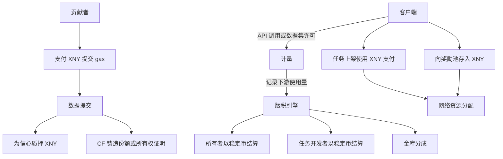

> **原则**
> - **$XNY 是协议燃料**：提交 gas、任务上架费用（进入协议金库）、用于信心的质押、以及所有权交换。
> - **稳定币是默认的版税结算货币**，通过 TNPL 与用量计费分发。
> - **开放且可集成**：任何应用或协议都可发起任务、访问计量资产，并接入结算。

### 一图速览

### 逐步说明
1. **客户端**进行数据查询 API 调用或许可数据集进行批量访问。**计量**记录由被访问数据支持的下游 AI 产品的使用单元。
2. **版税引擎**将使用转换为收入并分配给**所有者**（提供者、验证者、支持者），以及定义模式/分类法的**任务开发者**和**协议金库**。  
3. **贡献者**以少量 **$XNY gas** 提交数据，并可**质押 $XNY**提升信心。**内容指纹（CF）**可铸造**份额**或**所有权证明**。
4. **客户端**发起任务需**支付 $XNY**进行上架，并可**存入 $XNY**到奖励池以激活任务、吸引知识贡献者。
5. **结算**默认以**稳定币**进行；在双方同意的策略下可采用其他资产。

### 核心公式

- **单位收入** = `usage_units × price_per_unit`  
- **版税池** = `unit_revenue × royalty_rate`  
- **持有人 i 的分配** = `royalty_pool × owner_fraction_i × quality_multiplier_i`  

**小例子**：1,000,000 次 API 调用 × 0.001 USD/次，`royalty_rate = 30%` → **300 USD** 分配给所有者和其他合格方。  
若某持有人拥有 **2%** 且乘数 **1.1** → `300 × 0.02 × 1.1 = 6.6 USD`。

