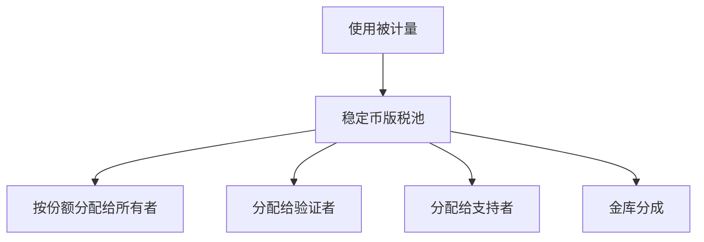

<Warning>
所有权流动性仍处于早期探索阶段。本页概念将随着时间进行测试与实验。请将其视为沟通材料，而非实际/最终设计。
</Warning>

### 铸造与默认分配

每个经验证的资产都会铸造代表所有权的**份额（fractions）**。策略在铸造时定义分配，例如：

| 份额类别 | 典型范围 | 说明 |
|---|---|---|
| **贡献者** | 占比最大 | 数据单元的主要创造者 |
| **验证者** | 小到中等 | 与验证深度和准确率挂钩 |
| **支持者** | 小到中等 | 用于承保批次或预付支持 |
| **协议金库** | 默认较小 | 用于审计、资助与基础设施 |

> 具体比例是每个任务或批次的**策略旋钮**，可按领域差异化设置。

### 结算路径

- **结算节奏**：持续计提，默认**每月结算**  
- **结算币种**：默认以**稳定币**支付  
- **跨链**：在策略允许时可通过批准路由跨链结算

### 所有权流动性

| 机制 | 实现能力 | 代币用途 |
|---|---|---|
| **转让** | 更换份额持有人 | 结算与索引收取 $XNY 费用 |
| **组合打包** | 跨任务/领域的多元化篮子 | 使用 $XNY 创建并上架组合 |
| **二级市场** | 数据资产的价格发现 | $XNY 上架与结算费用；收益仍以稳定币发放 |

