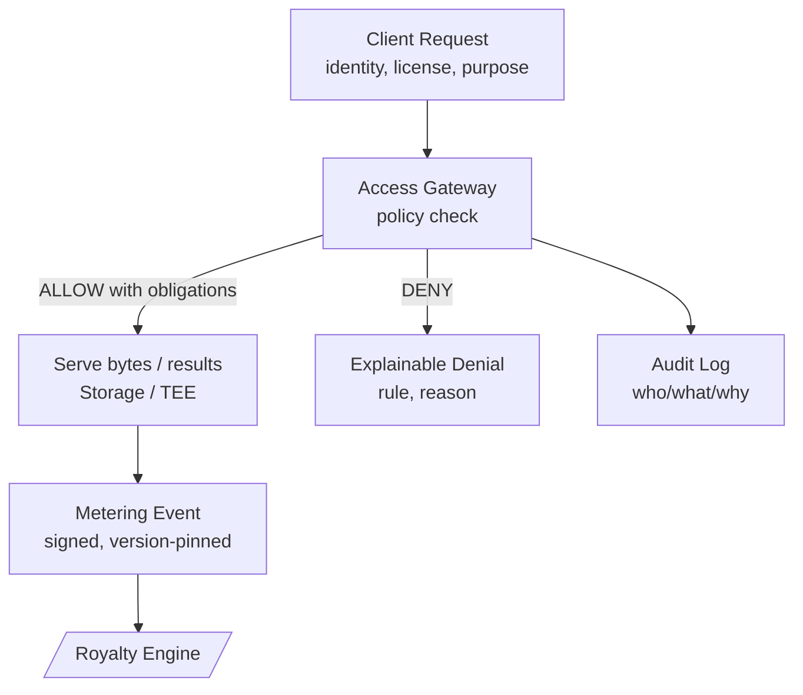

**这一层做什么**  
**访问网关（Access Gateway）** 决定**谁**可以在**什么条件下**读取**哪一个数据集版本**以及**读取多少**。**计量模块（Metering）**把被允许的读取转成**签名的使用事件**，后续驱动**计费与版税**。策略清晰、可版本化、可审计；事件可重放。

## 全局视图（请求 → 决策 → 服务 → 计量）

- **策略检查：** 评估身份、凭证/VC、层级（参见 [/core-concepts/reputation](/core-concepts/reputation)）、数据集版本、地域/时间、许可/TNPL。  
- **附加义务：** 决策可要求在服务前进行**脱敏**、**抽样**、**限速**、**水印**或**TEE 执行**。  
- **计量：** 事件包含**数据集版本**、**用量**（行/GB/请求）、**时间戳**、**估值配置版本**、**规则 ID**与**签名**。

## 策略基础
策略以**属性为主（ABAC）**，辅以角色（RBAC）便捷规则。每次决策评估：

- **主体：** 请求者身份（钱包/DID）、**验证等级**（VC/KYC）、**声誉层级**、组织/团队。  
- **资源：** **数据集 ID + 版本**、资产标签、敏感级别。  
- **动作：** 读取、抽样、导出、流式、聚合等。  
- **上下文：** 时间/区域、目的（研究/商业）、配额/预算、许可/TNPL、争议状态。

**结果：** **允许 / 拒绝 / 附条件允许**。义务可包括字段级脱敏、仅聚合、仅缓存或仅 TEE 处理。网关记录**命中的规则**与**理由**。

> 策略是**版本化**的；决策会存储策略版本，以便重放与原结果一致。

## 计量事件
每一次被允许的读取会产生一个或多个**使用事件**。通俗地，事件记录：

- **谁：** 请求者身份（或机构）与支付账户。  
- **什么：** 数据集**ID + 版本**、资源类型（文件/对象/查询）。  
- **多少：** 行/GB/请求/秒数。  
- **何时：** 时间戳 + **估值生效时间**。  
- **为何允许：** 匹配的**策略规则 ID**与义务集合（如“mask+sample”）。  
- **如何定价：** 使用的**估值配置版本**以导出**有效价格/权重**。  
- **证明：** 网关**签名**、可选的机密计算证明、以及**事件 ID**。

事件进入**[/core-concepts/royalty-engine](/core-concepts/royalty-engine)**。由于事件、所有权与估值均版本化，分配**可确定**且**可解释**。

## 许可与支付模式
- **标准许可：** 按用量付费；事件与数据消费者的**收入账户**结算。  
- **TNPL（先训练后付费）：** 先访问、生成**递延义务**；收入到帐时结算。  
- **预付/积分模式：** 从积分扣减；事件仍记录以供审计。

## 限速、配额与抽样
- **限速与配额：** 按身份/组织/区域节流；突发与冷却窗口用于防滥用与控成本。  
- **抽样：** 为探索提供代表性切片；完全访问需要更高策略层级或支付。  
- **公平使用：** 标记异常；对敏感查询要求更强凭证或仅 TEE 路径。

## 隐私与安全服务
- **最小披露：** 仅解密必要字节；优先 **TEE** 或**联邦式**执行（见 [/core-concepts/storage-compute-serving](/core-concepts/storage-compute-serving)）。  
- **选择性披露：** 需要特定凭证/声明而非原始 PII。  
- **脱敏与聚合：** 义务可强制字段级脱敏或仅返回聚合。

## 审计与重放
- **审计日志：** 谁请求、命中哪条规则、为何允许、返回了什么。  
- **重放：** 给定请求、策略版本与数据集版本，网关必须返回**相同决策**；给定相同事件，版税引擎计算**相同分配**。

## 接口
- **输入：** 请求者身份/凭证（见 **[/core-concepts/identity](/core-concepts/identity)**）、层级（见 **[/core-concepts/reputation](/core-concepts/reputation)**）、数据集/版本（见 **[/core-concepts/data-assembly](/core-concepts/data-assembly)**）与存储端点（见 **[/core-concepts/storage-compute-serving](/core-concepts/storage-compute-serving)**）。  
- **输出：** **计量事件**（至 **[/core-concepts/royalty-engine](/core-concepts/royalty-engine)**）、审计日志、策略决策（允许/拒绝/附条件）。  
- **交叉链接：** 定价/归属所需的所有权快照来自 **[/core-concepts/tokenized-ownership-proofs](/core-concepts/tokenized-ownership-proofs)**。

## 不变量
- **可解释：** 每个决策指向具体规则与策略版本。  
- **确定性：** 相同请求 + 相同策略 + 相同数据集版本 ⇒ 相同决策。  
- **可追溯：** 每个返回字节可追至数据集版本 → 资产 → CF。  
- **防篡改：** 事件与日志均签名；争议期间使用准备金。

