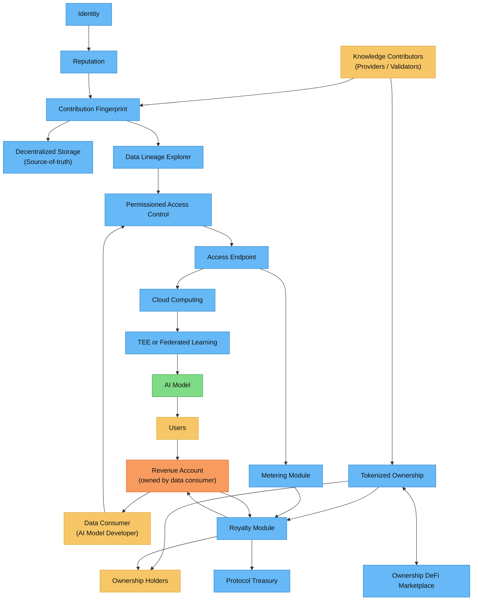

> **TL;DR**  
> Codatta 将人类/代理贡献转化为**可验证、可拥有的数据资产**，具有可追溯的谱系、策略限制和可观察的访问、可证明的所有权和**确定性版税支付**。

## 架构

## 4 步骤流程（端到端）

1. **贡献**：贡献者（人类或代理）提交工作，密封为**[贡献指纹](/core-concepts/contribution-fingerprint.mdx)**并绑定到**[身份](/core-concepts/identity.mdx)**和**[声誉](/core-concepts/reputation.mdx)**。
2. **资产化**：具有**验证的贡献指纹**的原子贡献（样本、标签、验证）被组合并策展成版本化数据集（**[谱系和资产组装](/core-concepts/lineage-asset-assembly.mdx)**），并被**铸造为**链上**[代币化所有权](/core-concepts/tokenized-ownership-proofs.mdx)**，带有**可转移份额**。
3. **使用**：AI 构建者通过**[访问网关](/core-concepts/access-control-metering.mdx)**访问数据，由安全**[存储/计算/服务](/core-concepts/storage-compute-serving.mdx)**支持。每次读取产生**使用和账单事件**（计量）。
4. **版税**：[版税引擎](/core-concepts/royalty-engine.mdx)**将收入、时间固定的所有权份额和计量事件组合，对所有权持有者和金库进行**确定性支付**。

## 关键组件一览

- **贡献指纹（CF）**：*谁在何时用什么证据做了什么*的原子、签名记录。  
- **身份和声誉**：隐私保护身份加上质押即信心和准确性历史来评分信任。  
- **谱系和资产组装**：将 CF 组合成可追溯的数据集，带有版本控制和来源查询。  
- **存储/计算/服务**：真源存储、安全计算（TEE/联合）和高性能交付。  
- **访问控制和计量**：策略限制的访问；发出可审计的**使用和账单事件**。  
- **代币化所有权**：链上、**可转移**的所有权份额覆盖单元/数据集，带有证明导出。  
- **版税引擎**：将收入转化为透明、可重放的贡献者/支持者（所有权持有者）分成。

### 如何获得所有权（简要）

- **知识贡献者（提供者/验证者）**：贡献**样本/标签/验证**。当您的贡献被**接受并发布为 CF**时，一个**默认份额**会铸造给您（每个任务按策略定义）。  
- **知识支持者（质押者/担保人/购买者）**：  
  - **质押即信心/担保**以**获得或提升**份额；审计可以**增加**或**削减**在治理上限内的头寸。  
  - 在二级市场上**购买份额**（如果启用流动性）。这**不改变支付数学**—只改变**谁**收到所有者份额。  
- **转移/托管**：直接移动份额或将它们**托管**直到满足条件（支付、KYC、里程碑、争议）。快照使用时间 *t* 的**记录所有者**进行支付。

参见**[core-concepts/tokenized-ownership-proofs](/core-concepts/tokenized-ownership-proofs)**了解详细信息。

## 从哪里开始

- **构建堆栈**：从**[贡献指纹](/core-concepts/contribution-fingerprint.mdx)**开始 → 身份 + 声誉 → 谱系 → 存储/服务 → 访问和计量 → 所有权证明 → 版税引擎。  
- **探索产品**：参见**产品 → 谱系探索器**和相关仪表板以获取 UI/API 使用和 SDK。

<Tip>
**主要目标**：使用区块链将数据转化为 AI 的可拥有资产类别—使权利**可证明**、所有权**可转移**、收入通过版税**可分享**。
</Tip>

