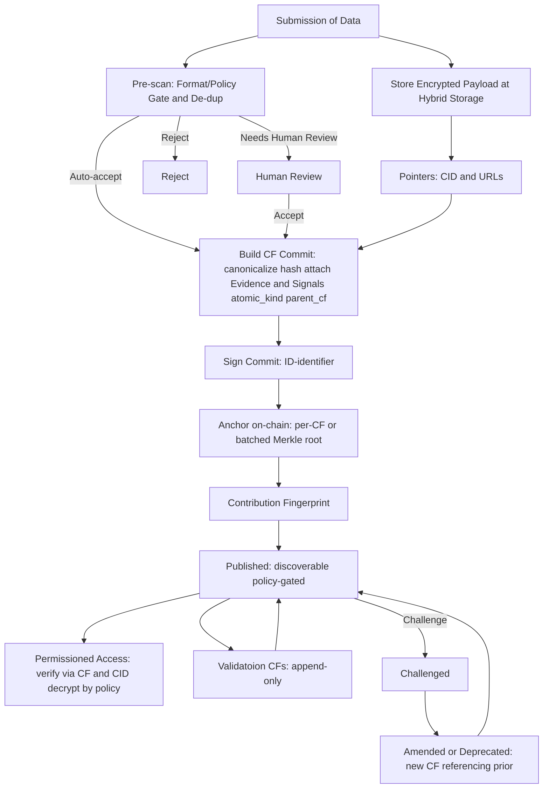

**贡献指纹（CF）** 就像一张带来源的**工作收据**。每当有人提交**样本**、**标签**或**验证**（我们称之为*原子贡献*），系统都会创建**一个 CF**，永久关联：

- **贡献了什么**（内容的稳定引用），  
- **是谁**完成的（贡献者的钱包或去中心化 ID），  
- **何时**发生（时间戳/锚点），  
- **为何可信**（附带的证据与评审信号）。

CF 是整个架构的**第一块砖**。它让作者身份清晰、支撑透明的所有权与版税，并可让任何人把数据集追溯到起源。

## CF 在大图中的位置
1. **贡献 →** 每个原子贡献对应**一个 CF**。  
2. **资产化 →** 多个 CF 组装成**数据资产**与可版本化的**数据集**。  
3. **使用 →** AI 构建者通过策略网关访问数据集；使用被计量。  
4. **版税 →** 收入 + 计量事件 + 所有权份额 = 可确定的分配。

## CF 如何被创建

**步骤说明**
- **提交：** 贡献者发送内容。我们保存**加密副本**与稳定引用（内容 ID 或 URL）。  
- **预扫描：** 轻量检查格式、隐私脱敏与去重。部分项目自动通过；其余可能需要人工快速审核。  
- **创建记录：** 标准化细节，标注是否为**样本**、**标签**或**验证**，并附上**证据与信号**。  
- **绑定身份：** 贡献者用钱包或 DID **签名**记录。  
- **链上锚定：** 指纹以不可变方式锚定到区块链（单条或批量）。  
- **发布：** CF 可被发现；原始内容的访问**受策略门控**。  
- **评估与修订：** 评审者会新增**他们自己的 CF**（评估）或提交争议。我们**不覆盖**原记录；更新通过**新 CF**引用旧 CF，完整保留历史。

## 证据与信号（我们如何支撑主张）
为在不暴露隐私数据的前提下保持高信任，每个 CF 可携带结构化**证据**与**信号**：

- **证据（artifact）：** 交易 ID、文档或图像哈希、稳定链接或已签名的凭证等。  
- **信号：** 说明主张**如何获得**（来源类别：启发式、模型推断、原始文档、链上真实等）以及**如何验证**（验证类别：无、同行评审、质押验证、裁决等）。也可记录**一致性程度**与**评审者声誉**。

评审者与算法**不会**编辑原始 CF。他们**附加自己的 CF**进行引用，这保持了可解释的审计轨迹。

## CF 能带来什么
- **作者清晰：** 每个原子贡献在诞生时就有 CF；署名永不丢失。  
- **数据集可追溯：** 任何数据集都能回溯至资产与构成它们的 CF。  
- **可证明所有权：** CF 锚定可转移的代币化所有权份额。  
- **公平分配：** 当数据被使用时，计量事件与所有权份额可回指正确的 CF，从而实现确定性版税。  
- **可问责改进：** 验证与修正以新 CF 追加，而非静默编辑。

## 示例：从贡献到版税
以林医生为例：他为一张医疗图像提供了**标签**（该图像由患者提供，来自近期病理诊断）。图像上传创建了**一个 CF**（样本）；林医生的标签创建了**第二个 CF**并与第一个关联。二者均**链上锚定并发布**（内容仍受策略门控）。独立评审者添加**他们自己的 CF**以确认或质疑该标签；若出现分歧则进入**争议流程**并产出新 CF（修订/弃用），且不改写历史。
这些 CF 被组装进**版本化数据集**。**代币化所有权份额**记录给患者（样本）、林医生（标签）、验证者（评审）、任何支持者以及金库。AI 构建者通过**访问网关**访问数据集；**计量**记录使用；支付流入其**收入账户**；**版税引擎**结合收入、使用事件与时间快照的所有权份额进行分配。

## 不变量（必须成立）
- **仅追加的 CF：** 每个原子贡献在创建时只有一个 CF；之后任何更改都会创建**新 CF**并链接原记录（如修正标签、添加证据、验证者结论、隐私处理）。视图指向最新有效 CF；早期 CF 不可变且可审计。  
- **可审计的确定性：** 相同输入产出相同 CF 与相同分配。  
- **可追溯：** 提供的数据可从数据集 → 资产 → CF → 贡献者完整追溯。  
- **最小披露：** 敏感载荷保持加密；访问受策略门控。

