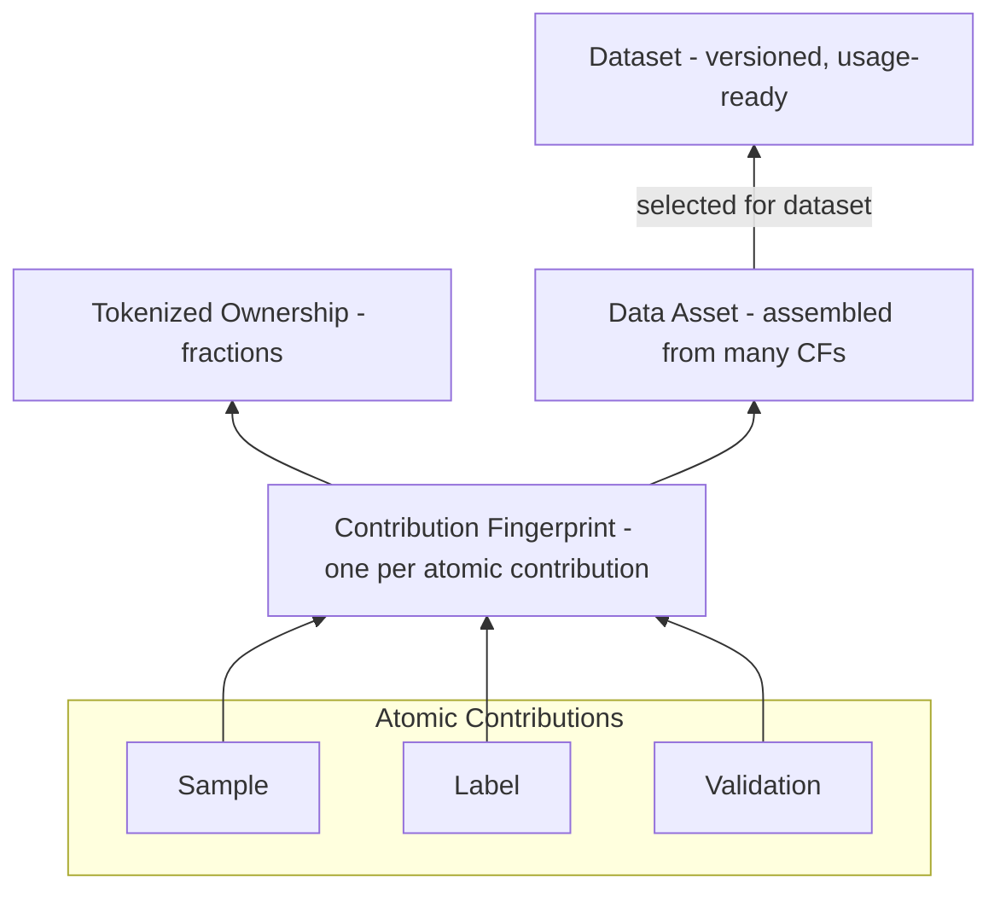
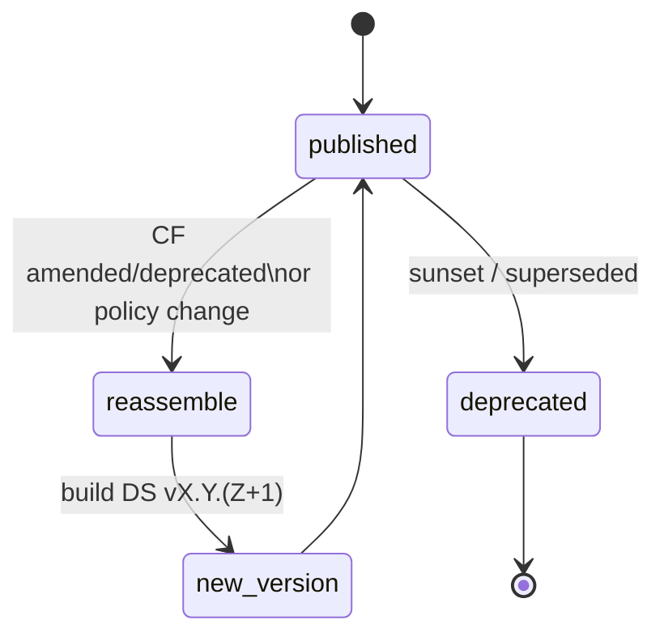
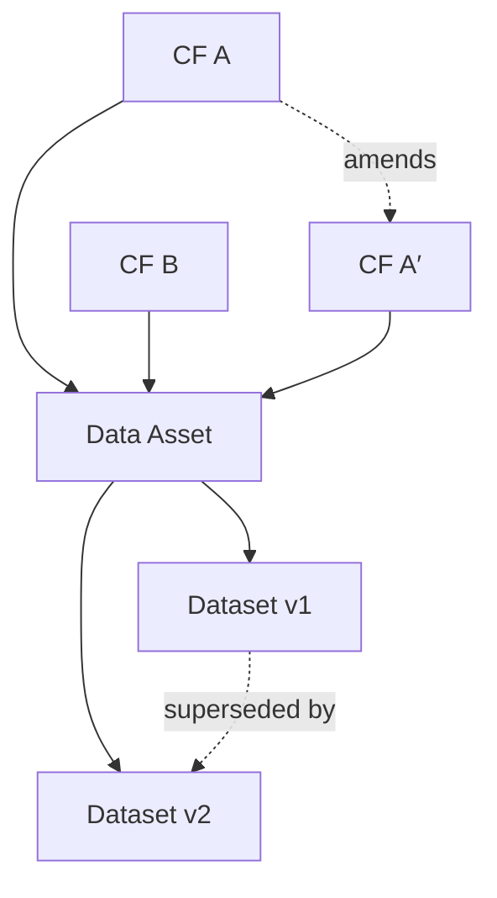

<Tip>
**心智模型：** 贡献指纹（CF）是原子。我们把 CF 组装成**数据资产**（可复用的捆绑），再选择资产/CF 组成始终**版本化**的**数据集**。谱系保留完整映射，使任何人都能解释*包含了什么*、*为何包含*与*来自何处*——并可在之后复现同一构建。
</Tip>

## 组装：从 CF 到资产再到数据集

**什么是原子贡献？**  
创建时以其**自身 CF**记录的最小工作单元。我们使用三类：**样本**、**标签**、**验证**。每个原子贡献在提交时**恰有一个 CF**；后续修正或评审会创建**新的 CF**引用原记录（从不编辑旧记录）。

**样本、标签、验证——如何关联**  
- **样本：** 原始材料（如图像、文本、轨迹）。加密存储，内容寻址，被 CF 引用。  
- **标签：** 对**样本**（或另一个标签）的结构化主张，如类别、框、属性、理由；回链至被描述对象。  
- **验证：** 对特定既有 CF（样本/标签/验证）的**带判断的核验**。给出结论（通过/拒绝/评分）及简要理由与可选证据。

<Warning>
重要的验证关联规则：**验证不能独立存在**。它必须**引用其评估对象的 CF ID**（样本、标签，甚至另一个验证）。验证者发布**他们自己的 CF**；原记录保持不可变。组装时利用验证间的一致性来决定纳入与权重，且全程可审计。
</Warning>

**什么是数据资产？**  
一个可复现、经策展的 CF 捆绑（例：“肺病理案例，验证者一致性 ≥ 0.7”）。资产是可在多个数据集中复用的便利构件。

**什么是数据集？**  
一个**可用、版本化**的集合（一个或多个资产 + 可选直接 CF），由清单固定。数据集是 AI 构建者许可并通过网关访问的对象。

## 版本策略
任何对输入或规则的更改都会创建**新数据集版本**，保持历史不可变、审计简单。

**触发新版本：** 新/移除 CF、更新过滤/阈值、不同去重/脱敏规则或任何构建配置变化。**Diff** 展示版本间新增/移除/变更的 CF 与资产。

## 谱系（来源与差异）
**什么是谱系？**  
谱系是关于制品随时间**如何关联**的**有向不可变记录**——连接**CF → 数据资产 → 数据集版本**，以及发生的**转换**（过滤、去重、脱敏）与**状态变化**（修订/弃用）。它是任何人证明**包含了什么**、**为何包含**、**来自何处**并**在未来复建**相同数据集的地图。

**如何建模（通俗）：**  
- **节点：** CF、资产、数据集版本。  
- **边（带类型）：** `derived-from`（CF → 资产）、`selected-into`（资产/CF → 数据集 vX.Y.Z）、`validates`（验证 CF → 目标 CF）、`amends` / `supersedes`（变更历史）。  
- **属性：** 边带时间戳与**触发纳入的规则**。节点从不被编辑——只**追加新节点/边**。

**可问的问题（核心查询）：**  
- **为何被包含？** 展示命中的清单规则与满足它的具体节点/边。  
- **为何被排除？** 展示失败的规则（如一致性低于阈值）。  
- **来自何处？** 追踪 数据集 → 资产 → CF → 贡献者。  
- **发生了什么变化？** 对比两个版本（新增/移除/变更的 CF 与资产）。  
- **影响分析：** “若此 CF 被修订，哪些资产/数据集版本受影响？”

**谱系保证**  
- **无环且仅追加（DAG）：** 谱系不成环；只通过添加节点/边增长。  
- **引用完整性：** 每个数据集条目可解析到有效 CF。  
- **时间索引：** 边带时间戳，可“时间旅行”查询。  
- **确定性：** 相同输入 + 相同清单规则 ⇒ 相同版本与相同谱系。

<Tip>
UI/API 使用参见 Products → Lineage Explorer（搜索、diff、导出）。
</Tip>

## 争议与重新组装
若某个 CF 被**修订**或**弃用**（如纠正标签或添加证据），数据集会用相同清单规则**重新组装**成新版本。历史版本可用于审计；未来使用跟随最新版本。（准备金与再分配由**版税引擎**处理。）

## 接口
- **输入：** CF（及其证据与信号）、可选声誉/一致性提示。  
- **输出：** 数据集**ID**与**版本 ID**，被 **存储/计算/服务** 与 **访问/计量**使用。  
- **所有权映射：** CF 级所有权被前传，以便在数据集级计算分配（细节见**代币化所有权证明**）。

## 不变量
- **引用完整性：** 每个数据集条目解析到具有有效锚定的 CF。  
- **确定性：** 相同输入 + 相同清单 ⇒ 相同版本 ID 与内容。  
- **不可变性：** 过去版本从不改变；新信息 ⇒ 新版本。  
- **可解释性：** 每次纳入/排除均绑定规则或 CF 状态，且易于展示。

