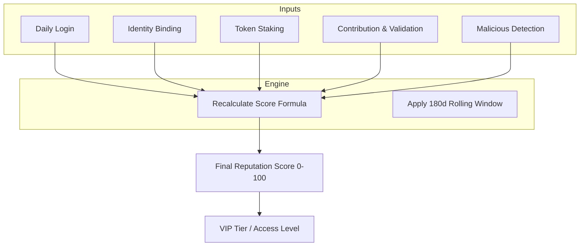

## 什么是声誉

声誉是 Codatta 网络内身份（人或代理）的**核心信任指标**。它是一个**量化分数**（范围从 0 到 100），用于捕捉你的工作**有多准确**、你的参与**有多一致**，以及你通过经济质押**有多投入**。

与不透明的"黑盒"算法不同，Codatta 的声誉系统是**完全透明和确定性的**。协议保留**按维度的细粒度信号**，但提供简单的**综合分数**用于路由、可见性和奖励计算。

### 为什么构建声誉

声誉不仅仅是一个荣誉指标；它是驱动价值分配和安全性的引擎。

- **对于用户（激励与特权）：**
  - **直接奖励影响：** 声誉在协议层面决定收益差异——即便是同等贡献，不同声誉对应不同回报；同时，它深度参与大规模激励机制（如持续性 Airdrop），积分到代币转换 汇率，以及对特殊任务与专属权益的优先获取权。
  - **VIP 访问（"Alpha" 状态）：** 类似于币安的 Alpha 积分或航空公司 VIP 等级，高声誉可解锁系统特权——例如更高的推荐奖励上限、优先访问高收益任务，或更低的服务费用。
- **对于平台（安全与质量）：**
  - **Sybil 抵抗：** 它为恶意行为者创造了成本障碍。
  - **质量过滤：** 它区分认真的贡献者和垃圾信息发送者。
  - **惩罚机制：** 它提供了快速惩罚恶意行为的工具（例如，因数据投毒而降低分数）。

### 声誉的作用（功能）

除了分数本身，声誉在 Codatta 架构中作为功能层：

- **加权贡献：** 在**数据组装**中，来自高声誉身份的原子贡献获得**更多权重**。这允许降低审查法定人数，并为受信任用户提供更高的纳入优先级。
- **治理所有权：** 根据**版税引擎**的定义，更高声誉的贡献者可能为同等贡献类型获得**更大份额的所有权分数**。
- **访问控制：** 某些高价值任务或敏感数据验证角色由**声誉层级**控制。

## 计算框架

声誉分数是**动态的**，根据用户操作和时间窗口（例如，滚动 180 天）进行更新。它由四个正向维度和一个负向惩罚维度组成。

### 总分数公式

```
Reputation = 0.1 × R_Login
          + 0.15 × R_Identity
          + 0.2 × R_Staking
          + 0.55 × R_Contribution
          - R_Malicious_Behavior
```

<Tip>
**透明性原则：** 计算逻辑是开放的。每次变更都映射到记录的事件，模型确保**相同事件 + 相同模型 = 相同声誉**。
</Tip>

### 身份（R_Identity）

**权重：** 15% | **验证"人性"与可联系性**

此维度通过验证用户可在多个平台上联系且唯一来促进 Sybil 抵抗。

```
R_Identity = 100 × (0.05 × isEmail + 0.05 × isX + 0.05 × isTG + 0.05 × isDiscord + 0.8 × R_Others)
```

- **逻辑：** 用户绑定外部账户（Email、X/Twitter、Telegram、Discord）。
- **影响：** 每次绑定为此子分数贡献 5 分。
- **未来证明：** `R_Others` 保留用于未来集成（目前为 0），使此维度的当前有效最大值为 20（为总声誉贡献 3 分）。

### 登录活动（R_Login）

**权重：** 10% | **奖励一致性与习惯**

Codatta 奖励持续关注。此分数反映你的**日活跃使用（DAU）**习惯。

```
R_Login = 100 × (daysLogged_180d / 180)
```

- **逻辑：** 计算你在过去 180 天内登录的天数（基于 UTC+0）。
- **影响：** 持续每日登录确保此组件保持在 100。

### 质押（R_Staking）

**权重：** 20% | **质押即信心**

这允许用户"用真金白银为自己的言论负责"。它衡量对生态系统的经济投入。

```
R_Staking = 100 × min(1, amountStakeXNY / 50,000)
```

- **逻辑：** 声誉随质押的 XNY 代币数量线性增加。
- **汇率：** 每质押约 2,500 XNY 为你的最终总声誉分数增加 1 分。
- **上限：** 效果在 50,000 XNY 处封顶。超过此数量的质押显示信心，但不会进一步增加声誉分数。

### 贡献质量（R_Contribution）

**权重：** 55% | **核心价值驱动因素**

这是最关键的维度。它使用**贝叶斯平滑平均**（类似于 IMDB 评分）评估你的工作质量，以确保新用户和高级用户之间的公平性。

```
R_Contribution = 100 × (countAdopt_180d + (20 × 0.5)) / (countAdopt_180d + countRefused_180d + 20)
```

- **为什么使用贝叶斯？** 它防止拥有 1 个正确提交（100% 率）的用户人为地超过拥有 990 个正确和 10 个错误（99% 率）的老用户。
- **参数：**
  - **0.5：** 基线概率（中性起点）。
  - **20：** "置信权重"——它确定需要多少提交才能显著地将分数从基线移开。
- **动态：** 新用户从 50 的子分数开始（为总分贡献 27.5 分）。高采用率将分数推向 100；高拒绝率将其推向 0。

### 惩罚（R_Malicious）

**"锤子"机制**

为了保护平台，恶意行为会导致严重的分数扣除。

```
R_Malicious_Behavior = 100 × min(1, CountBlacklisted / 3)
```

- **三振出局规则：**
  - **1 次：** 显著的声誉损害。
  - **3 次：** `R_Malicious` 变为 100，有效地将用户的总声誉分数清零为 0。
- **触发条件：** 这由确认的恶意意图触发（例如，脚本攻击、故意数据投毒），而不是简单的错误。

## 声誉如何更新（生命周期）

声誉不是静态的。它遵循由用户事件驱动的生命周期：



- **实时与定期：** 某些信号（如质押）立即更新，而其他信号（如贡献统计）可能按计划节奏更新。
- **衰减：** 180 天滚动窗口确保声誉需要维护。长期不活动会导致分数的温和衰减，保持信号新鲜。

## 隐私与披露

- **公开：** 你的**层级**和**总分数**是用于路由和排行榜的公开信号。
- **私有：** 原始**PII 数据**（例如，在 `R_Identity` 中链接的特定 Telegram 句柄或电子邮件地址）保持加密和私有。我们尽可能使用**可验证凭证**。
- **无黑盒：** 虽然个人数据是私有的，但你分数背后的推理不是。你始终可以准确看到你的分数是如何得出的（例如，"+30 来自质押"）。

<Tip>
**透明性原则：** 计算逻辑完全透明。每次变更都映射到记录的事件，确保**相同事件 + 相同模型 = 相同声誉**。
</Tip>

<Warning>
**状态说明：** 
权重、层级阈值、质押参数，以及从声誉到所有权的任何映射都是**受治理的**，可能会演变。180 天滚动窗口和公式参数可能通过治理进行调整，以维护系统健康性和公平性。
</Warning>
