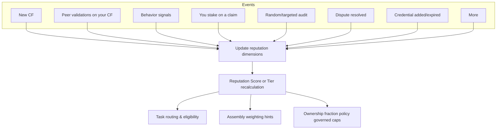

## 什么是声誉
声誉是面向身份（人或代理）的**多维度信任系统**。它捕捉你的工作**有多准确**、**他人如何验证**、你**具有什么属性**（如凭证）、以及你**有多投入**（响应、吞吐、经济质押）。协议保留**按维度的细粒度信号**，但在界面层提供简单的**分数**与**层级**用于路由与可见性。

## 维度与信号
声誉是**量化且多维**的。每一维度均被记录与版本化；治理设定权重以生成综合分数。

- **准确性与一致性** —— 你的 CF 被验证后的结果；通过率、争议率与被推翻历史。  
- **行为可靠性** —— **投入与响应**（准时交付、评审周转）、持续吞吐与任务完成质量。  
- **背书属性** —— **第三方背书**（如执照、隶属、认证）与**协议验证**（如通过教程/测验/测试）。  
- **时新性** —— 近期活动权重更高；长期不活跃会温和衰减。  
- **质押即信心** —— 用质押支持主张；审计可提升或削减声誉。  

<Tip>
协议**保留原始的按维度信号**，以便模型迭代；UI 展示清晰的层级与分数带。我们保持模型版本透明、可审计。
</Tip>

### 影响声誉的样例事件

| 事件 | 声誉影响 |
|---|---|
| 你的 CF 以高一致性通过验证 | 上升（准确性 + 一致性） |
| 你的 CF 被质疑并被推翻 | 下降（争议失利） |
| 持续准时且响应积极 | 上升（行为可靠性） |
| 你质押并通过随机审计 | 上升（信心获奖） |
| 你质押但审计失败（被削减） | 下降（信心受罚） |
| 新凭证/技能被验证 | 上升（属性加成；有上限） |
| 长期不活跃 | 温和衰减（时新性） |

## 声誉的作用（功能）

- **解锁更好的工作与报酬。** 更高声誉**解锁更高报酬的任务**与需要质量/投入的角色。部分任务还需要**附加资格**（如职业执照、学历、领域经验）；声誉**补充**这些要求而非替代。  
- **在组装阶段加权。** 高声誉身份的原子贡献在**数据组装**中可获得**更高权重**（如更低的评审配额、更高的纳入优先级），在保证质量的同时减少冗余评审。  
- **影响所有权份额（受治理）。** 在治理约束内，更高声誉的贡献者可为等量贡献获得**更大份额**，体现信任与期望质量。具体政策见**代币化所有权证明**，并由**版税引擎**在分配时给出解释。  
- **经济投入带来提升。** 通过**质押即信心**可**增强**声誉；通过审计上升，审计失败下降。把信号与实际后果绑定。

## 声誉如何更新（生命周期）

- 新 CF **起始中性**；验证结果决定分数上/下行。  
- 行为信号持续累积。  
- 质押在审计后作为**乘子**（正或负）。  
- 层级按节奏/冷却期更新，避免抖动与博弈。

## 安全、公平与恢复

- **Sybil 与串谋抵抗：** 跨时间聚合；要求验证者多样性；对风险模式限速。  
- **冷却与衰减：** 变更按节奏应用；不活跃期间引入温和衰减以保持信号新鲜。  
- **申诉与争议：** 申诉记录在案；公平更正有助恢复。  
- **无黑箱：** 每次变更映射到记录的事件；模型与权重版本化。

## 隐私与披露

- **公开：** 你的**层级**、粗略分数带与高层原因（如“高一致性”、“已验证执照”）。  
- **私有/受限：** 原始 artifact/**PII**；优先**可验证凭证**与**加密证据**而非明文。  
- **选择性披露：** 匿名凭证/零知识证明为**实验性**，可能变更。

## 不变量

- **事件驱动且仅追加：** 声誉变化来自记录在案的事件；历史不被重写。  
- **由输入决定的确定性：** 相同事件 + 相同模型版本 ⇒ 相同声誉结果。  
- **最小披露：** 仅披露策略所需。  
- **可审计：** 每次变化都可追溯至相关 CF、验证或背书。

## 接口

- **Identity：** 分数归属的身份；关联的钱包/DID；已验证属性。  
- **Contribution Fingerprints：** 你的 CF 的验证与审计驱动更新。  
- **Data Assembly：** 声誉提供**加权提示**，可降低评审需求。  
- **Tokenized Ownership Proofs & Royalty Engine：** 受治理的策略可能把声誉映射到**所有权份额**并在结算时解释拆分。  
- **Access & Metering：** 层级与属性映射到策略（谁能做什么；需要多少评审）。

<Warning>
**状态说明：** 权重、层级阈值、质押参数，以及从声誉映射到所有权的任何规则均**受治理**并可能演进。匿名凭证与 ZK 选择性披露为**实验性**，可能变更。
</Warning>

