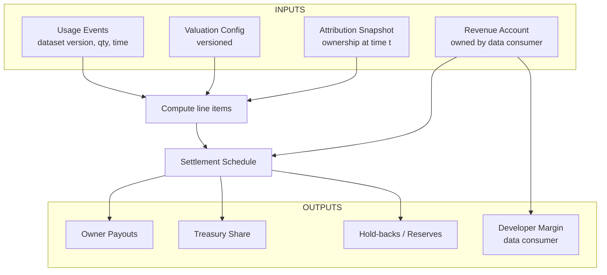

**版税引擎**把数据集的**使用**与**收入**转化为**所有权持有者**的**分配**——干净、可预测，并带完整审计轨迹。它组合四类版本化输入：

1) **使用事件（计量）：** 谁在**何时**访问了**哪个数据集版本**及**用量**。  
2) **估值配置：** 访问如何被**定价/加权**（质量、信息增益、供需、治理权重、时新性）。  
3) **归属快照：** 在**事件生效时间**上的**所有权份额**（单元/数据集）。  
4) **收入账户：** 由**数据消费者（AI 构建者）**控制、与该数据集/产品关联的总收入。

<Tip> 
**一句话目标：** **相同事件** + **相同所有权** + **相同估值配置** ⇒ 重放得到**相同分配结果**。
</Tip>

## 分配流程

**发生了什么：** 使用事件与估值生成**明细**；引擎查找**当时**的所有权，应用**金库份额**与**准备金**，并按**时间表**支付。**收入账户**为上述提供资金，同时也承载开发者利润。

- **使用事件（来自访问与计量）：** 签名记录固定**数据集版本**、**用量**（如行/GB/请求）、**时间戳**与**有效价格/权重**版本。  
- **估值配置（受治理）：** 透明、版本化的一组因素，产出每个数据集/版本的**有效价格/权重**。常见因素：**质量/准确性**、**信息丰富度**、**供需**、**市场参照**、**治理分配权重**、**新颖度/时新性**。  
- **归属快照（来自代币化所有权）：** 事件时间点上的**所有权份额**（版本固定）。  
- **收入账户（由数据消费者持有）：** AI 产品收到的收入归集处；用于支付分配、**金库份额**与消费者利润。

<Tip> 
**一切皆版本：** 事件引用估值配置版本与数据集版本；所有权在事件时间点读取。这使分配**可重放**且**可解释**。
</Tip>

## 明细如何计算
对每个使用事件，引擎确定：**用了什么**、**用了多少**、**成本是多少**（来自估值）、以及**当时谁拥有**（来自归属）。随后生成包含总额与按所有者拆分的**明细**，在金库/准备金前。

**示例（概念）：**  
> 包含协议、系统开发者与知识贡献者
- **总使用：** 1,000 次请求 × **$0.002**/请求 = **$2.00**。  
- **准备金（争议保留）：** **5%** × 总额 = **$0.10**，**可分配净额 = $1.90**。  
- **治理拆分（示例；在策略带内）：**  
  - **codatta（协议）：15%** × 净额 = **$0.285**  _(典型区间：10–30%)_  
  - **Schema/Taxonomy/Workflow 开发者：10%** × 净额 = **$0.190**  _(典型区间：5–15%)_  
  - **知识贡献者池：60%** × 净额 = **$1.140**  _(提供者 + 验证者 + 支持者；按所有权)_  
  - **消费者利润（AI 构建者）：余下 15%** × 净额 = **$0.285**

- **知识池内（事件时刻的所有权示例）：**  
  - **样本提供者（患者）：30%** of pool = **$0.342**  
  - **标注者（Dr. Lin）：50%** of pool = **$0.570**  
  - **验证者/支持者：20%** of pool = **$0.228**

- **合计校验：** **$0.10（准备金）** + **$0.285** + **$0.190** + **$1.140** + **$0.285** = **$2.00**。

<Warning>
说明：百分比**受治理与版本化**。任务清单可在允许范围内设定份额。**知识池**的拆分遵循事件时刻的**实际所有权份额**（可因任务/数据集而异）。
</Warning>

## 结算、时间表与币种

- **何时支付：** 按**时间表**（如每周）或达到阈值时。  
- **用什么支付：** 支持**多资产分配**（如稳定币、主流资产或协议代币 $XNY）。  
- **跨链：** 当所有者在不同链上，引擎排队**桥接或兑换**；回执记录路径与汇率。  
- **回执与对账单：** 每次分配包含事件 ID、估值版本、归属快照哈希与最终金额。（见 Products → Royalty Statements）。

## 争议、准备金与重放

- **准备金：** 受治理的**准备金率**可在**争议窗口**内冻结部分明细。  
- **解决：** 当某 CF 被修订/弃用或争议解决，引擎**重算**受影响明细并释放或重分配资金。  
- **重放：** 因为事件、估值与所有权均版本化，重放产出**一致**结果——除非争议修改了输入，此时变更被记录并解释。

## TNPL（先训练后付费）
引擎支持 **TNPL** 协议：构建者可**先访问**数据并**从未来收入中支付**。实践中，事件会累积**递延义务**，在收入到帐时由引擎结算，并向双方提供清晰的对账单。

## 接口

- **输入：** **[/core-concepts/access-control-metering](/core-concepts/access-control-metering)**（事件）、**[/core-concepts/tokenized-ownership-proofs](/core-concepts/tokenized-ownership-proofs)**（归属快照）、**[/core-concepts/data-assembly](/core-concepts/data-assembly)**（数据集/版本 ID）。  
- **输出：** 向**所有者**、**金库**、**准备金**与**开发者利润**的支付；用于审计的**回执**与**对账单**。

## 不变量（必须满足）

- **确定性：** 相同事件 + 相同所有权 + 相同估值配置 ⇒ 相同分配结果。  
- **可追溯：** 每一美元可回溯至数据集版本 → 资产 → CF → 贡献者。  
- **最小披露：** 金额公开；敏感artifact加密。  
- **无追溯修改：** 过去对账单保持有效；更正通过**重算**并记录原因。

<Warning> 
**状态说明（受治理且演进）：**  
- **估值配置**与**金库/准备金政策**由治理设定，可能演进；变更会版本化。  
- **所有权流动性**（二级交易）是**可选**的，不改变分配数学——只改变**谁**收到所有者份额。  
- **币种与桥接**会随生态发展扩展或变更。
</Warning>

