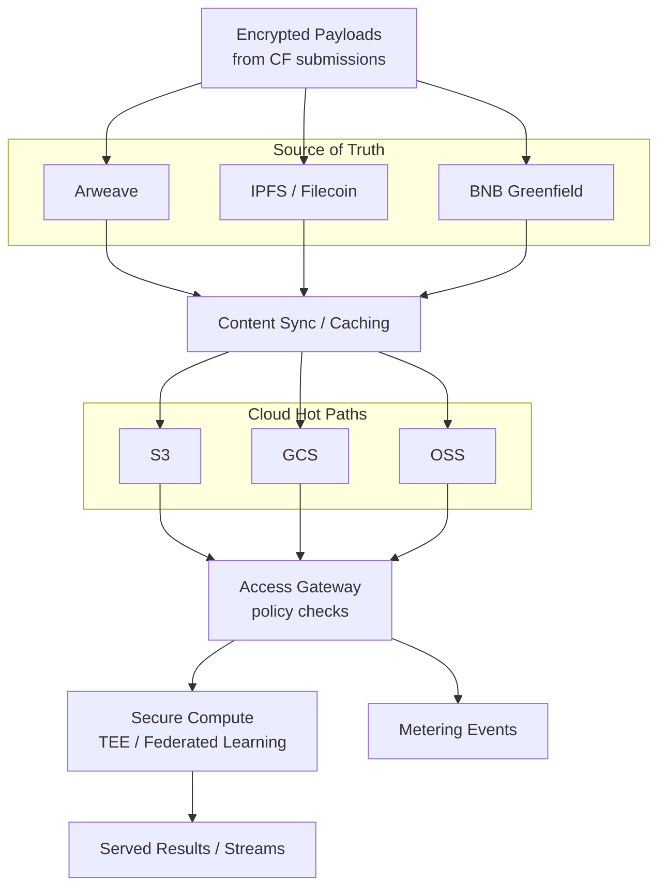

**这一层做什么**  
它让贡献内容**持久、私密、访问快速**。我们把去中心化**真源**与云端**热路径**结合以获得低延迟，并在**安全计算**环境中执行敏感处理。每个返回的字节都绑定到**贡献指纹（CF）**与**数据集版本**，使来源与计费可解释。

## 架构速览

- **真源：** 内容寻址存储（如 **Arweave**、**IPFS/Filecoin**、**BNB Greenfield**）把数据不可变地锚定到 CF 哈希。  
- **热路径：** 云对象存储（**S3/GCS/OSS**）缓存被允许的切片，提供**低延迟读取**与**批处理吞吐**；所有内容回链真源。  
- **访问网关：** 执行策略（角色/属性/令牌门控），产生**计量事件**，必要时交由安全计算。  
- **安全计算：** 隐私敏感工作在 **TEE** 或**联邦式**环境运行；仅授权方可见解密数据。

## 加密与密钥（通俗版）

- **静态与传输加密：** 载荷在存储前即被加密；链路使用 TLS。  
- **封套密钥：** 短期内容密钥由策略控制的主密钥（KMS）包裹。  
- **选择性解密：** 网关仅解密**策略允许**且**必要时段**内的数据。  
- **自带 KMS（可选）：** 企业消费者可接入自有密钥管理。

> **来源保持**：CF 中的内容引用（哈希、CID）从不改变；缓存层仅镜像被允许的字节。

## 安全计算模式

- **TEE 隔离**用于按请求变换（如脱敏、特征提取），无需暴露原始数据。  
- **联邦式运行**支持跨孤岛训练/评测；数据留本地，仅参数/更新流动。  
- **确定性回执：** 输出携带数据集/版本 ID，便于下游计费与审计匹配。

## 可观测性与成本/时延旋钮

- **可观测性：** 保留请求日志、策略决策与计量 ID 以供审计。  
- **旋钮：** 选择缓存 TTL、为常见查询预物化视图、控制复制范围（按区域）。  
- **背压：** 限速与抽样在高负载下保障成本与性能。

## 接口

- **输入：** 来自 **[/core-concepts/data-assembly](/core-concepts/data-assembly)** 的 CF 内容引用（哈希/CID/URI）与**数据集/版本 ID**，以及来自 **[/core-concepts/access-control-metering](/core-concepts/access-control-metering)** 的访问策略。  
- **输出：** 策略门控的字节流/对象、**计量事件**，以及绑定相同版本 ID 的可选 TEE 输出。  
- **交叉链接：** 来源回溯到 CF；计费前往 **[/core-concepts/royalty-engine](/core-concepts/royalty-engine)**。

## 不变量（必须满足）

- **真源优先：** 云缓存永不取代去中心化记录。  
- **可追溯：** 每个返回字节映射到（数据集版本 → 资产 → CF）。  
- **最小披露：** 仅解密/处理最少必要；优先 enclave/联邦模式。  
- **可重放：** 对相同版本的相同请求产生相同计量轨迹。

## 状态说明

- 支持的技术栈会扩展；混合设计保持稳定。  
- TEE 提供方与联邦框架可能随时间变化——接口保持一致。

