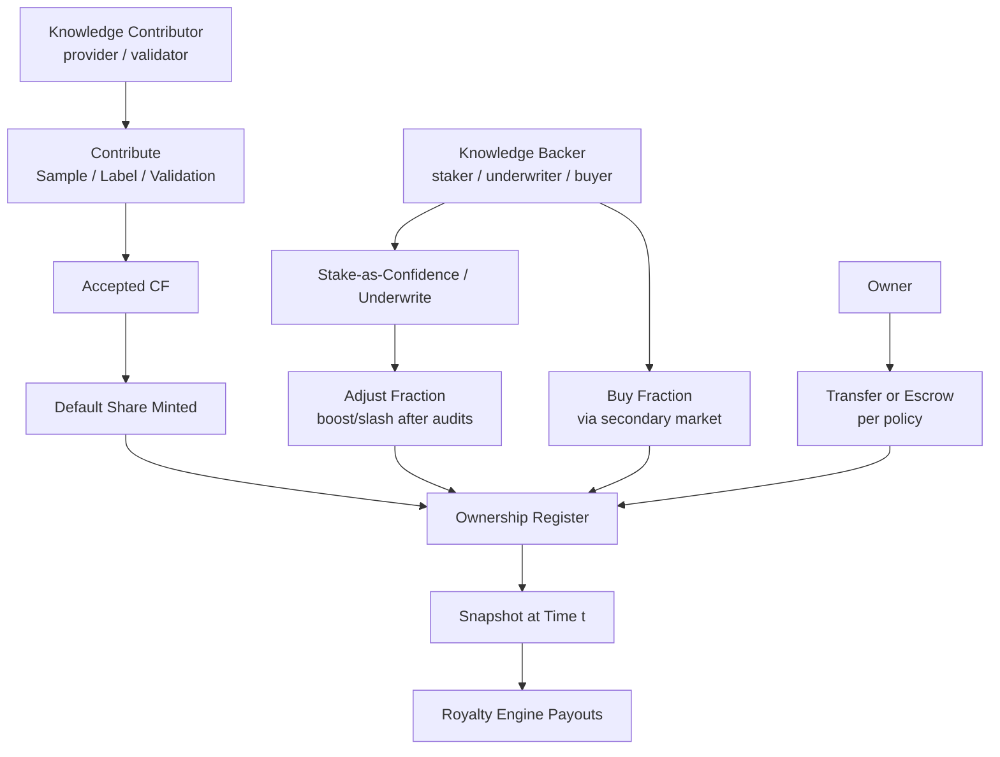
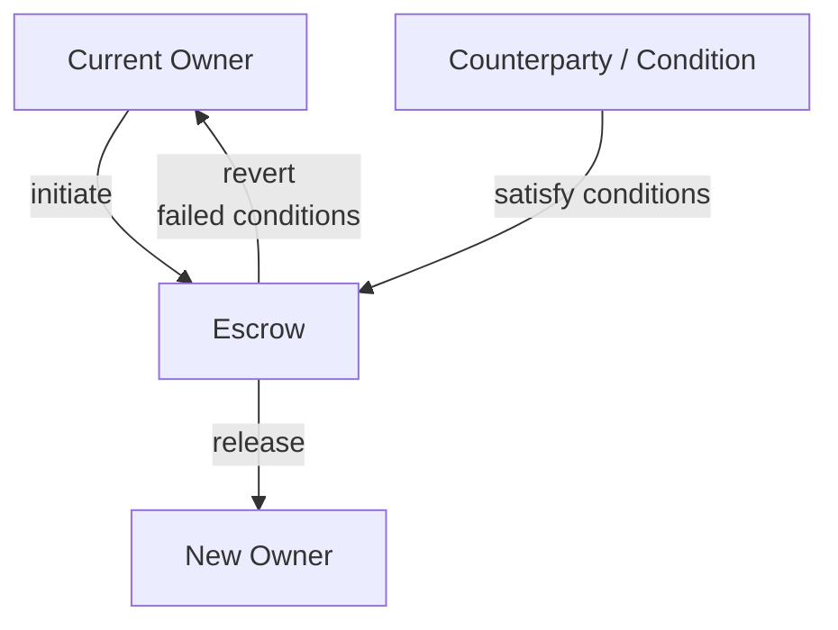

**本页涵盖什么**  
这是关于**谁拥有什么**以及**如何证明**的契约。所有权可附着在**单元**（单个 CF）或**数据集版本**上。权利**可转移**，可用**回执与证明**来佐证，并因**时间固定快照**与**争议窗口**而在分配中安全可用。

## 你可以拥有什么

- **单元级所有权：** 针对单个 **CF** 的份额——样本、标签与验证中常见。  
- **数据集级所有权：** 针对**特定数据集版本**的份额（经策展的 CF 捆绑）。  
- **治理基线：** 协议可按政策保留少量基线份额（如金库、模式/流程开发者）；一切透明且版本化。

<Tip>
所有权是**按份额**的。对某一单元或数据集版本，份额之和始终为 1.0。
</Tip>

## 获得份额的方式

- **知识贡献者（提供者/验证者）**：  
  **贡献样本/标签/验证。** 提交*原子贡献*。当贡献被**接受并发布为 CF**后，协议会按任务策略**铸造默认份额**给贡献者。

- **知识支持者（质押者/担保人/购买者）**：  
  **质押即信心/担保。** 为支持数据质量或担保某一群体/数据集而锁定质押；按计划审计可在治理上限内**提升/削减**份额。  
  **购买份额（二级市场）。** 若启用**所有权流动性**，可通过订单簿/AMM/OTC 买入既有份额。这**不改变分配数学**——只改变**接收者**。

- **转移/托管（受政策控制）**：  
  在身份（钱包/DID）间转移既有份额，或将其置于**托管**，直到满足条件（支付、里程碑、争议解决）。账本记录每次变更；快照在时间 *t* 反映**记录所有者**（含托管）。

## 可导出的证明

- **所有权回执：** 针对某单元/数据集在特定时刻的份额之签名声明。  
- **纳入证明：** 当使用批量锚定时，证明你的回执位于锚定集合中的**Merkle/累加器证明**。  
- **转移回执/托管凭据：** 谁对谁在何条件下转移了什么。  
- **快照哈希：** **版税引擎**用于某时间窗口分配计算的摘要。

<Tip> 
**所有证明**均**带时间戳**并引用数据集/版本 ID，便于审计**精准重放**。
</Tip>

## 争议与挑战窗口

- **挑战窗口：** 在铸造/调整/转移后的一个期间内可提交争议；受影响的分配使用**准备金**直到解决。  
- **解决：** **[/core-concepts/data-assembly](/core-concepts/data-assembly)** 中的修订/弃用可**重塑**所有权；重算解释差异；回执记录前后状态。

---

## 转移 vs 托管——是什么与为什么并存

**转移（直接）：** 在**所有权登记**上立即变更**记录所有者**。用于钱包整合、团队/赠与分配、OTC 交割、争议重新分配或跨组织交接。不同于**购买**，转移可零价或定价且无需价格发现。不同于**铸造**，转移**移动**既有份额——总供给不变。

**托管（有条件）：** **临时持有者**（合约/托管人）在**条件满足**（支付清算、KYC 通过、里程碑完成、争议解决、日期抵达）前接管份额。托管期间，**分配被暂扣**到准备金或**计入托管**，在解决时**释放/重分配**。快照指向时间 *t* 的**托管记录所有者**，使重放保持确定性。

## 流动性（评估中）

所有权的二级市场**可能**存在以改善价格发现与资本效率。它**不是**版税所必需；它仅改变**谁**收到所有者份额，而不改变**资产支付多少**。

<Info> 
**实验性：**  
流动性场所与挂牌标准仍在探索；接口可能变更。
</Info>

## 接口

- **输入：** 已接受的 CF（来自 **[/core-concepts/contribution-fingerprint](/core-concepts/contribution-fingerprint)**）、质押结果、谈判的支持者份额。  
- **输出：** 所有权**回执**、供 **[/core-concepts/royalty-engine](/core-concepts/royalty-engine)** 使用的**快照**、与转移/托管记录。  
- **交叉链接：** 数据集版本来自 **[/core-concepts/data-assembly](/core-concepts/data-assembly)**；策略门控在 **[/core-concepts/access-control-metering](/core-concepts/access-control-metering)**；权限归属（身份）在 **[/core-concepts/identity](/core-concepts/identity)**。

## 不变量

- **快照真实：** 分配使用**时间 *t* 的所有权快照**；后续变更不改写历史。  
- **回执胜于主张：** 若回执与证明可验证，所有权主张成立，直至受治理的争议推翻。  
- **总和为一：** 单元或数据集级份额之和始终为 1.0。  
- **仅追加：** 铸造、调整、转移以新条目记录；账本不编辑旧状态。

<Warning>
**状态说明：**  
- 基线份额（如协议或流程开发者）受治理且版本化。  
- 从声誉到份额上限的映射受治理并可能演进（见 **[/core-concepts/reputation](/core-concepts/reputation)**）。  
- 需要时支持跨链回执与桥接；格式可能扩展。
</Warning>

