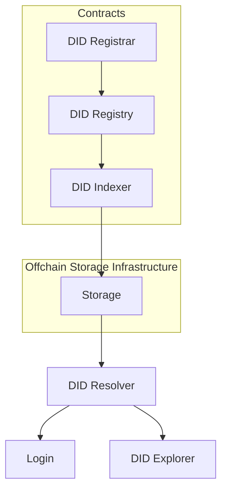

## 概述

Codatta DID是一个去中心化数字身份系统，它为用户提供用户自主控制的去中心化身份，并允许用户进行身份信息的授权、验证和撤销。

Codatta DID为Codatta生态提供必要的支持，但其并非与Codatta绑定，而是被设计为一个可共享的去中心化数字身份基础设施，任何人都可以独立使用。

在Codatta中，Codatta DID被用作生态的唯一身份标识，用于平台的登录授权验证，同时作为数据指纹与数据血缘可信、可追溯的基础标识，同时也是在数据可用性与数据隐私保护机制中，用于主体识别与访问鉴权的关键组件。

## 背景

**现有身份系统**：随着应用形态从单一平台向多链，多平台等多系统协同的方式演进，现有身份体系逐渐暴露出结构性问题：身份割裂，缺乏统一标识；身份依赖平台，用户缺乏自主权；授权模型僵化，难以适配复杂场景；身份与系统实现强耦合，扩展成本高。这些问题导致现有身份系统难以支撑长期、跨环境的身份使用需求。

**去中心化身份**：去中心化身份是由传统的中心化身份演化而来。中心化身份，是由中心化机构控制的，比如居民身份证是政府控制的。而去中心化身份，最大的特点就在于它可以完全由个体自己控制，身份的创建和管理都不依赖于某个中心化的机构。

**W3C DID**：自去中心化身份的概念提出以来，经过多年的研究与标准化推进，W3C 的 DID 规范整合了早期去中心化身份的相关探索，现已被广泛采用，成为 DID 体系的基础标准。  
W3C DID规定每个用户有一个ID用于标识其身份，同时用一个Document记录用户身份信息和相关的一系列数据，比如授权信息，可以用于第三方的登录授权验证，这个设计使得围绕该用户的可信交互成为可能。

## Codatta DID

Codatta DID是W3C DID规范的一个实例，通过自定义的Codatta DID method为用户提供跨链的、可扩展的去中心化身份基础设施，从而应对现有身份系统带来的挑战。

**DID Registrar**

Codatta DID注册入口，负责注册DID。

注册的逻辑不只一种，也不是一次性就能确定的，比如最开始的时候是白名单注册，后面需要改为在创建DID的时候收取一定费用，或者持有指定NFT可免费，最后改为免费注册等。为了保证这种业务模式的可行性，同时保持DID Registry的稳定性，我们将注册的功能独立出来，新增注册逻辑，只需要开发一个新的DID Registrar即可，不会对现有的功能有任何影响。

**DID Registry**

Codatta DID的核心业务实现，包括DID的创建、管理员管理、属性的更新、所有者转移等。所有的操作都会触发相应的事件，链下模块接收到事件之后，可以执行相应的处理逻辑。

此外，该合约记录了完整的DID Document数据，用户可以直接从合约中查询其DID Document。

**Storage**

链下数据存储模块，主要用于存储DID Document，也可以根据业务需求存储其他数据。

链下存储的数据便于扩展，可读性更强，适用高频交互场景，支持链下存储能够提升DID的可扩展性和易用性。

**DID Indexer**

监听链上DID事件，将DID Document数据更新到Storage中。

任何开发者都可以根据Codatta DID method构建自己的Indexer，以支持自己项目的业务功能。

**DID Resolver**

DID解析服务，根据did identifier，查询did document，并使用JSON-LD格式返回。

**DID Explorer**

在DID的基础上开发的浏览器，与blockchain explorer类似，可以方便用户查询DID相关的信息。DID Explorer需要在DID Resolver的基础上进行开发，需要根据@context进行语义解析。

**Login**

开放的登录接口，使得任何平台都可以接入Codatta DID身份系统，并通过其授权验证机制进行登录

## 核心价值

**统一、跨链的身份标识**

Codatta DID 为每个身份主体提供全局唯一的 DID，与具体链或应用无关。

在Codatta DID中，用户拥有全局的身份标识:did:codatta:\<UUIDv4\>，例如did:codatta:bcf71098-397d-4741-a4b6-851384a9d48a。

这个设计解决了传统多链、多应用环境中身份割裂的问题，使同一用户在不同系统中可以被一致识别，形成连续的身份历史。

**用户自主控制，降低平台依赖**

Codatta DID 的身份由用户生成并掌控，系统仅负责解析和验证。

用户不依赖包括Codatta在内的中心化平台，身份及其关联关系可以在不同应用间自由迁移，从而消除平台锁定风险，保障长期可用性。

**灵活授权模型，支持多场景**

通过 Codatta DID method，身份文档可承载细粒度的授权信息，包括不同范围、期限和可撤销的权限。

这一机制使身份能够适配多种使用场景，从简单登录验证，到跨系统协作和自动化授权，解决了传统身份体系授权僵化的问题。