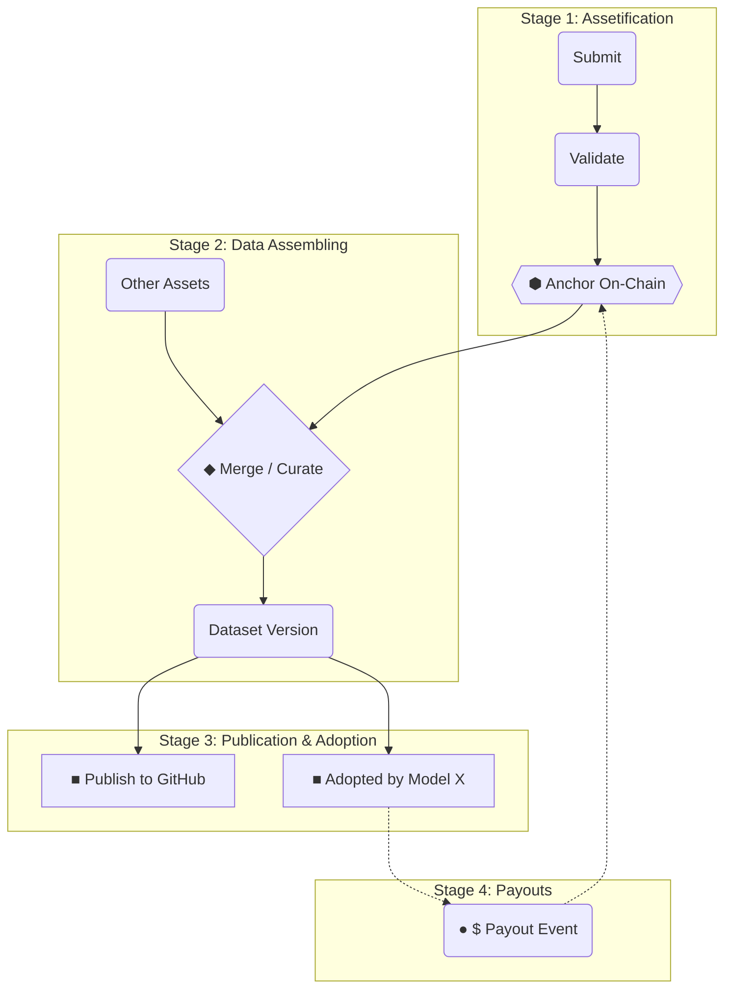

Codatta 提供一套透明、不可篡改的方式，来追踪数据从**原始贡献**到**链上资产**、再到**数据集组装**和**经济分配**的全过程。

**数据谱系 (Data Lineage)** 页面，把这一流程拆解为四个阶段，方便贡献者、验证者、买家和治理参与者理解和审计。

## 谱系可视化

下图（使用英文节点）展示了 Codatta 协议中数据生命周期的四个阶段。

## 生命周期阶段

### 1. 资产化 (Assetification)

原始贡献在这一阶段被转化为可信、不可篡改的链上资产：

- **提交 (Submission)：** 贡献者提交样本、标签等原子贡献，并生成对应的贡献指纹 (CF)。  
- **验证 (Validation)：** 网络中的验证者审核质量、合规性与正确性。  
- **锚定 (Anchoring)：** 通过锚定到区块链生成唯一资产 ID，并确立初始所有权份额。

相关文档：

- **[贡献指纹 (CF)](/cn/core-systems/contribution-fingerprint)**

### 2. 数据组装 (Data Assembling)

在资产化基础上，已经锚定的资产会被策展、组合成可用的数据集版本：

- **组合 (Composition)：** 多个原子资产与资产包被合并进一个数据集装配流程。  
- **版本化 (Versioning)：** 对输入或规则的每次修改都会生成新的数据集版本，方便回滚与对比。  

相关文档：

- **[数据组装 (Data Assembly)](/cn/core-systems/data-assembly)**

### 3. 发布与采纳 (Publication & Adoption)

完成组装与锚定后，数据集被发布并进入实际使用场景：

- **发布 (Publication)：** 数据集被发布到内部目录、HuggingFace、GitHub 或其他平台。  
- **采纳 (Adoption)：** 模型和应用将特定版本的数据集接入训练、评估或推理，形成“有效使用”记录。  

相关文档：

- **[访问控制与计量](/cn/core-systems/access-control-metering)**  
- **[存储、计算与服务](/cn/core-systems/storage-compute-serving)**

### 4. 分润 (Payouts)

当采纳行为产生收入（许可费、API 费用等）时，资金会沿着所有权图回流到权利方：

- **价值流动 (Value Flow)：** 每个付费事件都被绑定到具体的数据集版本与使用上下文。  
- **权利分配 (Distribution)：** 协议按照事件时间点的所有权快照，把净收入分配给贡献者、验证者、支持者和协议金库。  
- **可转让所有权 (Backers)：** 若所有权被二级交易给新的持有者，系统会自动把未来分润支付给当前持有人。  

相关文档：

- **[版税引擎 (Royalty Engine)](/cn/core-systems/royalty-engine)**

