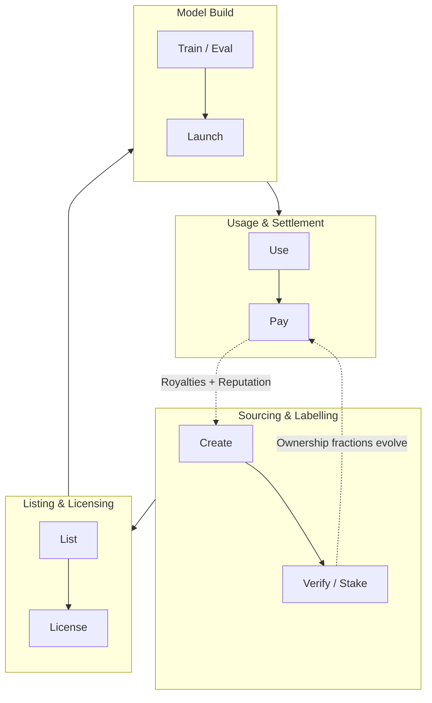

<Tip>
### TL;DR
本页解释了 codatta 如何将数据转化为创收资产（**版税经济**），**先训练后付费（TNPL）**商业模式如何在此基础上运作，并简要说明了为什么区块链基础是使其大规模运作的最实用方法。
要了解大局，请参见我们的愿景：[https://codatta.io/vision](https://codatta.io/vision)。

**关键概念：**
* **版税经济**：基于使用、持续为数据所有者和验证者分配收入。
* **TNPL**：开发者先训练，后通过版税在有价值后付费。
* **区块链（简要理由）**：可编程的所有权、可证明的来源和自动支付。
</Tip>

## 版税经济

### 它是什么

一种协议级机制，将**数据使用**（训练、微调和评估消费，加上**对源自许可数据的下游 AI 模型进行计量推断**）与数据所有者（贡献者、验证者、支持者）和协议金库的**持续版税流**关联。

### 为什么重要

* 将 AI 数据从一次性销售转向**流式、基于使用的收益**。
* 激励对齐：**更好的数据 → 更好的模型 → 更多使用 → 更多版税**。
* 使高技能贡献（如专家标签、基于证据的信号）在经济上可行。

### 如何运作（概念性）

1. **贡献和指纹识别**：数据被贡献并绑定到**贡献指纹**和**谱系-资产记录**。

2. **所有权份额**：通过**贡献、验证和质押即信心**建立所有权（分割、时间限定）。

3. **使用计量和归属**：

   * **训练/微调**：消费事件被记录以建立谱系和归属（谁在何时使用了什么）。
   * **推断（服务）**：对**源自许可数据**的模型使用进行**计量**（如请求/代币/API 调用）以计算版税。

4. **版税路由**：智能合约将收入分配给所有者和金库，遵循当前的所有权份额。

### 分配控制

* **按训练付费**：在**训练/微调消费**期间的小额版税（或仅归属，按交易）；**派生模型的推断被计量**以进行结算。
* **与绩效挂钩**：达到商定的质量阈值时解锁倍数。
* **协议份额**：小部分公共份额维持基础设施、审计和研究。

> **类比**：像音乐流媒体版税，但适用于*知识*：您的数据的每次有意义使用都会回馈给您。

---

## 新商业模式：TNPL（先训练后付费）

**定义**：让开发者**无需预先购买**即可访问数据；如果/当训练模型创造价值时，**版税**回流给数据所有者。

### 开发者工作流

1. **请求访问** → 同意 TNPL 条款（版税率、KPI 条款、终止条件）。
2. **训练/评估** → 协议在类似托管协议下跟踪谱系和使用。
3. **启动和货币化** → 模型/API 盈利；智能合约按 TNPL 条款分配收益。

### 为什么开发者喜欢它

* 降低前期成本和风险；**实验得以解锁**。
* 现金专注于产品-市场契合，而非数据获取。

### 为什么贡献者喜欢它

* 随着实际采用而扩展的**长尾收入**。
* 公平：支付与**测量的影响**和**可验证的使用**挂钩。

### 为什么协议喜欢它

* 最大化数据利用；吸引独立和企业级构建者。
* 创造**加强代币和库需求**的经常性流动。

---

## 为什么是区块链（精简版）

我们在此保持简要，并在专门章节中深入探讨。

* **可编程所有权**：可更新的分割、时间限制所有权，随着质押/验证演变。
* **可证明来源**：链上指纹和谱系使**谁贡献了什么**可审计。
* **自动支付**：智能合约即时且在全球范围内路由版税。
* **开放市场访问**：任何人都可以发现、许可和构建—没有围墙花园。
* **可组合性**：所有权份额可以**重新打包**成投资组合（风险/回报调整）。
* **隐私设计（混合）**：敏感数据保持在链下；证明、哈希和策略在链上。

<Note>
**综合起来**：这些原语构成了运作版税经济的最小可行基础。**可编程所有权**表达和更新获得报酬的权利；**来源**将每次使用绑定到正确的贡献者；**自动支付**和**开放市场访问**使每事件微额版税在经济和全球范围内可行；**可组合性**将原本非流动的数据份额转化为可融资、可发现的资产；**混合隐私**模型满足企业治理和监管。如果没有这个完整组合，归属将无法执行，结算将发展到不可扩展，或市场保持封闭—在这些条件下，**TNPL**和按使用**版税**无法蓬勃发展。
</Note>

## 版税经济中的模式

| 模式                   | 何时支付            | 触发               | 典型使用                | 注释                    |
| ---------------------- | ------------------- | ------------------ | ----------------------- | ----------------------- |
| **按训练付费**         | 训练/服务期间       | 计量使用           | 微调、评估、API         | 平滑的微流动            |
| **与绩效挂钩**         | KPI 达到后          | 准确性/延迟/SLA    | 安全评估、风险信号      | 增加公平性和严谨性      |
| **TNPL**               | 成功后              | 货币化事件         | 初创公司、试点          | 无预付款；分享收益      |

这三种可以在单个合约中组合。

---

## 数据（知识）生命周期和版税流

这个流程说明了 codatta 的**版税经济**中数据和版税的生命周期。
数据经历四个紧凑阶段：**采购和标注**（贡献者通过质押创建和验证数据），
**上市和许可**（数据被发布和许可使用），**模型构建**（开发者训练、微调，
并使用许可数据启动 AI 模型），以及**使用和结算**（模型被部署，用户互动，
版税回流给贡献者）。虚线反馈循环显示**所有权份额**如何演变以及
**版税**和**声誉更新**如何持续滋养生态系统—确保贡献者继续获得收益以及
**所有权**与**已验证参与**保持动态一致。

<Tip>
**示例 — 合规信号（简化）**

加密货币有**大量账户**必须**快速**且**正确**地标注。每次注释都需要**证据**、**可靠的推理**，并必须反映**最新状态**（分钟级，而非周级）。**Codatta** 运行全球**情报网络**—贡献者、验证者和 AI—以大规模产生和更新这些注释。以下步骤**说明了从创建到版税的关键流程**。

<Expandable title="详细信息">
<Steps>
   <Step title="采购和标注"> 
   贡献者提交**基于证据的风险信号**，并带有质押即信心。
   </Step>
   <Step title="上市和许可">
   多个验证者**交叉验证**；所有权份额更新。
   </Step>
   <Step title="模型构建"> 
   KYT 提供商在**TNPL**下订阅；他们的模型和系统得到改进。
   </Step>
   <Step title="使用和结算">
   随着客户使用 KYT API，**版税**流向贡献者集合和金库。
   </Step>
</Steps>
</Expandable>
</Tip>

---

## 角色和激励（谁赚什么）

| 角色           | 贡献                      | 赚取                                      |
| -------------- | ------------------------- | ----------------------------------------- |
| **贡献者**     | 原始数据、标签、证据      | 持续版税（分割份额）                      |
| **验证者**     | QA、反证、审计            | 版税份额 + 验证者赏金                     |
| **支持者**     | 质押即信心、发现          | 与质押影响成比例的版税份额                |
| **协议**       | 基础设施、治理、安全      | 用于可持续发展的金库份额                  |

---

## 合约和条款（通俗语言）

* **版税率**：与使用事件相关的收入百分比。
* **归属范围**：版税涵盖的资产/版本。
* **KPI 条款**（可选）：改变费率的绩效阈值。
* **终止/续约**：时间限制、重新协商触发。
* **可审计性**：记录的数据、如何验证和争议窗口。

---

## 为什么这降低了所有人的风险

* **构建者**：从资本支出转向运营支出；仅在模型有效时支付。
* **贡献者**：免受一次性"雇佣工作"的保护；保留收益。
* **购买者**：从来源到模型影响的透明可见性。

---

## 常见问题（简短）

**问：TNPL 只是付款计划吗？**
*答*：不。它是**可合同约定的收入分成**，由可验证的数据使用和绩效锚定。

**问：我能混合预付费 + 版税吗？**
*答*：是的。支持混合交易（最低保证 + 版税尾款）。

**问：我会失去数据控制吗？**
*答*：不。访问受策略限制；链上策略强制执行范围和条款。

**问：隐私/监管怎么样？**
*答*：敏感内容保持在链下；只有指纹、策略和流在链上。数据室和访问日志可审计。

---

## 另请参阅
* 我们的愿景：[https://codatta.io/vision](https://codatta.io/vision)
* 概念词汇表：版税经济、版税循环、TNPL（即将推出）
* 深入探讨：为什么数据版税使用区块链（即将推出）

