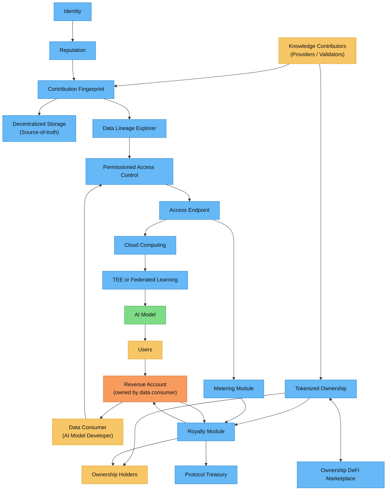

> **TL;DR**  
> Codatta turns human/agent contributions into **verifiable, ownable data assets** with traceable lineage, policy-gated & observable access, provable ownership, and **deterministic royalty payouts**.

## Architecture

## The 4-step flow (end-to-end)

1. **Contribution**: A contributor (human or agent) submits work that is sealed as a **[Contribution Fingerprint](/core-concepts/contribution-fingerprint.mdx)** and bound to **[Identity](/core-concepts/identity.mdx)** and **[Reputation](/core-concepts/reputation.mdx)**.
2. **Assetification**: Atomic contributions (samples, labels, validations) with **verified contribuiton fingerprints**, are assembled and curated into versioned datasets (**[Lineage & Asset Assembly](/core-concepts/lineage-asset-assembly.mdx)**), and are **minted into** on-chain **[Tokenized Ownership](/core-concepts/tokenized-ownership-proofs.mdx)** with **transferable fractions**.
3. **Usage**: AI builders access data through the **[Access Gateway](/core-concepts/access-control-metering.mdx)** backed by secure **[Storage / Compute / Serving](/core-concepts/storage-compute-serving.mdx)**. Every read produces **usage & billing events** (metering).
4. **Royalty**: The **[Royalty Engine](/core-concepts/royalty-engine.mdx)** combines revenue, time-pinned ownership fractions, and metering events to produce **deterministic payouts** to ownership holders and the treasury.

## Key components at a glance

- **Contribution Fingerprint (CF)**: atomic, signed record of *who did what, when, with what evidence*.  
- **Identity & Reputation**: privacy-preserving identity plus staking-as-confidence and accuracy history to score trust.  
- **Lineage & Asset Assembly**: composes CFs into traceable datasets with versioning and provenance queries.  
- **Storage / Compute / Serving**: source-of-truth storage, secure compute (TEE/federated), and performant delivery.  
- **Access Control & Metering**: policy-gated access; emits auditable **usage & billing events**.  
- **Tokenized Ownership**: on-chain, **transferable** ownership fractions over units/datasets with proof exports.  
- **Royalty Engine**: converts revenue into transparent, replayable splits for contributors/backers (ownership holders).

### How to acquire ownership (short)

- **Knowledge Contributors (providers / validators):** contribute **samples / labels / validations**. When your contribution is **accepted and published as a CF**, a **default share** is minted to you (policy-defined per task).  
- **Knowledge Backers (stakers / underwriters / buyers):**  
  - **Stake-as-confidence / Underwrite** to **acquire or boost** fractions; audits can **increase** or **slash** positions within governed caps.  
  - **Buy fractions** on a secondary market (if liquidity is enabled). This **does not change payout math**—only **who** receives the owner share.  
- **Transfer / Escrow:** move fractions directly or place them in **escrow** until conditions are met (payment, KYC, milestones, disputes). Snapshots use the **owner-of-record** at time *t* for payouts.

See **[/core-concepts/tokenized-ownership-proofs](/core-concepts/tokenized-ownership-proofs)** for details.

## Where to start

- **Building the stack:** start with **[Contribution Fingerprint](/core-concepts/contribution-fingerprint.mdx)** → Identity + Reputation → Lineage → Storage/Serving → Access & Metering → Ownership Proofs → Royalty Engine.  
- **Exploring products:** see **Products → Lineage Explorer** and related dashboards for UI/API usage and SDKs.

<Tip>
**Main goal:** use blockchain to **turn data into an ownable asset class** for AI—making rights **provable**, ownership **transferable**, and revenue **shareable** via royalties.
</Tip>