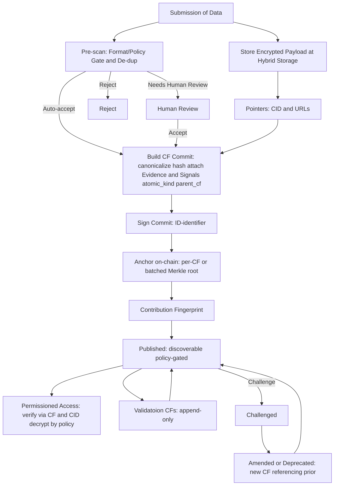

A **Contribution Fingerprint (CF)** is like a **receipt with provenance** for one piece of work.  Whenever someone submits a **sample**, **label**, or **validation** (we call these *atomic contributions*), the system creates **one CF** that permanently links:

- **What** was contributed (a stable reference to the content),
- **Who** did it (the contributor’s wallet or decentralized ID),
- **When** it happened (a timestamp/anchor),
- **Why it’s credible** (attached evidence and review signals).

CFs are the **first brick** of the whole architecture. They make authorship clear, power transparent ownership and royalties, and let anyone trace a dataset back to its origins.

---

## Where CFs fit (big picture)

1. **Contribution →** one CF per atomic contribution.  
2. **Assetification →** many CFs are assembled into **data assets** and versioned **datasets**.  
3. **Usage →** AI builders access datasets via policy‑gated endpoints; usage is metered.  
4. **Royalty →** revenue + metered events + ownership fractions = deterministic payouts.

---

## How a CF is created

**Step explanations**

- **Submit** — The contributor sends the content. We save an **encrypted copy** and a stable reference (content ID or URL).  
- **Pre‑scan** — Light checks for format, privacy redactions, and duplicates. Some items pass automatically; others may need a quick human review.  
- **Create the record** — We standardize the details, mark whether it’s a **sample**, **label**, or **validation**, and attach **evidence & signals** (see below).  
- **Bind identity** — The contributor approves/signs the record using a wallet or decentralized ID (DID).  
- **Anchor on chain** — A fingerprint is immutably anchored to a blockchain (individually or in a batch).  
- **Publish** — The CF becomes discoverable. Access to the original content is **policy‑gated**.  
- **Evaluate & amend** — Reviewers add **their own CFs** (evaluations) or file disputes. We **never overwrite** the original; updates create **new CFs** that reference earlier ones, preserving the full history.

---

## Evidence & signals (how we back a claim)

To keep trust high without exposing private data, each CF can carry structured **evidence** and **signals**:

- **Evidence (artifacts):** transaction IDs, document or image hashes, stable links, or signed credentials that support the claim.  
- **Signals:** how the claim was obtained (**source class** such as heuristic, ML inference, primary document, or on‑chain ground truth) and how it was checked (**validation class** such as none, peer‑reviewed, staked verification, or adjudicated). We can also record **agreement levels** and **reviewer reputations**.

Reviewers and algorithms do **not** edit the original CF. They **append their own CFs** that reference it. That keeps the audit trail clean and explainable.

---

## What CFs enable

- **Clear authorship** — Every atomic contribution has one CF at birth; credit is never lost.  
- **Traceable datasets** — Any dataset can be walked back through assets to the CFs that built it.  
- **Provable ownership** — CFs anchor tokenized, transferable ownership fractions.  
- **Fair payouts** — When data is used, metered events and ownership fractions point back to the right CFs, enabling deterministic royalties.  
- **Accountable improvements** — Validations and corrections are new CFs instead of silent edits.

---

## Example: from contribution to royalties

Dr. Lin contributes a **label** for a medical image, which was **provided by the patient from a recent pathology diagnosis**. The image upload creates one **CF** (for the sample); Dr. Lin’s label creates a **second CF** linked to the first. Both are **anchored on-chain** and **published** (the content stays policy-gated). Independent reviewers add **their own CFs** to confirm or challenge the label; disagreements open a **dispute** that results in a new CF (amend/deprecate) without editing history.
These CFs are assembled into a **versioned dataset**. **Tokenized ownership fractions** are recorded for the patient (sample), Dr. Lin (label), validators (reviews), any backers, and the treasury. An AI builder accesses the dataset via the **access gateway**; usage is **metered**, payments flow to the builder’s **revenue account**, and the **royalty engine** combines revenue, usage events, and time-pinned

---

## Invariants (always true)

- **Append-only CFs:** One CF per atomic contribution at creation; any later change leads to a creation of **new CF**, which is linked to the original (e.g., corrected label, added evidence, validator decision, privacy redaction). Views point to the latest valid CF; earlier CFs remain immutable and auditable.
- **Deterministic & auditable:** the same inputs reproduce the same CF and the same payouts.  
- **Traceable:** served data can be traced from dataset → asset → CF → contributor.  
- **Minimal disclosure:** sensitive payloads remain encrypted; access is policy‑gated.
