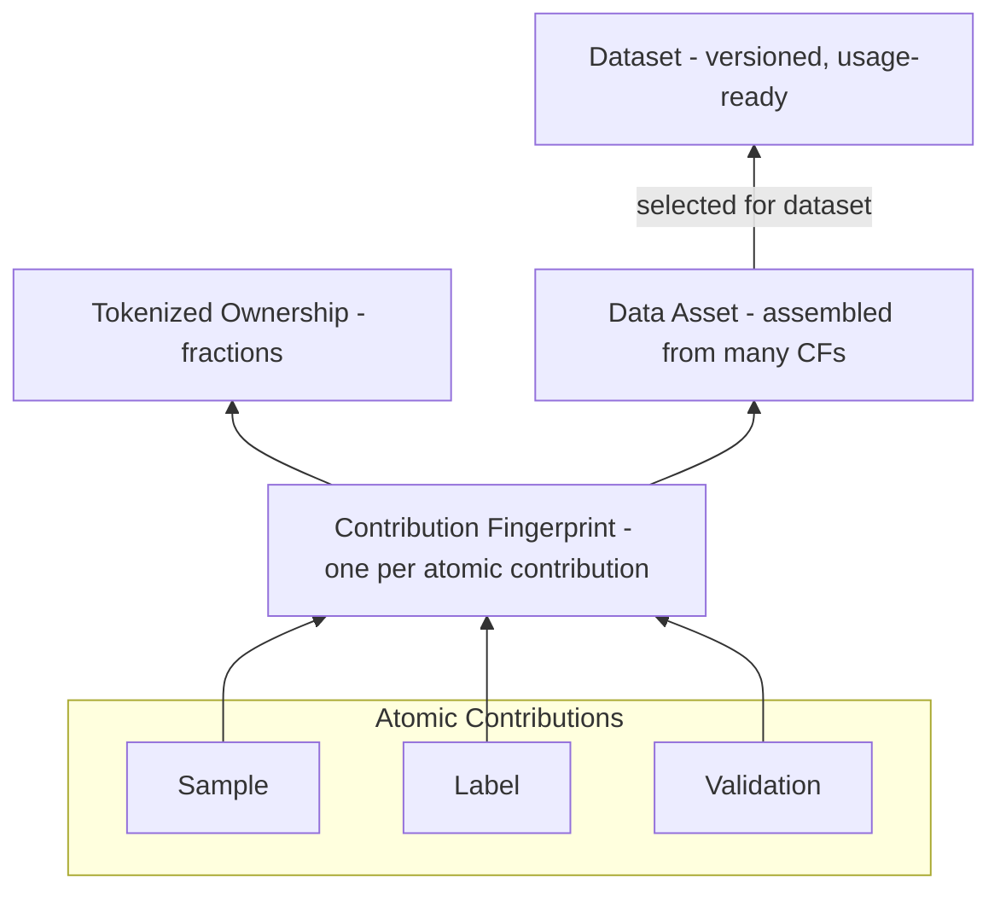
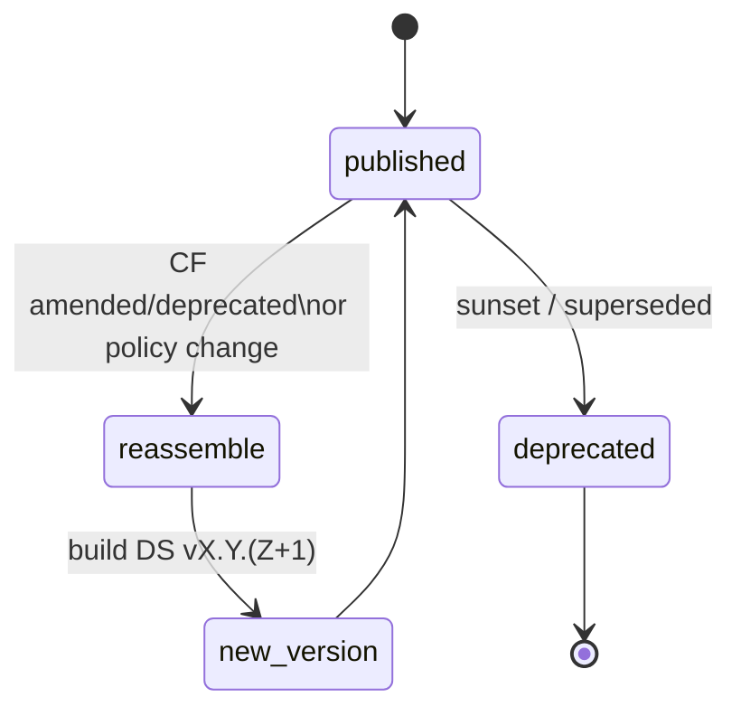
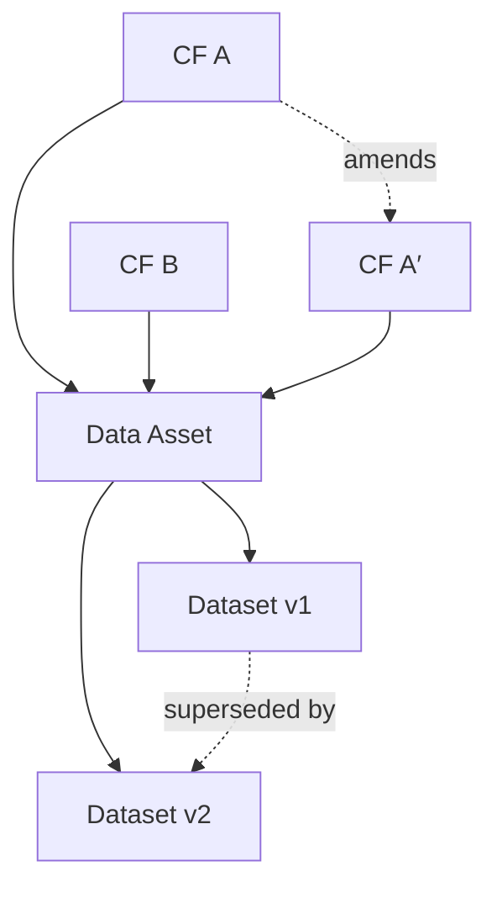

<Tip>
**Mental model.** Contribution Fingerprints (CFs) are the atoms. We assemble CFs into **Data Assets** (reusable bundles), and select assets/CFs into a **Dataset** that is always **versioned**. Lineage keeps a full map so anyone can explain *what’s in*, *why it’s in*, and *where it came from*—and can reproduce the same build later.
</Tip>

## Assembly: From CFs to Assets to a Dataset

**What is an Atomic Contribution?**  
The smallest unit of work recorded by its **own Contribution Fingerprint (CF)** at creation time. We use three kinds: **Sample**, **Label**, and **Validation**. Each atomic contribution has exactly **one CF** when it’s submitted; later fixes or reviews create **new CFs** that reference the originals (never edits).

**Samples, Labels, Validations — how they relate**  
- **Sample** — Original material (e.g., image, text, trace). Stored encrypted, content-addressed, and referenced by CF.  
- **Label** — A structured claim about a **sample** (or another label), e.g., class, bounding box, attribute, rationale. It links back to the thing it describes.  
- **Validation** — A reviewer’s **opinionated verification** of a specific prior CF (sample/label/validation). It states a verdict (approve/reject/score) with a short rationale and optional evidence.

<Warning>
important Validation linkage rule
A **validation cannot stand alone**. It must **reference the CF ID(s)** of the item(s) it evaluates (sample, label, or even another validation). Validators publish **their own CFs**; originals remain immutable. Agreement across validations is used in assembly for inclusion and weighting, while full provenance stays auditable.
</Warning>

**What is a Data Asset?** 
A reproducible, curated bundle of CFs (e.g., “lung pathology cases with validator agreement ≥ 0.7”). Assets are convenient building blocks that can be reused across multiple datasets.

**What is a Dataset?** 
A **usage-ready**, **versioned** collection (one or more assets plus optional direct CFs) pinned by a manifest. Datasets are what AI builders license and access via the gateway.

## Versioning policy

Any change to inputs or rules creates a **new dataset version**. That keeps history immutable and audits simple.

**Triggers for a new version:** new/removed CFs, updated filters or thresholds, different dedup/redaction rules, or any change to the build config. **Diffs** show added/removed/changed CFs and assets between versions.

## Lineage (provenance & diffs)

### What is lineage?
Lineage is the **directed, immutable record** of how artifacts relate over time—linking **Contribution Fingerprints (CFs)** → **Data Assets** → **Dataset versions**, plus the **transformations** that happened (filters, de-dup, redactions) and **state changes** (amended/deprecated). It’s the map that lets anyone prove **what’s inside**, **why it’s included**, and **where it came from**, and to **rebuild** the same dataset later.

**How it’s modeled (plain English):**  
- **Nodes:** CFs, Assets, Dataset versions.  
- **Edges (typed):** `derived-from` (CF → Asset), `selected-into` (Asset/CF → Dataset vX.Y.Z), `validates` (Validation CF → target CF), `amends` / `supersedes` (change history).  
- **Properties:** edges carry timestamps and the **manifest rule** that caused the inclusion. Nodes are never edited—**new nodes/edges** are appended.

### What you can ask (core queries):
- **Why included?** Show the manifest rule and the specific node/edge that satisfied it.  
- **Why excluded?** Show the failed rule (e.g., agreement below threshold).  
- **Where from?** Trace Dataset → Asset → CF → contributor.  
- **What changed?** Diff two versions (added/removed/changed CFs and assets).  
- **Impact analysis:** “If this CF is amended, which assets/dataset versions are affected?”

### Lineage Guarantees
- **Acyclic & append-only (DAG):** lineage never forms cycles and only grows by adding nodes/edges.  
- **Referential integrity:** every dataset entry resolves to valid CFs.  
- **Time-indexed:** edges are timestamped so queries can “time-travel.”  
- **Determinism:** same inputs + same manifest rules ⇒ same version and same lineage.

<Tip>
For UI/API usage, see Products → Lineage Explorer for search, diffs, and export.
</Tip>

## Disputes & re-assembly

If a CF is **amended** or **deprecated** (e.g., corrected label or added evidence), the dataset **re-assembles** to a new version using the same manifest rules. Past versions remain available for audit; future usage follows the latest version. (Reserves and reallocation for payouts are handled by the **Royalty Engine**.)

## Interfaces

- **Inputs:** CFs (and their Evidence & Signals), optional reputation/agreement hints.  
- **Outputs:** dataset **ID** and **version ID**, used by **Storage/Compute/Serving** and **Access/Metering**.  
- **Ownership mapping:** CF-level ownership is carried forward so payouts can be computed at dataset level (details in **Tokenized Ownership Proofs**).

## Invariants

- **Referential integrity:** every dataset entry resolves to CFs with valid anchors.  
- **Determinism:** same inputs + same manifest = same version ID and contents.  
- **Immutability:** past versions never change; new info → new version.  
- **Explainability:** every inclusion/exclusion is tied to a rule or CF state and is easy to show.
