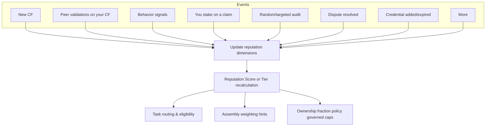

## What is reputation
Reputation is a **multi‑dimensional trust system** for identities (humans or agents). It captures **how accurate** your work is, **how others validate** it, **which attributes you hold** (e.g., credentials), and **how committed** you are (responsiveness, throughput, economic stake). The protocol keeps **granular signals per dimension**, but presents a simple **score** and **tier** for routing and visibility.

## Dimensions & signals
Reputation is **quantitative and multi‑dimensional**. Each dimension is recorded and versioned; governance sets the weights that produce the composite score.

- **Accuracy & agreement** — outcomes of validations on your CFs; pass rate, dispute rate, and reversal history.  
- **Behavioral reliability** — commitment and **responsiveness** (on‑time delivery, review turnaround), sustained throughput, and task completion quality.  
- **Attested attributes** — **third‑party attestations** (e.g., licenses, affiliations, certifications) provided by human participants or trusted registries, and **protocol‑verified** checks (e.g., passing tutorials/quizzes/tests).  
- **Recency** — fresh activity counts more; long inactivity decays gently.  
- **Staking‑as‑confidence** — backing claims with stake; audits can boost or slash reputation.  

<Tip>
The protocol **retains all raw, per‑dimension signals**, so models can improve over time, while UIs show a clear tier and score band. We keep model versions transparent and auditable.
</Tip>

### List of Sample Events which can impact reputation

| Event | Reputation impact |
|---|---|
| Your CF validated with high agreement | Increase (accuracy + agreement) |
| Your CF challenged and overturned | Decrease (dispute loss) |
| Consistently on‑time, responsive participation | Increase (behavioral reliability) |
| You stake and pass random audit | Increase (confidence rewarded) |
| You stake and fail audit (slashed) | Decrease (confidence penalized) |
| New credential/skill verified | Increase (attribute boost; capped) |
| Long inactivity | Gentle decay (recency) |

## What reputation does (functions)

- **Unlocks better work & pay.** Higher reputation **unlocks higher‑paying tasks** and roles that expect quality and commitment. Some tasks also require **additional qualifications** (e.g., professional license, education level, domain expertise); reputation **complements** these requirements, it doesn’t replace them.  
- **Weights contributions during assembly.** Atomic contributions from higher‑reputation identities can receive **more weight** in **Data Assembly** (e.g., lower review quorum, higher inclusion priority). This improves quality while reducing redundant reviews.  
- **Influences ownership fractions (governed).** Within governance‑defined bounds, higher‑reputation contributors may earn a **larger share of ownership fractions** for equivalent contribution types, reflecting trust and expected quality. Exact policies live in **Tokenized Ownership Proofs** and are explained by the **Royalty Engine** during payout.  
- **Boosts via economic commitment.** You can **boost** reputation through **staking‑as‑confidence**. Passing audits increases trust; failed audits decrease it. Skin‑in‑the‑game ties the signal to real consequences.

## How reputation updates (lifecycle)

- New CFs start **neutral**; validations tilt the score up or down.  
- Behavioral signals accumulate continuously.  
- Staking acts as a **multiplier** (positive or negative) after audits.  
- Tiers update on a schedule/cooldown to avoid flapping and gaming.

## Safety, fairness & recovery

- **Sybil & collusion resistance:** aggregate across time; require validator diversity; rate‑limit risky patterns.  
- **Cooldowns & decay:** apply changes on a schedule; introduce gentle decay during inactivity to keep the signal fresh.  
- **Appeals & disputes:** appeal outcomes are recorded; fair corrections help recovery.  
- **No black boxes:** every change maps to recorded events; the model and weights are versioned.

## Privacy & disclosure

- **Public:** your **tier**, coarse score band, and high‑level reasons (e.g., “high agreement”, “verified license”).  
- **Private/permissioned:** raw artifacts/**PII**; prefer **verifiable credentials** and **encrypted evidence** over plaintext.  
- **Selective disclosure:** anonymous credentials / ZK proofs are **experimental** and may change.

## Invariants
- **Event‑driven & append‑only:** reputation changes come from recorded events; history isn’t rewritten.  
- **Deterministic from inputs:** same events + same model version ⇒ same reputation outcome.  
- **Minimal disclosure:** reveal only what policy requires for a decision.  
- **Auditability:** each change links to underlying CFs, validations, or attestations.

## Interfaces

- **Identity:** who the score belongs to; linked wallets/DIDs; verified attributes.  
- **Contribution Fingerprints:** validations and audits on your CFs drive updates.  
- **Data Assembly:** reputation supplies **weighting hints** and can reduce review needs.  
- **Tokenized Ownership Proofs & Royalty Engine:** governed policies may map reputation to **ownership fractions** and explain splits at payout time.  
- **Access & Metering:** tiers and attributes map to policy (who can do what; how much review is needed).

<Warning>
**Status notes**: 
Weights, tier thresholds, staking parameters, and any mapping from reputation to ownership are **governed** and may evolve. Anonymous credentials and ZK selective disclosure are **experimental** and could change.
</Warning>