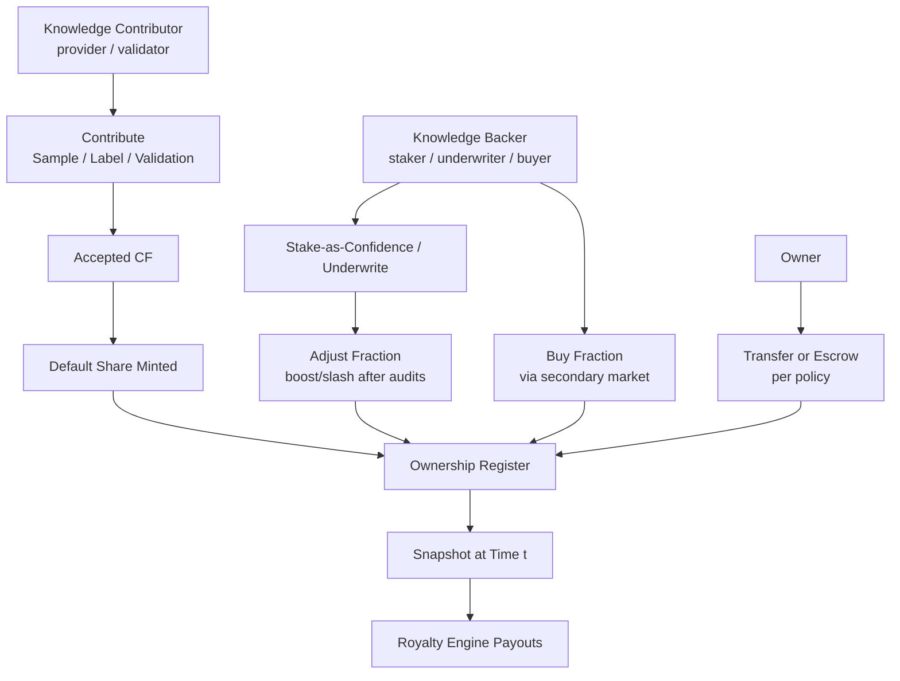
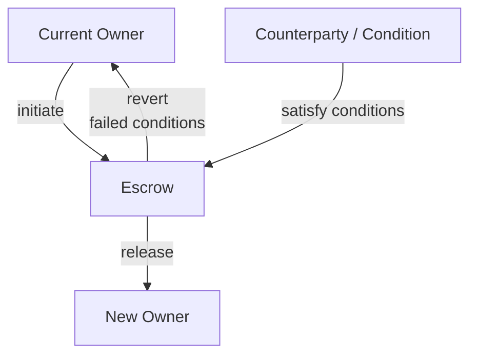

**What this page covers.**  
This is the contract for **who owns what**—and how to prove it. Ownership can attach to a **unit** (a single CF) or to a **dataset version**. Rights are **transferable**, provable with **receipts and proofs**, and safe to use in payouts thanks to **time‑pinned snapshots** and **challenge windows**.

## What you can own

- **Unit‑level ownership:** a fraction over a single **Contribution Fingerprint (CF)**—common for samples, labels, and validations.  
- **Dataset‑level ownership:** a fraction over a **specific dataset version** (a curated bundle of CFs).  
- **Governed baselines:** the protocol may reserve a small baseline share (e.g., treasury, schema/workflow developer) as defined by policy; everything is transparent and versioned.

<Tip>
Ownership is **fractional**. Fractions always sum to 1.0 for the unit or dataset version in question.
</Tip>

## Acquiring fractions

- **By Knowledge Contributors (providers / validators):**  
  **Contribute samples / labels / validations.** Submit *atomic contributions* (sample, label, validation). When the contribution is **accepted and published as a CF**, the protocol **mints a default share** (policy‑defined per task) to the contributor.

- **By Knowledge Backers (stakers / underwriters / buyers):**  
  **Stake‑as‑confidence / Underwrite.** Lock stake to support data quality or underwrite a cohort/dataset; scheduled audits can **boost** or **slash** your fraction within governed caps.  
  **Buy fraction (secondary market).** If **ownership liquidity** is enabled, purchase existing fractions via orderbook/AMM/OTC. This **does not change payout math**—only **who** receives the owner share.

- **By Transfer/Escrow (policy‑controlled):**  
  Move existing fractions between identities (wallet/DID) or place them in **escrow** until conditions are met (payment, milestones, dispute resolution). The ledger records every change; snapshots reflect the **owner‑of‑record** (including escrow) at time *t*.

## Proofs you can export

- **Ownership receipt:** a signed statement of your fraction for a unit/dataset at a given time.  
- **Inclusion proof:** when using batched anchors, a **Merkle/accumulator proof** that your receipt is in the anchored set.  
- **Transfer receipt / escrow note:** who transferred what, to whom, under which conditions.  
- **Snapshot hash:** the digest used by the **Royalty Engine** to compute payouts for a time window.

<Tip> 
**All proofs** are **time‑stamped** and reference dataset/version IDs so audits can replay outcomes exactly.
</Tip>

## Disputes & challenge windows

- **Challenge window:** for a period after mint/adjust/transfer, a dispute can be filed; affected payouts use **reserves** until resolution.  
- **Resolution:** amendments/deprecations in **[/core-concepts/data-assembly](/core-concepts/data-assembly)** can re‑shape ownership; recomputation explains deltas; receipts capture before/after.

---

## Transfer vs Escrow — what they are (and why both exist)

**Transfer (direct):** an immediate change of owner‑of‑record on the **Ownership Register**. Use it for wallet consolidation, team/grant allocations, OTC settlement, dispute reallocation, or cross‑org handoff. Unlike a market **purchase**, a transfer can be zero‑price or priced and doesn’t require price discovery. Unlike **minting**, transfer **moves** existing fractions—total supply is unchanged.

**Escrow (conditional):** a **temporary holder** (contract/custodian) takes the fraction until **conditions** are met (payment clears, KYC passes, milestone delivered, dispute resolved, date reached). During escrow, **payouts are withheld** to reserves or **accrue to escrow**, then **released/reallocated** at resolution. Snapshots point to the **escrow owner‑of‑record** at time *t*, so replays stay deterministic.

## Liquidity (under review)

A secondary market for ownership **may** exist to improve price discovery and capital efficiency. It is **not required** for royalties; it only changes **who** receives the owner share, not **how much** the asset pays.

<Info> 
**Experimental:** 
Liquidity venues and listing standards are under exploration; exact interfaces may change.
</Info>

## Interfaces

- **In:** accepted CFs (from **[/core-concepts/contribution-fingerprint](/core-concepts/contribution-fingerprint)**), staking outcomes, negotiated backer shares.  
- **Out:** ownership **receipts**, **snapshots** for **[/core-concepts/royalty-engine](/core-concepts/royalty-engine)**, and transfer/escrow records.  
- **Cross‑links:** dataset versions come from **[/core-concepts/data-assembly](/core-concepts/data-assembly)**; policy gates live in **[/core-concepts/access-control-metering](/core-concepts/access-control-metering)**; identity for entitlements lives in **[/core-concepts/identity](/core-concepts/identity)**.

## Invariants

- **Snapshot truth:** payouts use the **ownership snapshot at time *t***; later changes don’t rewrite history.  
- **Receipts beat opinions:** if a receipt and proof verify, the ownership claim stands until a governed dispute overturns it.  
- **Sum to one:** unit or dataset‑level fractions always sum to 1.0.  
- **Append‑only:** mints, adjustments, transfers are recorded as new entries; the ledger never edits old state.

<Warning>
**Status notes**:
- Baseline shares (e.g., protocol or workflow developer) are governed and versioned.  
- Mapping from reputation to ownership caps is governed and may evolve (see **[/core-concepts/reputation](/core-concepts/reputation)**).  
- Cross‑chain receipts and bridges are supported where needed; formats may expand over time.
</Warning>