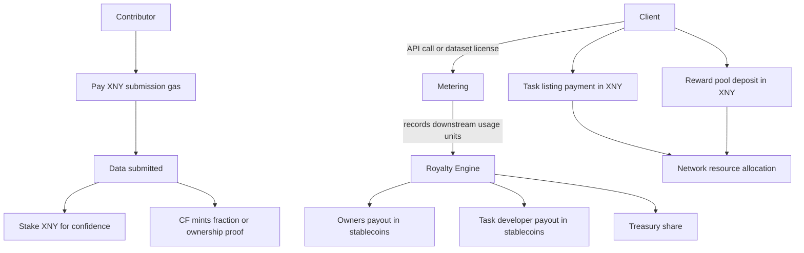

> **Principles**
> - **$XNY is protocol fuel**: submission gas, task launch payment (to protocol treasury), staking as confidence, ownership exchange.
> - **Stablecoins are the default royalty currency** via TNPL and usage-based payouts.
> - **Open & integrable**: any app or protocol can launch tasks, access metered assets, and plug into payouts.

### One-glance flow

### Walkthrough
1. **Clients** call an API for data lookup or license a dataset for batch access. **Metering** records usage units of downstream AI products empowered by the accessed data.
2. The **royalty engine** converts usage into revenue and splits it to **owners** — providers, validators, or backers — plus the **task developer** who defines the schema or taxonomy, and the **protocol treasury**.  
3. **Contributors** submit data with a small **$XNY gas** and may **stake $XNY** to boost confidence. The **Content Fingerprint** can mint **fractions** or **proofs of ownership**.
4. For **clients** to launch a task, they **pay $XNY** to list the task and may **deposit $XNY** into a reward pool to activate the task and attract knowledge contributors.
5. **Payouts** are distributed in **stablecoins by default**; policy can allow alternatives if mutually opted-in.

### Core math

- **Unit revenue** = `usage_units × price_per_unit`  
- **Royalty pool** = `unit_revenue × royalty_rate`  
- **Payout to holder i** = `royalty_pool × owner_fraction_i × quality_multiplier_i`  

**Tiny example**: 1,000,000 API calls at 0.001 USD per call, royalty_rate 60% → 600 USD to owners and other eligible parties.  
If a holder owns 2% with multiplier 1.1 → `600 × 0.02 × 1.1 = 13.2 USD`.
