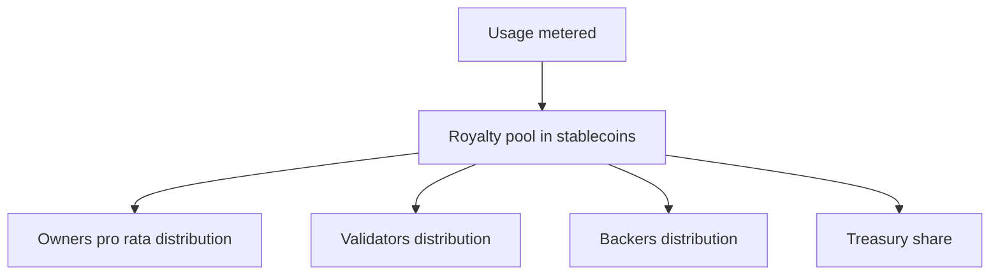

<Warning>
Ownership liquidity is an early-stage exploration. The concepts on this page will be tested and experimented over time. Treat this content as communication material, not the actual or final design.
</Warning>

### Minting and default splits

Each verified asset mints **fractions** that represent ownership. Policies define splits at mint time, for example:

| Share class | Typical range | Notes |
|---|---|---|
| **Contributors** | Largest share | Primary creators of the data unit |
| **Validators** | Small to medium | Tied to verification depth and accuracy |
| **Backers** | Small to medium | For underwritten cohorts or advances |
| **Protocol treasury** | Small default | Funds audits, grants, and infra |

> Exact ranges are **policy knobs** per task or cohort and can vary by domain.

### Settlement path

- **Cadence**: continuous accrual with **monthly settlement** by default  
- **Currency**: payouts are **stablecoins by default**  
- **Cross-chain**: settlements can bridge via approved routes when policies permit

### Ownership liquidity

| Mechanism | What it enables | Token usage |
|---|---|---|
| **Transfer** | Simple change of fraction holder | $XNY fee for settlement and indexing |
| **Portfolio bundling** | Diversified baskets across tasks or domains | $XNY to create and list bundles |
| **Secondary markets** | Market discovery for data assets | $XNY listing fees and settlement; payouts still in stablecoins |
