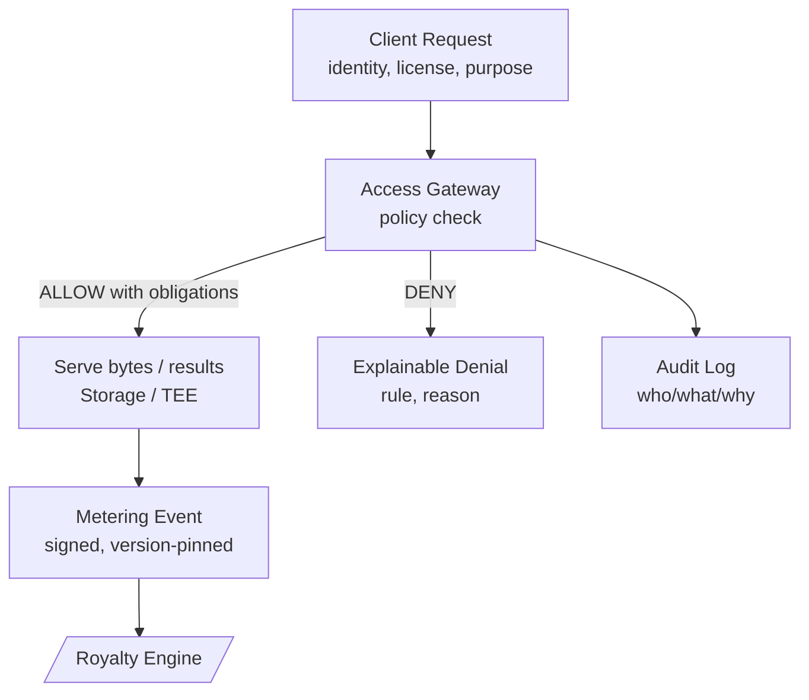

**What this layer does.**  
The **Access Gateway** decides **who** can read **which dataset version**, **how much**, and **under what conditions**. The **Metering module** turns permitted reads into **signed usage events** that later drive **billing and royalties**. Policies are clear, versioned, and auditable; events are replayable.

## Big picture (request → decision → serve → meter)

- **Policy check:** evaluate identity, credentials/VCs, tier (**[/core-concepts/reputation](/core-concepts/reputation)**), dataset version, region/time, license/TNPL.  
- **Obligations:** a decision can require **masking**, **sampling**, **rate‑limit**, **watermarking**, or **TEE execution** before serve.  
- **Metering:** emits an event with **dataset version**, **quantity** (rows/GB/requests), **timestamp**, **valuation config version**, **rule ID**, and a **signature**.

## Policy fundamentals

Policies are **attribute‑based (ABAC)** with role‑based (RBAC) shortcuts. Each decision evaluates:

- **Principal:** requester identity (wallet/DID), **verification level** (VC/KYC), **reputation tier**, org/team.  
- **Resource:** **dataset ID + version**, asset tags, sensitivity class.  
- **Action:** read, sample, export, stream, aggregate, etc.  
- **Context:** time/region, purpose (research/commercial), quota/budget, license/TNPL, dispute status.

**Outcomes:** **ALLOW / DENY / ALLOW‑WITH‑OBLIGATIONS.** Obligations can include field redaction, aggregation, cache‑only, or TEE‑only processing. The gateway records **which rule matched** and **why**.

> Policies are **versioned**; decisions store the policy version so replays match the original outcome.

## Metering events

Each permitted read produces one or more **usage events**. In human terms, an event captures:

- **Who:** requester identity (or org), and payment account.  
- **What:** dataset **ID + version**, and resource kind (file/object/query).  
- **How much:** rows/GB/requests/seconds.  
- **When:** timestamp + **effective time** for valuation and ownership.  
- **Why allowed:** matched **policy rule ID** and obligation set (e.g., “mask+sample”).  
- **How priced:** **valuation config version** used to derive the **effective price/weight**.  
- **Proofs:** gateway **signature**, optional enclave attestation, and an **event ID**.

Events feed the **[/core-concepts/royalty-engine](/core-concepts/royalty-engine)**. Because events, ownership, and valuation are versioned, payouts are **deterministic** and **explainable**.

## Licenses & payment modes

- **Standard license:** pay‑as‑you‑go; usage events settle against the **revenue account** of the data consumer.  
- **TNPL (Train‑Now‑Pay‑Later):** access now, accrue **deferred obligations**; settle when revenue lands.  
- **Prepaid/credit modes:** subtract from credits; events still recorded for audits.

## Rate limits, quotas & sampling

- **Rate limits & quotas:** throttle per identity/org/region; burst and cooldown windows prevent abuse and control cost.  
- **Sampling:** serve representative slices for exploration; full access requires higher policy tiers or payment.  
- **Fair usage:** flag outliers; require stronger credentials or TEE‑only paths for sensitive queries.

## Privacy & secure serving

- **Minimal disclosure:** decrypt only the necessary bytes; prefer **TEE** or **federated** execution **[/core-concepts/storage-compute-serving](/core-concepts/storage-compute-serving)**.  
- **Selective disclosure:** require specific credentials/claims rather than raw PII.  
- **Masking & aggregation:** obligations can enforce field‑level masking or return aggregates only.

## Audits & replays

- **Audit logs:** who asked, which rule matched, why, and what was served.  
- **Replays:** given a request, policy version, and dataset version, the gateway must return the **same decision**; given the same events, the Royalty Engine computes the **same payouts**.

## Interfaces

- **Inputs:** requester identity/credentials (**[/core-concepts/identity](/core-concepts/identity)**), tier (**[/core-concepts/reputation](/core-concepts/reputation)**), dataset/version (**[/core-concepts/data-assembly](/core-concepts/data-assembly)**), and storage endpoints (**[/core-concepts/storage-compute-serving](/core-concepts/storage-compute-serving)**).  
- **Outputs:** **metering events** (to **[/core-concepts/royalty-engine](/core-concepts/royalty-engine)**), audit logs, and policy decisions (allow/deny/obligations).  
- **Cross‑links:** ownership snapshots for pricing/attribution come from **[/core-concepts/tokenized-ownership-proofs](/core-concepts/tokenized-ownership-proofs)**.

## Invariants

- **Explainable:** every decision cites a rule and policy version.  
- **Deterministic:** same request + same policy + same dataset version ⇒ same decision.  
- **Traceable:** every served byte ties back to dataset version → assets → CFs.  
- **Tamper‑evident:** events and logs are signed; disputes use reserves until resolved.

## Status notes

- Policy language and valuation hooks are **governed** and may evolve; versions are preserved.  
- Support for additional identity schemes, enclaves, and licensing modes may expand over time.
