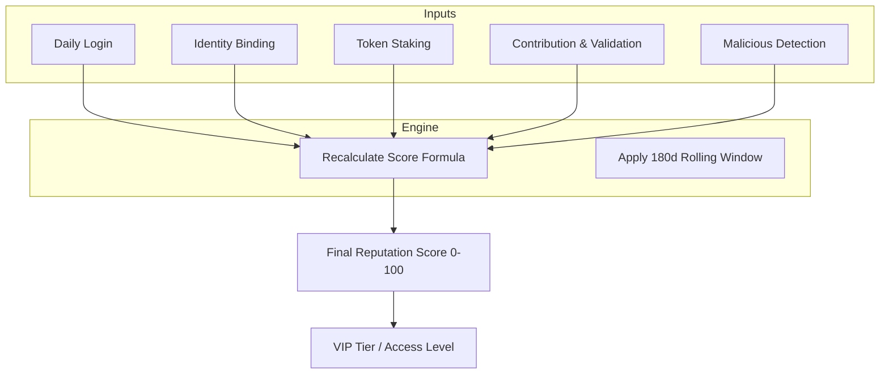

## What is reputation

Reputation is the **core trust metric** for identities (humans or agents) within the Codatta network. It is a **quantitative score** (ranging from 0 to 100) that captures **how accurate** your work is, **how consistent** your participation is, and **how committed** you are through economic staking.

Unlike opaque "black box" algorithms, Codatta's reputation system is **fully transparent and deterministic**. The protocol keeps **granular signals per dimension** but presents a simple **composite score** for routing, visibility, and reward calculation.

### Why build reputation

Reputation is not just a vanity metric; it is the engine that drives value distribution and security.

- **For Users (Incentives & Privileges):**
  - **Direct Reward Impact:** Reputation heavily influences significant economic events, such as weighting during **Token Generation Events (TGE)** or determining exchange rates for **Points-to-Token conversions**.
  - **VIP Access (The "Alpha" Status):** Similar to Binance's Alpha Points or airline VIP tiers, high reputation unlocks system privileges—such as higher referral reward caps, priority access to high-yield tasks, or lower service fees.
- **For the Platform (Security & Quality):**
  - **Sybil Resistance:** It creates a cost barrier for malicious actors.
  - **Quality Filtering:** It differentiates serious contributors from spammers.
  - **Punishment Mechanism:** It provides a handle to penalize malicious behavior swiftly (e.g., reducing score for data poisoning).

### What reputation does (functions)

Beyond the score itself, Reputation serves as a functional layer in the Codatta architecture:

- **Weights contributions.** In **Data Assembly**, atomic contributions from high-reputation identities receive **more weight**. This allows for lower review quorums and higher inclusion priority for trusted users.
- **Governs ownership.** Higher-reputation contributors may earn a **larger share of ownership fractions** for equivalent contribution types, as defined by the **Royalty Engine**.
- **Access control.** Certain high-value tasks or sensitive data validation roles are gated by **Reputation Tiers**.


## The calculation framework

The Reputation Score is **dynamic**, updated based on user actions and time windows (e.g., rolling 180 days). It is composed of four positive dimensions and one negative penalty dimension.

### Total score formula

```
Reputation = 0.1 × R_Login
          + 0.15 × R_Identity
          + 0.2 × R_Staking
          + 0.55 × R_Contribution
          - R_Malicious_Behavior
```

<Tip>
**Transparency Principle:** The calculation logic is open. Every change maps to recorded events, and the model ensures that **Same Events + Same Model = Same Reputation**.
</Tip>

### Identity (R_Identity)

**Weight:** 15% | **Verifies "Humanity" & Reachability**

This dimension promotes Sybil resistance by verifying that the user is reachable and unique across multiple platforms.

```
R_Identity = 100 × (0.05 × isEmail + 0.05 × isX + 0.05 × isTG + 0.05 × isDiscord + 0.8 × R_Others)
```

- **Logic:** Users bind external accounts (Email, X/Twitter, Telegram, Discord).
- **Impact:** Each binding contributes 5 points to this sub-score.
- **Future Proofing:** `R_Others` is reserved for future integrations (currently 0), making the current effective max for this dimension 20 (contributing 3 points to the total Reputation).

### Login activity (R_Login)

**Weight:** 10% | **Rewards Consistency & Habit**

Codatta rewards sustained attention. This score reflects your **Daily Active Usage (DAU)** habit.

```
R_Login = 100 × (daysLogged_180d / 180)
```

- **Logic:** Calculates the number of days you have logged in over the last 180 days (based on UTC+0).
- **Impact:** Consistent daily logins ensure this component remains at 100.

### Staking (R_Staking)

**Weight:** 20% | **Staking as Confidence**

This allows users to "put their money where their mouth is." It measures economic commitment to the ecosystem.

```
R_Staking = 100 × min(1, amountStakeXNY / 50,000)
```

- **Logic:** Reputation increases linearly with the amount of XNY tokens staked.
- **Exchange Rate:** Every 2500 XNY staked adds 1 point to your final Total Reputation Score.
- **Cap:** The effect caps at 50,000 XNY. Staking beyond this demonstrates faith but does not further increase the Reputation score.

### Contribution quality (R_Contribution)

**Weight:** 55% | **The Core Value Driver**

This is the most critical dimension. It assesses the quality of your work using a **Bayesian Smooth Average** (similar to IMDB ratings) to ensure fairness between new users and power users.

```
R_Contribution = 100 × (countAdopt_180d + (20 × 0.5)) / (countAdopt_180d + countRefused_180d + 20)
```

- **Why Bayesian?** It prevents a user with 1 correct submission (100% rate) from artificially outranking a veteran with 990 correct and 10 wrong (99% rate).
- **Parameters:**
  - **0.5:** The baseline probability (neutral start).
  - **20:** The "confidence weight"—it determines how many submissions are needed to significantly move the score away from the baseline.
- **Dynamics:** A new user starts with a sub-score of 50 (contributing 27.5 points to the total). High adoption rates push the score toward 100; high refusal rates push it toward 0.

### Penalties (R_Malicious)

**The "Hammer" Mechanism**

To protect the platform, malicious behavior results in severe score deductions.

```
R_Malicious_Behavior = 100 × min(1, CountBlacklisted / 3)
```

- **Three-Strike Rule:**
  - **1 Strike:** Significant Reputation damage.
  - **3 Strikes:** `R_Malicious` becomes 100, effectively wiping out the user's Total Reputation Score to 0.
- **Triggers:** This is triggered by confirmed malicious intent (e.g., script attacks, deliberate data poisoning) rather than simple mistakes.

## How reputation updates (lifecycle)

Reputation is not static. It follows a lifecycle driven by user events:



- **Real-time & Periodic:** Some signals (like staking) update immediately, while others (like contribution stats) may update on a scheduled cadence.
- **Decay:** The 180-day rolling window ensures that Reputation requires maintenance. Long inactivity results in a gentle decay of the score, keeping the signal fresh.


## Privacy & disclosure

- **Public:** Your **Tier** and **Total Score** are public signals used for routing and leaderboards.
- **Private:** The raw **PII data** (e.g., the specific Telegram handle or email address linked in `R_Identity`) remains encrypted and private. We use **Verifiable Credentials** where possible.
- **No Black Boxes:** While personal data is private, the reasoning behind your score is not. You can always see exactly how your score was derived (e.g., "+30 from Staking").

<Tip>
**Transparency Principle:** The calculation logic is fully transparent. Every change maps to recorded events, ensuring that **Same Events + Same Model = Same Reputation**.
</Tip>

<Warning>
**Status notes:** 
Weights, tier thresholds, staking parameters, and any mapping from reputation to ownership are **governed** and may evolve. The 180-day rolling window and formula parameters may be adjusted through governance to maintain system health and fairness.
</Warning>