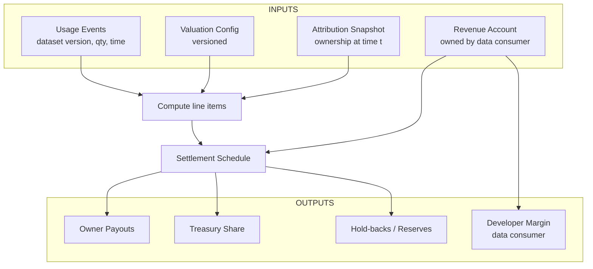

The **Royalty Engine** converts dataset **usage** and **revenue** into **payouts** for ownership holders—cleanly, predictably, and with a full audit trail. It does this by combining four versioned inputs:

1) **Usage events (metering):** who accessed **which dataset version**, how much, and when.  
2) **Valuation configuration:** how access is **priced/weighted** (quality, information gain, demand/scarcity, governance weights, recency).  
3) **Attribution snapshot:** **ownership fractions** for the relevant unit/dataset **at the event’s effective timestamp**.  
4) **Revenue account:** gross revenue controlled by the **data consumer (AI builder)** for that dataset/product.

<Tip> 
**Goal in one sentence:** **same events** + **same ownership** + **same valuation config** ⇒ **the same payout result** on replay.
</Tip>

## The payout flow

**What happens:** usage events and valuation produce **line items**; the engine looks up ownership **at that time**, applies any **treasury share** and **reserves**, and sends payouts on a **schedule**. The **revenue account** funds all of this and also captures the developer margin (the AI product’s share).

- **Usage events (from Access & Metering):** signed records pinning the **dataset version**, the **quantity** (e.g., rows/GB/requests), the **timestamp**, and the **effective price/weight** version.  
- **Valuation configuration (governed):** a transparent, versioned set of factors that yields an **effective price/weight** per dataset/version. Typical factors include: **quality/accuracy**, **information richness**, **demand/scarcity**, **market references**, **governance distribution weights**, and **novelty/recency**.  
- **Attribution snapshot (from Tokenized Ownership):** the **ownership fractions** for the relevant unit/dataset at the **event time** (version‑pinned).  
- **Revenue account (owned by the data consumer):** where money lands from the AI product; used to fund payouts, **treasury share**, and the consumer’s margin.

<Tip> 
**Version everything.** Events reference a valuation config version and a dataset version; ownership is read at the event’s timestamp. This makes payouts **replayable** and **explainable**.
</Tip>

## How line items are computed

For each usage event, the engine determines: **what was used**, **how much**, **what it costs** (from valuation), and **who owned it at that time** (from attribution). It then creates a **line item** with a gross amount and a breakdown per owner—before any treasury share or reserves.

**Example (conceptual):**  
> with protocol, system developer, and knowledge contributors
- **Gross usage:** 1,000 requests × **\$0.002** per request = **\$2.00**.  
- **Reserve (dispute hold-back):** **5%** of gross = **\$0.10** is **Net distributable = \$1.90**.  
- **Governed splits (illustrative; within policy bands):**  
  - **codatta (protocol): 15%** of net is **\$0.285**  _(typical band: 10–30%)_  
  - **Schema/Taxonomy/Workflow developer: 10%** of net is **\$0.190**  _(typical band: 5–15%)_  
  - **Knowledge contributors pool: 60%** of net is **\$1.140**  _(providers + validators + backers; ownership-driven)_  
  - **Consumer margin (AI builder): remainder 15%** of net is **\$0.285**

- **Inside the knowledge pool (ownership at time *t*, example):**  
  - **Sample provider (patient): 30%** of pool is **\$0.342**  
  - **Labeler (Dr. Lin): 50%** of pool is **\$0.570**  
  - **Validators/backers: 20%** of pool is **\$0.228**

- **Totals check:** **\$0.10 (reserve)** + **\$0.285** + **\$0.190** + **\$1.140** + **\$0.285** = **\$2.00**.

<Warning>
Notes: Percentages are **governed and versioned**. Task manifests may set shares within allowed bands. The **knowledge pool split** follows **actual ownership fractions** at the event’s timestamp (can differ per task/dataset).
</Warning>

## Settlement, schedules & currencies

- **When we pay:** on a calendar **schedule** (e.g., weekly) or when thresholds are met.  
- **What we pay with:** **multi‑asset payouts** are supported (e.g., stablecoins, major assets, or protocol tokens such as $XNY).  
- **Cross‑chain:** when owners are on different chains, the engine queues a **bridge or swap** step; receipts record routes and rates.  
- **Receipts & statements:** every payout includes event IDs, valuation version, attribution snapshot hash, and final amounts. (See **Products → Royalty Statements**.)

## Disputes, hold‑backs & replays

- **Hold‑backs / Reserves:** a governed **reserve rate** can quarantine a slice of matching line items while a **dispute window** is open.  
- **Resolution:** when a CF is amended/deprecated or a dispute resolves, the engine **recomputes** affected line items and releases or reallocates funds.  
- **Replays:** because events, valuation, and ownership are versioned, replays produce **identical** results—unless a dispute changes the inputs, in which case the change is logged and explained.

## TNPL (Train‑Now‑Pay‑Later)

The engine supports **TNPL** agreements: builders can access data **now** and **pay from future revenue**. In practice, this means events accrue **deferred obligations** that the engine settles when revenue lands, with clear statements for both parties.

## Interfaces

- **In:** **[/core-concepts/access-control-metering](/core-concepts/access-control-metering)** (events), **[/core-concepts/tokenized-ownership-proofs](/core-concepts/tokenized-ownership-proofs)** (attribution snapshots), **[/core-concepts/data-assembly](/core-concepts/data-assembly)** (dataset/version IDs).  
- **Out:** payouts to **owners**, **treasury**, **reserves**, and developer **margin**; **receipts** and **statements** for audit.

## Invariants (must hold)

- **Determinism:** same events + same ownership + same valuation config ⇒ same payout result.  
- **Traceability:** every dollar links back to dataset version → assets → CFs → contributors.  
- **Minimal disclosure:** amounts are public; sensitive artifacts stay encrypted.  
- **No retroactive edits:** past statements remain valid; corrections use **recomputation** with a logged reason.

<Warning> 
**Status notes** (governed and evolving):
- **Valuation configuration** and **treasury/reserve policies** are set by governance and may evolve; changes are versioned.  
- **Ownership Liquidity** (secondary trading) is **optional** and does not change payout math—only who receives the owner share.  
- **Currencies & bridges** may be expanded or changed as ecosystems evolve.
</Warning>