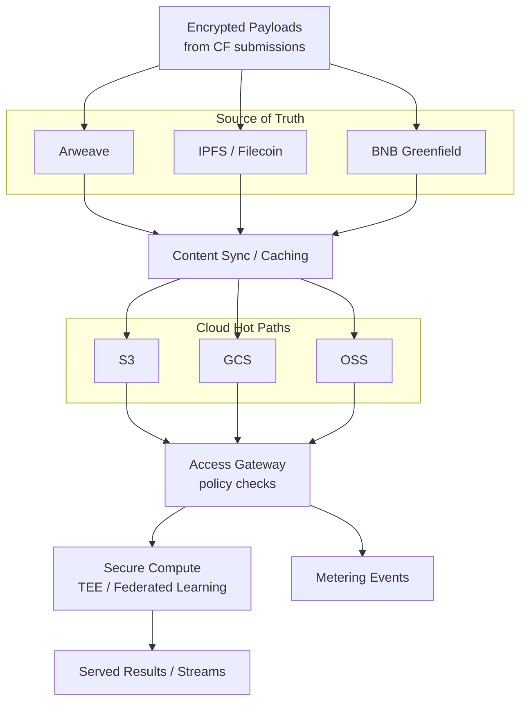

**What this layer does.**  
It keeps contributed content **durable, private, and fast to access**. We combine a decentralized **source‑of‑truth** with cloud **hot paths** for low latency, and execute sensitive processing in **secure compute** environments. Every byte we serve remains tied to **Contribution Fingerprints (CFs)** and **dataset versions** so provenance and billing stay explainable.

## Architecture at a glance

- **Source‑of‑truth:** content‑addressed storage (e.g., **Arweave**, **IPFS/Filecoin**, **BNB Greenfield**) anchors data immutably to CF hashes.  
- **Hot paths:** cloud object stores (**S3/GCS/OSS**) cache permitted slices for **low‑latency reads** and **batch throughput**; everything points back to the source‑of‑truth.  
- **Access Gateway:** enforces policies (role/attribute/token‑gated), emits **metering events**, and hands off to secure compute if needed.  
- **Secure compute:** privacy‑sensitive work runs in **TEEs** or **federated** setups; only authorized parties see decrypted data.

## Encryption & keys (plain language)

- **Encrypt at rest & in transit.** Payloads are encrypted before storage; links use TLS.  
- **Envelope keys.** We use short‑lived content keys wrapped by policy‑controlled master keys (KMS).  
- **Selective decryption.** The gateway decrypts **only what a policy allows**, and only for the time needed.  
- **Bring‑your‑own‑KMS (optional).** Enterprise consumers can plug in their own key managers.

> **Provenance stays intact:** content references in CFs (hashes, CIDs) never change; caching layers only mirror permitted bytes.

## Secure compute patterns

- **TEE enclaves** for per‑request transforms (e.g., redaction, feature extraction) without exposing raw data.  
- **Federated runs** for training/evaluation across silos; data stays local, only updates move.  
- **Deterministic receipts:** outputs carry dataset/version IDs so downstream billing and audits match what was served.

## Observability & cost/latency knobs

- **Observability:** request logs, policy decisions, and metering IDs are kept for audit.  
- **Knobs:** choose cache TTL, pre‑materialize views for common queries, and control replication scope (per region).  
- **Backpressure:** rate limits and sampling protect cost and performance under load.

## Interfaces

- **Inputs:** CF content references (hash/CID/URI), **dataset & version IDs** from **[/core-concepts/data-assembly](/core-concepts/data-assembly)**, and access policies from **[/core-concepts/access-control-metering](/core-concepts/access-control-metering)**.  
- **Outputs:** policy‑gated byte streams/objects, **metering events**, and optional TEE outputs tied to the same version IDs.  
- **Cross‑links:** provenance goes back to CFs; billing goes forward to **[/core-concepts/royalty-engine](/core-concepts/royalty-engine)**.

## Invariants (must hold)

- **Source‑of‑truth first:** cloud caches never replace the decentralized record.  
- **Traceable:** each served byte maps to (dataset version → assets → CFs).  
- **Minimal disclosure:** decrypt and process the least necessary; prefer enclave/federated patterns.  
- **Replayable:** the same request against the same version yields the same metering trail.

## Status notes

- Supported stacks will expand; the hybrid design remains stable.  
- TEE providers and federated frameworks may change over time—interfaces stay the same.
