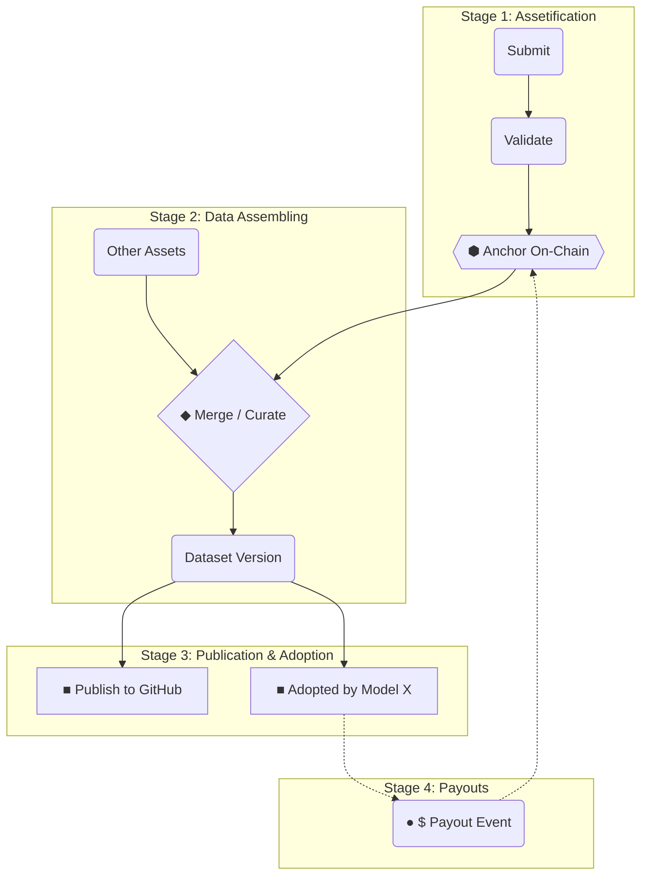

Codatta provides a transparent, immutable visualization of data—from its genesis as a verified asset to its inclusion in larger datasets and final economic utilization.

The **Data Lineage** interface visualizes this lifecycle across four distinct stages.

## Lineage Visualization

The following diagram illustrates the flow of data through the four codified stages of the Codatta protocol.

## Lifecycle Stages

### 1. Assetification

The foundational stage where raw contributions are transformed into trusted, immutable assets. This process involves three critical steps tracked by the lineage graph:

- **Submission:** Contributors submit raw samples (e.g., text, images) and corresponding metadata.
- **Validation:** The network validators verify the quality and accuracy of the submission.
- **Anchoring:** Once validated, the data is immutably recorded (anchored) on the blockchain. This generates a unique Asset ID and establishes the initial ownership rights.

For the underlying mechanics, see:

- **[Contribution Fingerprint (CF)](/core-systems/contribution-fingerprint)** – how each atomic contribution becomes a signed, anchored record.

### 2. Data Assembling

In this stage, individual anchored assets are curated and combined to form comprehensive datasets.

- **Composition:** The lineage view visualizes how multiple atomic assets (from Stage 1) flow into a larger "Assembly."
- **Versioning:** Assembling allows for different versions of a dataset (e.g., "Training Set v1.0") to be created from a pool of assets without altering the underlying provenance of the original contributions.

For assembly rules, manifests, and versioning semantics, see **[Data Assembly](/core-concepts/data-assembly)**.

### 3. Publication & Adoption

Once assembled, datasets are released for utility. This stage tracks the downstream reach of the data.

- **Publication:** Visualizes where the dataset has been pushed (e.g., HuggingFace, GitHub, decentralized storage).
- **Adoption:** Tracks commercial or research usage, such as a specific AI model integrating the dataset for training. This node represents the "proof of utility."

For access control and usage metering, see:

- **[Access Control & Metering](/core-concepts/access-control-metering)**
- **[Storage, Compute & Serving](/core-concepts/storage-compute-serving)**

### 4. Payouts

The final stage closes the economic loop. When an adoption event generates revenue (e.g., a licensing fee), it is visualized as a **Payout Event**.

- **Value Flow:** A connection is drawn from the Payout node back to the original **Anchored Assets**.
- **Distribution to Backers:** Funds are distributed to the *current* ownership holders at the time of the payout snapshot.
  - **Initial Owners:** Originally, ownership belongs to the contributors (submitters), validators, and initial stakers.
  - **Backers:** Because fractional ownership is tradable, the current holder may differ from the original creator. The lineage view identifies these current owners as **Backers**—investors or entities who have acquired ownership rights on the open market. The system ensures rewards reach the wallet currently holding the asset fraction.

For payout math, reserves, and replay guarantees, see **[Royalty Engine](/core-concepts/royalty-engine)**.
