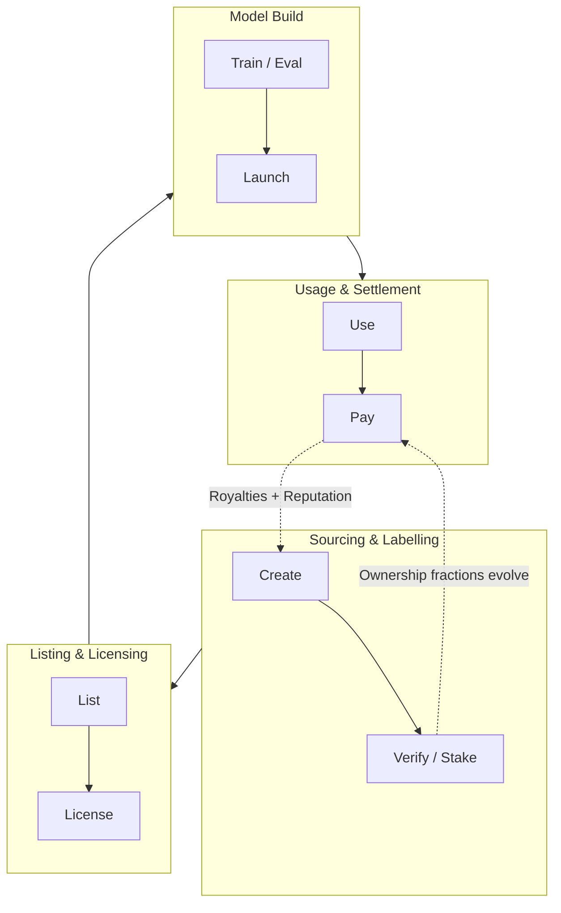

<Tip>
### TL;DR
This page explains how codatta turns data into a revenue‑generating asset (the **Royalty Economy**), how the **Train‑Now, Pay‑Later (TNPL)** 
business model rides on top of it, and, briefly, why a blockchain foundation is the most practical way to make it work at scale. 
For the big‑picture narrative, see our vision: [https://codatta.io/vision](https://codatta.io/vision).

**Key concepts:**
* **Royalty Economy**: usage‑based, ongoing revenue sharing for data owners and validators.
* **TNPL**: developers train first, pay later via royalties once value is created.
* **Blockchain (light rationale)**: programmable ownership, provable provenance, and automated payouts.
</Tip>

## The Royalty Economy

### What it is

A protocol-level mechanism that links **data usage**—training, fine-tuning, and evaluation consumption, plus **metered inference of downstream AI models derived from licensed data**—to **continuous royalty flows** for data owners (contributors, validators, backers) and the protocol treasury.

### Why it matters

* Moves AI data from one‑off sales to **streaming, usage‑based earnings**.
* Aligns incentives: **better data → better models → more usage → more royalties**.
* Makes high‑skill contributions (e.g., expert labels, evidence‑backed signals) **economically viable**.

### How it works (conceptual)

1. **Contribute & fingerprint**: Data is contributed and bound to a **contribution fingerprint** and **lineage‑asset record**.

2. **Ownership fractions**: Ownership is established via **contribution, verification, and staking‑as‑confidence** (fractional, time‑scoped).

3. **Usage metering & attribution**:

   * **Training/Fine‑tune**: consumption events are recorded to establish lineage and attribution (who used what, when).
   * **Inference (serving)**: usage of models **derived from licensed data** is **metered** (e.g., requests/tokens/API calls) for royalty calculation.

4. **Royalty routing**: Smart contracts split revenue to owners and treasury, following the current ownership fractions.

### Distribution knobs

* **Pay‑as‑you‑train**: micro‑royalties (or attribution-only, per deal) during **training/fine‑tune consumption**; **inference of derived models is metered** for settlement.
* **Performance‑linked**: multipliers unlock when agreed quality thresholds are met.
* **Protocol share**: a small public share sustains infra, audits, and research.

> **Analogy**: Like music streaming royalties, but for *knowledge*: every meaningful use of your data pays you back.

---

## New business model: TNPL (Train‑Now, Pay‑Later)

**Definition**: Let developers access data **without upfront purchase**; if/when the trained model creates value, **royalties** flow back to data owners.

### Developer workflow

1. **Request access** → agree to TNPL terms (royalty rate, KPI clauses, sunset conditions).
2. **Train/evaluate** → protocol tracks lineage and usage under an escrow‑like agreement.
3. **Launch & monetize** → model/API earns; smart contracts split proceeds per TNPL terms.

### Why devs love it

* Reduces upfront cost and risk; **experimentation unblocks**.
* Keeps cash focused on product‑market fit, not data acquisition.

### Why contributors love it

* **Long‑tail income** that scales with real adoption.
* Fairness: payout is tied to **measured impact** and **verifiable use**.

### Why the protocol loves it

* Maximizes data utilization; attracts both indie and enterprise builders.
* Creates recurring flows that **strengthen token and treasury demand**.

---

## Why blockchain (light version)

We keep this brief here and dive deep in a dedicated section.

* **Programmable ownership**: Fractional, time‑bound ownership that updates as staking/verification evolves.
* **Provable provenance**: On‑chain fingerprints and lineage make **who contributed what** auditable.
* **Automated payouts**: Smart contracts route royalties instantly and globally.
* **Open market access**: Anyone can discover, license, and build—no walled gardens.
* **Composability**: Ownership fractions can be **repackaged** into portfolios (risk/return tuning).
* **Privacy by design (hybrid)**: Sensitive data stays off‑chain; proofs, hashes, and policy live on‑chain.

<Note>
**Putting it together:** These primitives form the minimum viable substrate for a functioning royalty economy. **Programmable ownership** expresses and updates the right to be paid; **provenance** binds each usage to the correct contributors; **automated payouts** and **open market access** make per-event micro-royalties economical and global; **composability** turns otherwise illiquid data shards into financeable, discoverable assets; and the **hybrid privacy** model satisfies enterprise governance and regulation. Without this full set in concert, attribution becomes unenforceable, settlement becomes unscalable, or markets remain closed—conditions under which **TNPL** and per-use **royalties** cannot thrive.
</Note>

## Modes inside the Royalty Economy

| Mode                   | When it pays            | Trigger              | Typical use                | Notes                    |
| ---------------------- | ----------------------- | -------------------- | -------------------------- | ------------------------ |
| **Pay‑as‑you‑train**   | During training/serving | Metered usage        | Fine‑tunes, evals, APIs    | Smooth micro‑flows       |
| **Performance‑linked** | After KPIs met          | Accuracy/latency/SLA | Safety evals, risk signals | Adds fairness + rigor    |
| **TNPL**               | After success           | Monetization events  | Startups, pilots           | No upfront; share upside |

All three can be combined in a single contract.

---

## Data (Knowledge) Lifecycle and Royalties Flow

This flow illustrates the lifecycle of data and royalties in codatta’s **Royalty Economy**. 
Data moves through four compact phases: **Sourcing and Labelling** (contributors create and verify data through staking), 
**Listing & Licensing** (data is published and licensed for use), **Model Build** (developers train, fine-tune, 
and launch AI models using the licensed data), and **Usage & Settlement** (models are deployed, users interact, 
and royalties flow back to contributors). The dashed feedback loops show how **ownership fractions** evolve and 
how **royalties** and **reputation updates** continually feed the ecosystem -- ensuring that contributors keep 
earning and that **ownership** stays dynamically aligned with **verified participation**.

<Tip>
**Example — Signals for Compliance (simplified)**

Crypto has **massive volumes of accounts** that must be labeled **fast** and **correctly**. Each annotation needs **evidence**, **dependable reasoning** and must reflect the **latest status** (minutes, not weeks). **Codatta** runs a global **intelligence network**—contributors, validators, and AI—to produce and update these annotations at scale. The steps below **illustrate the key flow** from creation to royalties.

<Expandable title="details">
<Steps>
   <Step title="Sourcing & Labelling"> 
   A contributor submits an **evidence‑backed risk signal** with staking‑as‑confidence.
   </Step>
   <Step title="Listing & Licensing">
   Multiple validators **cross‑verify**; ownership fractions update.
   </Step>
   <Step title="Model Build"> 
   A KYT provider subscribes under **TNPL**; their models amd systems improve.
   </Step>
   <Step title="Usage & Settlement">
   As clients use the KYT API, **royalties** stream to the contributor set and treasury.
   </Step>
</Steps>
</Expandable>
</Tip>

---

## Roles & incentives (who earns what)

| Role            | Contributes                      | Earns                                      |
| --------------- | -------------------------------- | ------------------------------------------ |
| **Contributor** | Original data, labels, evidence  | Ongoing royalties (fractional share)       |
| **Validator**   | QA, counter‑evidence, audits     | Royalty share + validator bounties         |
| **Backer**      | Staking‑as‑confidence, discovery | Royalty share proportional to stake impact |
| **Protocol**    | Infra, governance, security      | Treasury share for sustainability          |

---

## Contracts & terms (plain language)

* **Royalty rate**: percentage of revenue tied to usage events.
* **Attribution scope**: which assets/versions the royalties cover.
* **KPI clauses** (optional): performance thresholds that change rates.
* **Sunset/renewal**: time limits, re‑negotiation triggers.
* **Auditability**: what data is logged, how it’s verified, and dispute windows.

---

## Why this reduces risk for everyone

* **Builders**: shift from capex to opex; only pay if the model works.
* **Contributors**: protection from one‑off “work‑for‑hire”; upside preserved.
* **Buyers**: transparent line‑of‑sight from source to model impact.

---

## FAQ (short)

**Q: Is TNPL just a payment plan?**
*A:* No. It’s a **contractual revenue‑share** anchored by verifiable data usage and performance.

**Q: Can I mix upfront + royalties?**
*A:* Yes. Hybrid deals are supported (minimum guarantee + royalty tail).

**Q: Do I lose control of my data?**
*A:* No. Access is policy‑gated; proofssimpl/on‑chain policy enforce scope and terms.

**Q: What about privacy/regulation?**
*A:* Sensitive content stays off‑chain; only fingerprints, policies, and flows are on‑chain. Data rooms and access logs are auditable.

---

## See also
* Our vision: [https://codatta.io/vision](https://codatta.io/vision)
* Concept glossary: Royalty Economy, Royalty Loop, TNPL (coming soon)
* Deep dive: Why blockchain for data royalties (coming soon)
