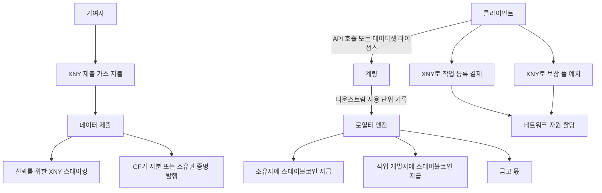

> **원칙**
> - **$XNY는 프로토콜의 연료**: 제출 가스, 작업 시작 비용(프로토콜 금고), 신뢰를 위한 스테이킹, 소유권 교환.
> - **스테이블코인(stablecoin)이 기본 로열티 통화**이며 TNPL과 사용량 기반 정산으로 분배됩니다.
> - **개방적이며 통합 가능**: 어떤 앱이나 프로토콜도 작업을 개시하고, 계량된 자산에 접근하며, 지급 흐름에 연결할 수 있습니다.

### 한눈에 보는 흐름

### 단계별 설명
1. **클라이언트**는 데이터 조회를 위해 API를 호출하거나 배치 접근을 위해 데이터셋을 라이선스합니다. **계량**은 해당 데이터로 강화된 다운스트림 AI 제품의 사용 단위를 기록합니다.
2. **로열티 엔진**은 사용을 수익으로 전환하여 **소유자**(제공자, 검증자, 후원자), **작업 개발자**(스키마/분류 체계 정의), 그리고 **프로토콜 금고**에 분배합니다.  
3. **기여자**는 소량의 **$XNY 가스**로 데이터를 제출하고 **$XNY를 스테이킹**하여 신뢰를 높일 수 있습니다. **콘텐츠 지문(CF)**은 **지분** 또는 **소유권 증명**을 발행할 수 있습니다.
4. **클라이언트**가 작업을 개시하려면 **$XNY**로 등록 비용을 지불하고, 작업을 활성화하고 지식 기여자를 유치하기 위해 보상 풀에 **$XNY**를 예치할 수 있습니다.
5. **지급**은 기본적으로 **스테이블코인**으로 분배되며, 정책에 따라 상호 합의 시 대안을 허용할 수 있습니다.

### 핵심 수식

- **단위 수익** = `usage_units × price_per_unit`  
- **로열티 풀** = `unit_revenue × royalty_rate`  
- **보유자 i 지급액** = `royalty_pool × owner_fraction_i × quality_multiplier_i`  

**간단 예시**: API 호출 1,000,000건 × 0.001 USD/건, `royalty_rate = 30%` → **300 USD**가 소유자 등에게 배분.  
보유 지분 **2%**, 승수 **1.1**이면 → `300 × 0.02 × 1.1 = 6.6 USD`.

