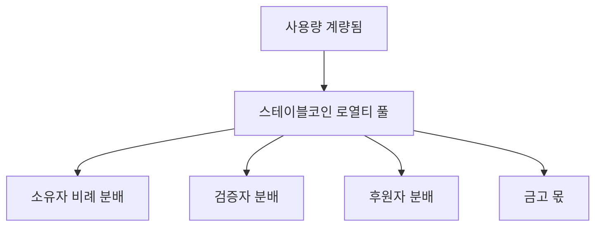

<Warning>
소유권 유동성은 아직 초기 탐색 단계입니다. 본 페이지의 개념은 시간에 따라 검증과 실험을 거칠 예정입니다. 이 내용은 실제/최종 설계가 아닌 커뮤니케이션 자료로 간주해 주세요.
</Warning>

### 발행과 기본 분배

검증된 각 자산은 소유권을 나타내는 **지분(fractions)**을 발행합니다. 정책은 발행 시 분배를 정의합니다. 예:

| 지분 유형 | 일반 범위 | 비고 |
|---|---|---|
| **기여자** | 가장 큰 비중 | 데이터 단위의 주요 창작자 |
| **검증자** | 소~중간 | 검증 깊이와 정확도에 연동 |
| **후원자** | 소~중간 | 코호트 인수/선지급 지원 |
| **프로토콜 금고** | 기본 소량 | 감사, 보조금, 인프라 재원 |

> 정확한 범위는 작업/코호트별 **정책 조정치**이며 도메인에 따라 달라질 수 있습니다.

### 정산 경로

- **주기**: 지속적 발생, 기본 **월별 정산**  
- **통화**: 지급은 기본적으로 **스테이블코인**  
- **크로스체인**: 정책 허용 시 승인된 경로로 브리지 가능

### 소유권 유동성

| 메커니즘 | 가능하게 하는 것 | 토큰 사용 |
|---|---|---|
| **이전** | 지분 보유자 단순 변경 | 정산·인덱싱에 $XNY 수수료 |
| **포트폴리오 번들링** | 작업/도메인 간 분산 바스켓 | 번들 생성·상장에 $XNY |
| **2차 시장** | 데이터 자산의 가격발견 | $XNY 상장·정산 수수료; 지급은 여전히 스테이블코인 |

