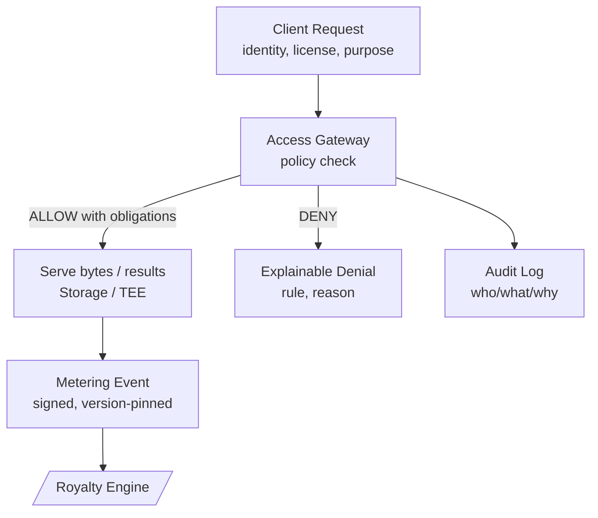

**이 레이어가 하는 일**  
**액세스 게이트웨이**는 **누가** **어떤 데이터셋 버전**을 **얼마나**, **어떤 조건**으로 읽을 수 있는지 결정합니다. **계량 모듈**은 허용된 읽기를 **서명된 사용 이벤트**로 변환해 이후 **청구와 로열티**를 구동합니다. 정책은 명확하고 버전 관리되며 감사 가능하고, 이벤트는 재생(리플레이) 가능합니다.

## 전체 흐름(요청 → 결정 → 서빙 → 계량)

- **정책 점검:** 아이덴티티, 자격/VC, 티어(**[/core-concepts/reputation](/core-concepts/reputation)**), 데이터셋 버전, 지역/시간, 라이선스/TNPL 등을 평가합니다.  
- **의무 사항(Obligations):** 결정에는 서빙 전에 **마스킹**, **샘플링**, **레이트리밋**, **워터마크**, **TEE 실행**이 요구될 수 있습니다.  
- **계량:** **데이터셋 버전**, **수량**(rows/GB/requests), **타임스탬프**, **평가/가격 설정 버전**, **규칙 ID**, **서명**을 포함한 이벤트를 방출합니다.

## 정책 기초
정책은 **속성 기반(ABAC)**을 기본으로 하며 역할 기반(RBAC)을 보완적으로 사용합니다. 각 결정은 다음을 평가합니다:

- **주체:** 요청자 신원(지갑/DID), **검증 레벨**(VC/KYC), **평판 티어**, 조직/팀  
- **리소스:** **데이터셋 ID + 버전**, 자산 태그, 민감도 등급  
- **행동:** 읽기, 샘플, 내보내기, 스트림, 집계 등  
- **컨텍스트:** 시간/지역, 목적(연구/상업), 쿼터/예산, 라이선스/TNPL, 분쟁 상태

**결과:** **ALLOW / DENY / ALLOW‑WITH‑OBLIGATIONS**. 의무에는 필드 레벨 마스킹, 집계만 반환, 캐시 전용, TEE 전용 처리 등이 포함될 수 있습니다. 게이트웨이는 **어떤 규칙이 매치되었고** **왜** 그런지 기록합니다.

> 정책은 **버전 관리**됩니다. 결정은 정책 버전을 저장하여 리플레이 시 원래 결과와 일치하게 합니다.

## 계량 이벤트
허용된 각 읽기는 하나 이상의 **사용 이벤트**를 생성합니다. 사람이 이해하기 쉽게 요약하면 다음을 담습니다:

- **누가:** 요청자(또는 조직)와 결제 계정  
- **무엇을:** **데이터셋 ID + 버전**, 리소스 종류(파일/오브젝트/쿼리)  
- **얼마나:** 행/GB/요청/초  
- **언제:** 타임스탬프 + **평가/귀속에 사용할 유효 시각**  
- **왜 허용되었는가:** 매치된 **정책 규칙 ID**와 의무 세트(예: “mask+sample”)  
- **가격 책정 방식:** **평가 구성 버전**(effective price/weight 산출에 사용)  
- **증명:** 게이트웨이 **서명**, 선택적 엔클레이브 증명, **이벤트 ID**

이벤트는 **[/core-concepts/royalty-engine](/core-concepts/royalty-engine)** 으로 전달됩니다. 이벤트/소유권/평가가 버전 고정이므로 분배는 **결정적**이고 **설명 가능**합니다.

## 라이선스 & 지불 모드
- **표준 라이선스:** 종량제; 사용 이벤트는 데이터 소비자의 **수익 계정**과 정산됩니다.  
- **TNPL:** 지금 접근하고 **이연 의무**를 누적; 매출 발생 시 정산.  
- **선불/크레딧:** 크레딧 차감; 이벤트는 감사용으로 계속 기록됩니다.

## 레이트리밋, 쿼터 & 샘플링
- **레이트리밋/쿼터:** 신원/조직/지역별로 스로틀링; 버스트/쿨다운 윈도우로 오남용 방지·비용 통제  
- **샘플링:** 탐색을 위한 대표 슬라이스 제공; 전체 접근은 더 높은 정책 티어나 지불 필요  
- **공정 사용:** 이상치 플래깅; 민감 쿼리는 더 강한 자격 또는 TEE 전용 경로 요구

## 프라이버시 & 안전한 서빙
- **최소 공개:** 필요한 바이트만 복호화; **TEE** 또는 **연합 실행** 선호(**[/core-concepts/storage-compute-serving](/core-concepts/storage-compute-serving)**)  
- **선택적 공개:** 원시 PII 대신 특정 자격/주장을 요구  
- **마스킹 & 집계:** 의무로 필드 마스킹/집계 전용을 강제 가능

## 감사 & 리플레이
- **감사 로그:** 누가 요청했고, 어떤 규칙이 매치되었으며, 왜, 무엇이 제공되었는지  
- **리플레이:** 동일 요청/정책 버전/데이터셋 버전이면 **동일 결정**; 동일 이벤트면 로열티 엔진이 **동일 분배**를 계산

## 인터페이스
- **입력:** 요청자 신원/자격(**[/core-concepts/identity](/core-concepts/identity)**), 티어(**[/core-concepts/reputation](/core-concepts/reputation)**), 데이터셋/버전(**[/core-concepts/data-assembly](/core-concepts/data-assembly)**), 스토리지 엔드포인트(**[/core-concepts/storage-compute-serving](/core-concepts/storage-compute-serving)**)  
- **출력:** **계량 이벤트**(**[/core-concepts/royalty-engine](/core-concepts/royalty-engine)**), 감사 로그, 정책 결정(allow/deny/obligations)  
- **크로스 링크:** 가격/귀속을 위한 소유권 스냅샷은 **[/core-concepts/tokenized-ownership-proofs](/core-concepts/tokenized-ownership-proofs)** 에서 가져옴

## 불변 조건
- **설명 가능성:** 모든 결정은 규칙/정책 버전을 명시  
- **결정성:** 동일 요청 + 동일 정책 + 동일 버전 ⇒ 동일 결정  
- **추적 가능성:** 모든 바이트는 데이터셋 버전 → 자산 → CF로 역추적  
- **변조 증거성:** 이벤트/로그 서명; 분쟁 시 준비금 사용

## 상태 노트
- 정책 언어와 평가 훅은 **거버넌스** 대상이며 버전이 유지됩니다.  
- 아이덴티티 스킴, 엔클레이브, 라이선스 모드 지원은 시간이 지나며 확장될 수 있습니다.

