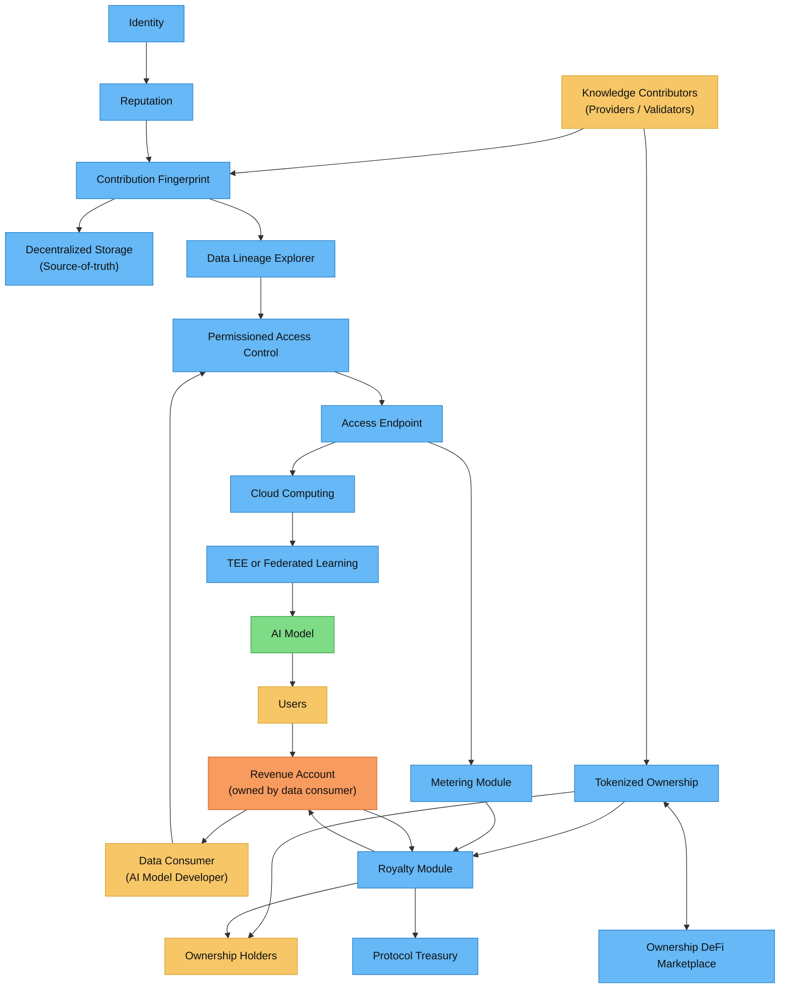

> **요약**  
> Codatta는 사람/에이전트의 기여를 **검증 가능하고 소유 가능한 데이터 자산**으로 전환합니다. 계보가 추적 가능하고, 정책으로 게이트/관찰되는 접근, 증명 가능한 소유권, 그리고 **결정적 로열티 분배**를 제공합니다.

## 아키텍처

## 엔드투엔드 4단계 흐름

1. **기여(Contribution)**: 기여자(사람/에이전트)가 제출한 작업은 **[기여 지문](/core-concepts/contribution-fingerprint.mdx)** 으로 고정되며 **[아이덴티티](/core-concepts/identity.mdx)**, **[평판](/core-concepts/reputation.mdx)** 과 결속됩니다.
2. **자산화(Assetification)**: 검증된 지문을 갖는 원자 기여(샘플/레이블/검증)를 모아 버전드 데이터셋(**[계보 & 자산 조립](/core-concepts/lineage-asset-assembly.mdx)**)을 만들고, 온체인 **[토큰화 소유권](/core-concepts/tokenized-ownership-proofs.mdx)**(양도 가능한 분수)으로 **민팅**합니다.
3. **사용(Usage)**: AI 빌더는 **[접근 게이트웨이](/core-concepts/access-control-metering.mdx)** 를 통해 데이터를 사용하며, **[스토리지/컴퓨트/서빙](/core-concepts/storage-compute-serving.mdx)** 이 이를 뒷받침합니다. 모든 읽기는 **사용/청구 이벤트**(계량)를 남깁니다.
4. **로열티(Royalty)**: **[로열티 엔진](/core-concepts/royalty-engine.mdx)** 이 매출, 시간 고정 소유권 분수, 계량 이벤트를 결합해 소유자와 금고에 **결정적 분배**를 수행합니다.

## 핵심 구성요소 한눈에 보기

- **기여 지문(CF)**: *누가, 언제, 무엇을, 어떤 증거로* 했는지에 대한 원자적 서명 기록  
- **아이덴티티 & 평판**: 프라이버시 친화적 아이덴티티 + 신뢰로서의 스테이킹/정확도 이력으로 신뢰 점수  
- **계보 & 자산 조립**: CF를 버전드·추적 가능한 데이터셋으로 조합  
- **스토리지 / 컴퓨트 / 서빙**: 진실 소스 스토리지, 안전한 컴퓨트(TEE/연합), 고성능 전달  
- **접근 제어 & 계량**: 정책 게이트 접근; 감사 가능한 **사용/청구 이벤트** 방출  
- **토큰화 소유권**: 온체인 **양도 가능** 소유권 분수(증명 내보내기)  
- **로열티 엔진**: 매출을 투명하고 재현 가능한 분할로 변환

### 소유권을 얻는 법(요약)

- **지식 기여자(제공자/검증자)**: **샘플/레이블/검증**을 기여합니다. 기여가 **CF로 수락·게시**되면(태스크 정책에 따름) **기본 지분**이 민팅됩니다.  
- **지식 후원자(스테이커/언더라이터/구매자)**:  
  - **스테이킹/언더라이팅**으로 **지분을 확보/상향**; 감사 결과에 따라 거버넌스 한도 내 **증가/삭감**될 수 있습니다.  
  - **2차 시장에서 지분 매수**(유동성 활성 시). 이는 **분배 수학**을 바꾸지 않고, **수령자만** 바꿉니다.  
- **이전/에스크로**: 조건(지불, KYC, 마일스톤, 분쟁 등) 충족 시까지 **에스크로**에 두거나 직접 이전. 스냅샷은 시점 *t*의 **기록상 소유자**로 분배합니다.

자세한 내용은 **[/core-concepts/tokenized-ownership-proofs](/core-concepts/tokenized-ownership-proofs)** 참고.

## 어디서 시작할까

- **스택 빌드:** **[기여 지문](/core-concepts/contribution-fingerprint.mdx)** → 아이덴티티 + 평판 → 계보 → 스토리지/서빙 → 접근 & 계량 → 소유권 증명 → 로열티 엔진  
- **제품 탐색:** **Products → Lineage Explorer** 및 관련 대시보드에서 UI/API 사용과 SDK를 확인하세요.

<Tip>
**주요 목표:** 블록체인으로 데이터를 AI의 **소유 가능한 자산 클래스**로 전환—권리를 **증명 가능**하게, 소유권을 **양도 가능**하게, 수익을 **로열티로 공유 가능**하게 만듭니다.
</Tip>

