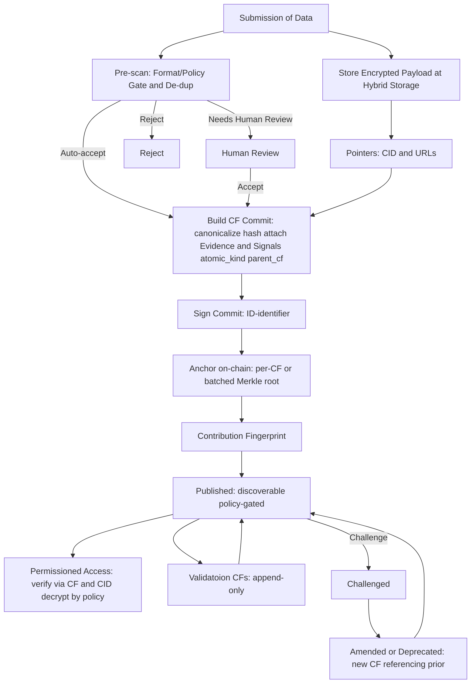

**기여 지문(Contribution Fingerprint, CF)**은 한 작업 단위에 대한 **출처가 명시된 영수증**과 같습니다. 누군가 **샘플**, **레이블**, **검증**(통칭 *원자적 기여*)을 제출할 때마다 시스템은 **하나의 CF**를 생성해 다음을 영구히 연결합니다:

- **무엇**이 기여되었는지(콘텐츠에 대한 안정적 참조)
- **누가** 했는지(기여자의 지갑 또는 DID)
- **언제** 발생했는지(타임스탬프/앵커)
- **왜 신뢰할 수 있는지**(첨부된 증거와 리뷰 신호)

CF는 전체 아키텍처의 **첫 번째 벽돌**입니다. 저작을 명확히 하고, 투명한 소유권/로열티를 가능하게 하며, 누구든 데이터셋을 기원까지 추적할 수 있게 합니다.

## CF의 위치(큰 그림)

1. **기여 →** 원자적 기여당 CF **하나**.  
2. **자산화 →** 여러 CF가 모여 **데이터 자산**과 버전드 **데이터셋**을 이룹니다.  
3. **사용 →** AI 빌더는 정책 게이트 엔드포인트로 데이터셋에 접근하며, 사용은 계량됩니다.  
4. **로열티 →** 매출 + 계량 이벤트 + 소유권 분수 = 결정적 분배.

## CF가 생성되는 방법

**단계 설명**
- **제출** — 기여자가 콘텐츠를 보냅니다. **암호화 사본**과 안정적 참조(콘텐츠 ID/URL)를 저장합니다.  
- **사전 점검** — 형식/프라이버시 마스킹/중복을 가볍게 확인. 일부는 자동 통과, 일부는 간단한 휴먼 리뷰 필요.  
- **기록 생성** — 세부를 표준화하고 **샘플/레이블/검증** 여부를 표시하며 **증거 & 신호**를 첨부.  
- **아이덴티티 바인딩** — 지갑/DID로 레코드에 승인/서명.  
- **온체인 앵커** — 지문을 블록체인에 불변으로 앵커(단건 or 배치).  
- **게시** — CF는 검색 가능해집니다. 원본 콘텐츠 접근은 **정책 게이트**입니다.  
- **평가 & 수정** — 리뷰어는 **자신의 CF**(평가)를 추가하거나 분쟁을 제기합니다. 원본은 **절대 덮어쓰지 않고**, 업데이트는 이전 항목을 참조하는 **새 CF**를 만들어 전체 히스토리를 보존합니다.

## 증거 & 신호(주장을 어떻게 뒷받침하나)
프라이버시를 노출하지 않으면서 신뢰를 높이기 위해, 각 CF에는 구조화된 **증거**와 **신호**를 담을 수 있습니다:

- **증거(아티팩트):** 트랜잭션 ID, 문서/이미지 해시, 안정 링크, 서명된 자격 등  
- **신호:** 주장이 **어떻게 획득**되었는지(휴리스틱/ML 추론/원문/온체인 진실 등)와 **어떻게 검증**되었는지(없음/동료 검토/스테이킹 검증/판정). **합의 수준**과 **리뷰어 평판**도 기록 가능.

리뷰어와 알고리즘은 **원본 CF를 수정하지 않습니다**. 대신 이를 참조하는 **자신의 CF를 추가**합니다. 덕분에 감사 추적이 깨끗하고 설명 가능합니다.

## CF가 가능하게 하는 것들

- **명확한 저작** — 모든 원자 기여는 탄생 시 CF 하나; 크레딧이 사라지지 않음  
- **추적 가능한 데이터셋** — 어떤 데이터셋이든 자산을 거쳐 이를 만든 CF까지 역추적 가능  
- **증명 가능한 소유권** — CF는 토큰화된, 양도 가능한 소유권 분수를 앵커  
- **공정한 분배** — 데이터 사용 시, 계량 이벤트와 소유권 분수가 올바른 CF로 연결되어 결정적 로열티 분배 가능  
- **책임 있는 개선** — 검증과 수정은 조용한 편집이 아니라 **새 CF**로 남김

## 예시: 기여에서 로열티까지

Lin 박사는 **의료 이미지 레이블**을 기여합니다(이미지는 **최근 병리 진단**에서 환자가 제공). 이미지 업로드는 **샘플용 CF** 하나를 만들고, Lin 박사의 레이블은 첫 CF에 연결된 **두 번째 CF**를 만듭니다. 두 CF 모두 **온체인 앵커**되고 **게시**됩니다(콘텐츠는 정책 게이트). 독립 리뷰어는 **자신의 CF**를 추가해 레이블을 확인/도전하며, 이견은 **분쟁**으로 이어져 새 CF(수정/폐기)를 만들고 기록은 덮어쓰지 않습니다.
이 CF들은 **버전드 데이터셋**으로 조립됩니다. **토큰화 소유권 분수**는 환자(샘플), Lin 박사(레이블), 검증자(리뷰), 후원자, 금고에 기록됩니다. AI 빌더가 **접근 게이트웨이**로 데이터셋에 접근하면 사용이 **계량**되고, 대금은 빌더의 **수익 계정**으로 흐르며, **로열티 엔진**이 매출/이벤트/시간 고정 소유권을 결합해 분배합니다.

## 불변 조건(항상 참)

- **추가 전용 CF:** 생성 시 원자적 기여당 CF 하나; 이후 변화는 **원본에 연결된 새 CF** 생성(레이블 수정, 증거 추가, 검증자 결정, 프라이버시 마스킹 등). 뷰는 최신 유효 CF를 가리키며, 과거 CF는 불변/감사 가능.  
- **재현 가능하며 감사 가능한 구조:** 동일 입력이면 동일 CF와 동일 분배를 재현  
- **추적 가능:** 제공 데이터는 데이터셋 → 자산 → CF → 기여자로 추적  
- **최소 공개:** 민감 페이로드는 암호화 유지; 접근은 정책 게이트

