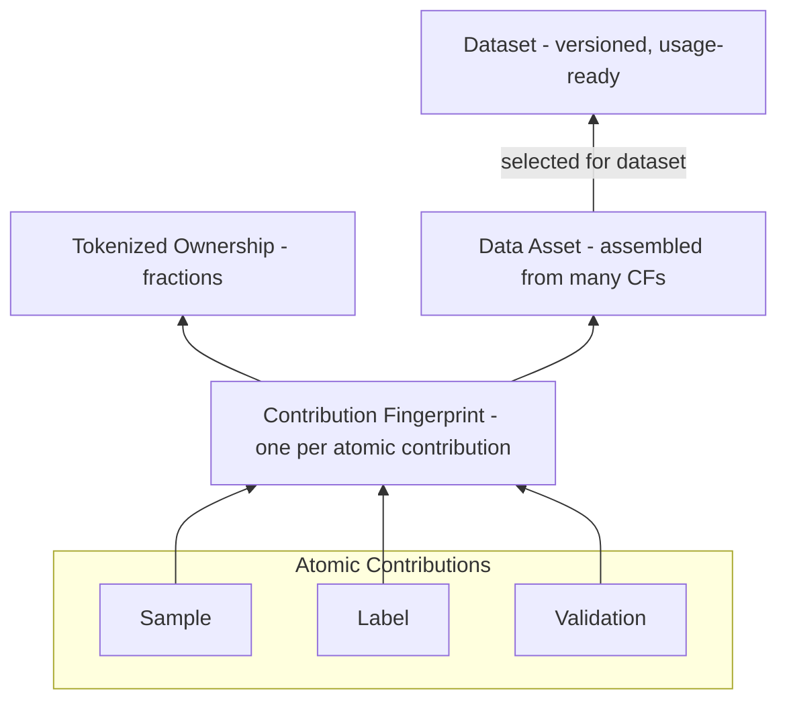
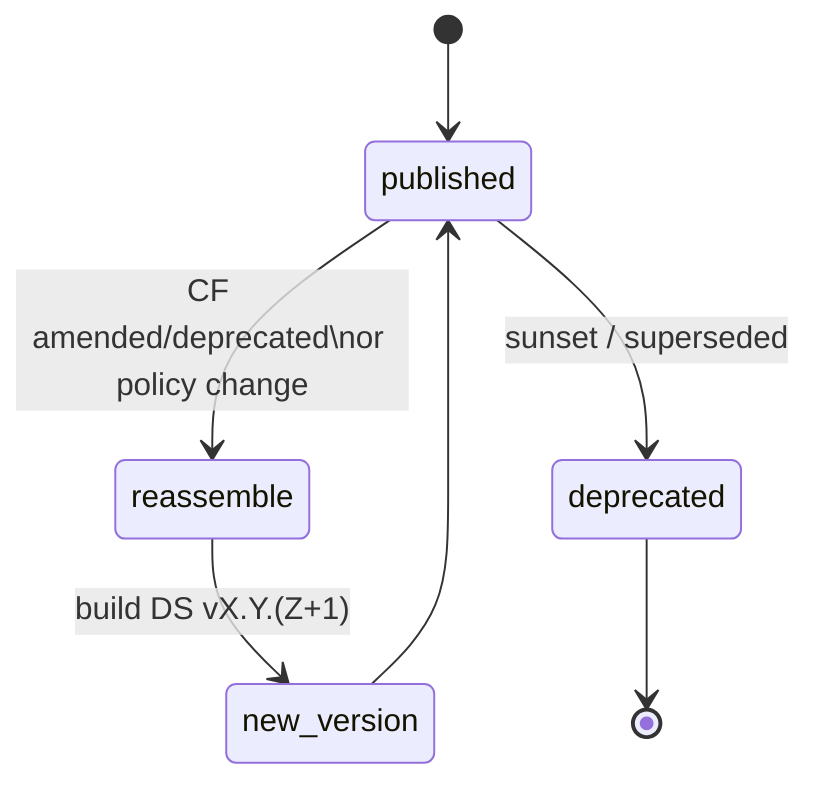
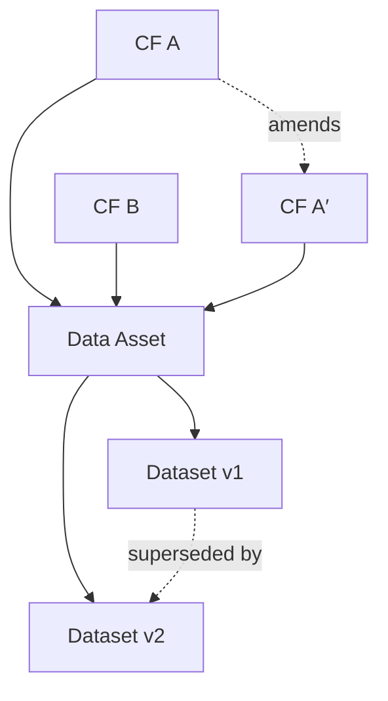

<Tip>
**멘탈 모델.** 기여 지문(CF)은 원자 단위입니다. CF를 모아 **데이터 자산**(재사용 가능한 번들)으로 만들고, 자산/CF를 선택해 항상 **버전드**인 **데이터셋**을 구성합니다. 계보(lineage)는 *무엇이 들어 있고*, *왜 들어 있으며*, *어디서 왔는지*를 누구나 설명하고, 나중에 동일 빌드를 **재현**할 수 있도록 전체 지도를 유지합니다.
</Tip>

## 조립: CF → 자산 → 데이터셋

**원자적 기여란?**  
생성 시점에 **고유의 기여 지문(CF)** 으로 기록되는 최소 작업 단위. **샘플**, **레이블**, **검증**의 세 종류를 사용합니다. 각 원자적 기여는 제출 시 **정확히 하나의 CF**를 갖고, 이후의 수정/리뷰는 원본을 편집하지 않고 **원본을 참조하는 새 CF**를 만듭니다.

**샘플·레이블·검증 — 관계**  
- **샘플** — 원본 자료(이미지/텍스트/트레이스 등). 암호화 저장·콘텐츠 주소화·CF로 참조.  
- **레이블** — **샘플**(또는 다른 레이블)에 대한 구조적 주장: 클래스, 박스, 속성, 근거 등. 대상에 대한 링크 포함.  
- **검증** — 특정 기존 CF(샘플/레이블/검증)에 대한 **의견 있는 검증**. 승인/거절/점수와 간단한 근거 및 선택적 증거를 명시.

<Warning>
중요: **검증은 단독으로 존재할 수 없습니다**. 반드시 평가 대상의 **CF ID**(샘플/레이블/다른 검증)를 참조해야 합니다. 검증자는 **자신의 CF**를 발행하고 원본은 불변으로 유지됩니다. 검증 간 합의는 포함/가중치 판단에 사용되며, 전체 출처는 감사 가능하게 유지됩니다.
</Warning>

**데이터 자산이란?**  
예: “검증자 합의 ≥ 0.7인 폐 병리 케이스”와 같은 재현 가능한 CF 번들입니다. 자산은 여러 데이터셋에서 재사용 가능한 빌딩 블록입니다.

**데이터셋이란?**  
**사용 준비 완료**, **버전드** 컬렉션(하나 이상의 자산 + 선택적 직접 CF)으로, 매니페스트에 의해 고정됩니다. 데이터셋은 빌더가 라이선스하고 게이트웨이를 통해 접근하는 대상입니다.

## 버전 정책
입력이나 규칙의 어떤 변경도 **새 데이터셋 버전**을 생성합니다. 이는 역사를 불변으로 유지하고 감사를 단순화합니다.

**새 버전 트리거:** 신규/제거된 CF, 변경된 필터/임계, 상이한 중복제거/마스킹 규칙, 빌드 구성 변경. **Diffs**는 버전 간 추가/제거/변경된 CF와 자산을 보여줍니다.

## 계보(출처 & 차이)

**계보란?**  
시간에 따라 산출물이 어떻게 연결되는지에 대한 **영향·불변 기록**입니다—**CF → 데이터 자산 → 데이터셋 버전**을 잇고, 발생한 **변환**(필터/중복제거/마스킹)과 **상태 변화**(수정/폐기)를 포함합니다. 이를 통해 **무엇이 들어 있고**, **왜 포함되었는지**, **어디서 왔는지**를 증명하고, 동일 데이터셋을 나중에 **재빌드**할 수 있습니다.

**모델링(간단 설명):**  
- **노드:** CF, 자산, 데이터셋 버전  
- **엣지(타입):** `derived-from`(CF → 자산), `selected-into`(자산/CF → 데이터셋 vX.Y.Z), `validates`(검증 CF → 대상 CF), `amends`/`supersedes`(변경 이력)  
- **속성:** 엣지는 타임스탬프와 **포함을 유발한 매니페스트 규칙**을 보유. 노드는 편집되지 않으며 **새 노드/엣지 추가**로만 성장

**핵심 질의:**  
- **왜 포함?** 매니페스트 규칙과 이를 만족한 특정 노드/엣지를 표시  
- **왜 제외?** 실패한 규칙(예: 합의 < 임계) 표시  
- **출처는?** 데이터셋 → 자산 → CF → 기여자 경로 추적  
- **무엇이 바뀌었나?** 두 버전의 diff(추가/제거/변경된 CF/자산)  
- **영향 분석:** “이 CF를 수정하면 어떤 자산/데이터셋 버전에 영향?”

### 계보 보장
- **비순환 & 추가 전용(DAG):** 계보는 순환을 만들지 않으며 노드/엣지 추가로만 성장  
- **참조 무결성:** 모든 데이터셋 엔트리는 유효한 CF로 해석 가능  
- **시간 인덱싱:** 엣지는 타임스탬프를 가지며 시간여행형 질의 가능  
- **결정성:** 동일 입력 + 동일 매니페스트 ⇒ 동일 버전과 동일 계보

<Tip>
UI/API 사용은 Products → Lineage Explorer(검색, diff, 내보내기)를 참고하세요.
</Tip>

## 분쟁 & 재조립
CF가 **수정/폐기**되면(예: 잘못된 레이블 수정, 증거 추가) 동일 매니페스트 규칙으로 데이터셋을 **재조립**해 새 버전을 만듭니다. 과거 버전은 감사용으로 유지되며, 향후 사용은 최신 버전을 따릅니다. (분배 관련 준비금/재배분은 **로열티 엔진**이 처리.)

## 인터페이스
- **입력:** CF(및 Evidence & Signals), 선택적 평판/합의 힌트  
- **출력:** **데이터셋 ID**와 **버전 ID**(스토리지/컴퓨트/서빙·액세스/계량에서 사용)  
- **소유권 매핑:** CF 수준 소유권이 전파되어 데이터셋 수준 분배 계산에 사용(**토큰화 소유권 증명** 참고)

## 불변 조건
- **참조 무결성:** 모든 엔트리는 유효한 앵커의 CF로 해석  
- **결정성:** 동일 입력 + 동일 매니페스트 ⇒ 동일 버전 ID/내용  
- **불변성:** 과거 버전은 변하지 않음; 새 정보 ⇒ 새 버전  
- **설명 가능성:** 포함/제외는 규칙 또는 CF 상태에 결부되어 쉽게 제시 가능
