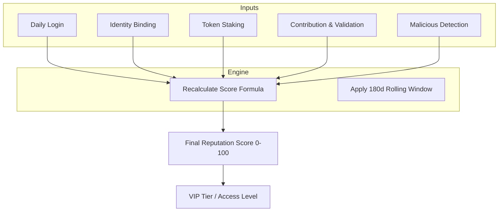

## 평판이란

평판은 Codatta 네트워크 내 아이덴티티(사람 또는 에이전트)의 **핵심 신뢰 지표**입니다. 작업이 **얼마나 정확한지**, 참여가 **얼마나 일관적인지**, 경제적 스테이킹을 통해 **얼마나 커밋하는지**를 포착하는 **정량적 점수**(0~100 범위)입니다.

불투명한 "블랙박스" 알고리즘과 달리, Codatta의 평판 시스템은 **완전히 투명하고 결정론적**입니다. 프로토콜은 **차원별 세밀한 신호**를 유지하지만, 라우팅, 가시성 및 보상 계산을 위해 간단한 **종합 점수**를 제공합니다.

### 평판을 구축하는 이유

평판은 단순한 명예 지표가 아닙니다. 가치 분배와 보안을 구동하는 엔진입니다.

- **사용자용(인센티브 & 특권):**
  - **직접 보상 영향:** 평판은 프로토콜 수준에서 보상 차이를 결정합니다—동등한 기여에도 불구하고, 다른 평판 수준은 다른 수익에 해당합니다. 또한, 지속적인 에어드롭과 같은 대규모 인센티브 메커니즘, **포인트-토큰 변환** 환율, 그리고 특별 작업 및 독점 특권에 대한 우선 액세스에 깊이 참여합니다.
  - **VIP 액세스("Alpha" 상태):** 바이낸스의 Alpha 포인트나 항공사 VIP 등급과 유사하게, 높은 평판은 더 높은 추천 보상 상한, 고수익 작업에 대한 우선 액세스, 또는 더 낮은 서비스 수수료와 같은 시스템 특권을 해제합니다.
- **플랫폼용(보안 & 품질):**
  - **시빌 저항:** 악의적인 행위자에게 비용 장벽을 만듭니다.
  - **품질 필터링:** 진지한 기여자와 스팸 발송자를 구분합니다.
  - **처벌 메커니즘:** 악의적인 행동을 신속하게 처벌할 수 있는 수단을 제공합니다(예: 데이터 중독에 대한 점수 감소).

### 평판의 기능

점수 자체를 넘어서, 평판은 Codatta 아키텍처에서 기능적 계층으로 작동합니다:

- **기여 가중:** **데이터 조립**에서 높은 평판 아이덴티티의 원자적 기여는 **더 큰 가중치**를 받습니다. 이를 통해 신뢰할 수 있는 사용자에 대해 더 낮은 검토 정족수와 더 높은 포함 우선순위를 허용합니다.
- **소유권 관리:** **로열티 엔진**에 정의된 대로, 더 높은 평판 기여자는 동등한 기여 유형에 대해 **더 큰 소유권 분수 지분**을 얻을 수 있습니다.
- **액세스 제어:** 특정 고가치 작업이나 민감한 데이터 검증 역할은 **평판 티어**로 제한됩니다.

## 계산 프레임워크

평판 점수는 **동적**이며, 사용자 행동과 시간 창(예: 롤링 180일)을 기반으로 업데이트됩니다. 4개의 긍정적 차원과 1개의 부정적 처벌 차원으로 구성됩니다.

### 총점 공식

```
Reputation = 0.1 × R_Login
          + 0.15 × R_Identity
          + 0.2 × R_Staking
          + 0.55 × R_Contribution
          - R_Malicious_Behavior
```

<Tip>
**투명성 원칙:** 계산 로직은 공개됩니다. 모든 변경 사항은 기록된 이벤트에 매핑되며, 모델은 **동일한 이벤트 + 동일한 모델 = 동일한 평판**을 보장합니다.
</Tip>

### 아이덴티티 (R_Identity)

**가중치:** 15% | **"인간성" 및 접근성 검증**

이 차원은 사용자가 여러 플랫폼에서 접근 가능하고 고유한지 확인하여 시빌 저항을 촉진합니다.

```
R_Identity = 100 × (0.05 × isEmail + 0.05 × isX + 0.05 × isTG + 0.05 × isDiscord + 0.8 × R_Others)
```

- **로직:** 사용자가 외부 계정(이메일, X/Twitter, Telegram, Discord)을 바인딩합니다.
- **영향:** 각 바인딩은 이 하위 점수에 5점을 기여합니다.
- **미래 대비:** `R_Others`는 향후 통합을 위해 예약되어 있으며(현재 0), 이 차원의 현재 유효 최대값은 20입니다(총 평판에 3점 기여).

### 로그인 활동 (R_Login)

**가중치:** 10% | **일관성 및 습관 보상**

Codatta는 지속적인 관심을 보상합니다. 이 점수는 **일일 활성 사용(DAU)** 습관을 반영합니다.

```
R_Login = 100 × (daysLogged_180d / 180)
```

- **로직:** 지난 180일 동안 로그인한 일수를 계산합니다(UTC+0 기준).
- **영향:** 지속적인 일일 로그인은 이 구성 요소가 100을 유지하도록 보장합니다.

### 스테이킹 (R_Staking)

**가중치:** 20% | **신뢰로서의 스테이킹**

이를 통해 사용자가 "말한 대로 돈을 걸 수" 있습니다. 생태계에 대한 경제적 커밋을 측정합니다.

```
R_Staking = 100 × min(1, amountStakeXNY / 50,000)
```

- **로직:** 평판은 스테이킹된 XNY 토큰의 양에 따라 선형적으로 증가합니다.
- **환율:** 약 2,500 XNY를 스테이킹할 때마다 최종 총 평판 점수에 1점이 추가됩니다.
- **상한:** 효과는 50,000 XNY에서 상한선에 도달합니다. 이를 초과하는 스테이킹은 신뢰를 보여주지만 평판 점수를 더 이상 증가시키지 않습니다.

### 기여 품질 (R_Contribution)

**가중치:** 55% | **핵심 가치 동인**

가장 중요한 차원입니다. **베이지안 평활 평균**(IMDB 등급과 유사)을 사용하여 작업 품질을 평가하여 신규 사용자와 파워 사용자 간의 공정성을 보장합니다.

```
R_Contribution = 100 × (countAdopt_180d + (20 × 0.5)) / (countAdopt_180d + countRefused_180d + 20)
```

- **베이지안을 사용하는 이유?** 1개의 올바른 제출(100% 비율)을 가진 사용자가 990개의 올바른 제출과 10개의 잘못된 제출(99% 비율)을 가진 베테랑을 인위적으로 앞서는 것을 방지합니다.
- **매개변수:**
  - **0.5:** 기준 확률(중립 시작).
  - **20:** "신뢰 가중치"—점수를 기준에서 크게 벗어나게 하는 데 필요한 제출 수를 결정합니다.
- **동적:** 신규 사용자는 50의 하위 점수로 시작합니다(총점에 27.5점 기여). 높은 채택률은 점수를 100으로 밀어 올리고, 높은 거부율은 0으로 밀어 냅니다.

### 처벌 (R_Malicious)

**"해머" 메커니즘**

플랫폼을 보호하기 위해 악의적인 행동은 심각한 점수 공제를 초래합니다.

```
R_Malicious_Behavior = 100 × min(1, CountBlacklisted / 3)
```

- **삼진 아웃 규칙:**
  - **1회:** 상당한 평판 손상.
  - **3회:** `R_Malicious`가 100이 되어 사용자의 총 평판 점수를 효과적으로 0으로 만듭니다.
- **트리거:** 이것은 단순한 실수가 아닌 확인된 악의적 의도(예: 스크립트 공격, 의도적인 데이터 중독)에 의해 트리거됩니다.

## 평판 업데이트(수명주기)

평판은 정적이 아닙니다. 사용자 이벤트에 의해 구동되는 수명주기를 따릅니다:



- **실시간 및 주기적:** 일부 신호(스테이킹 등)는 즉시 업데이트되는 반면, 다른 신호(기여 통계 등)는 예정된 주기로 업데이트될 수 있습니다.
- **감쇠:** 180일 롤링 창은 평판이 유지 관리가 필요함을 보장합니다. 장기간 비활성은 점수의 완만한 감쇠를 초래하여 신호를 신선하게 유지합니다.

## 프라이버시 & 공개

- **공개:** **티어**와 **총점**은 라우팅 및 리더보드에 사용되는 공개 신호입니다.
- **비공개:** 원시 **PII 데이터**(예: `R_Identity`에 연결된 특정 Telegram 핸들 또는 이메일 주소)는 암호화되고 비공개로 유지됩니다. 가능한 경우 **검증 가능한 자격 증명**을 사용합니다.
- **블랙박스 없음:** 개인 데이터는 비공개이지만, 점수 뒤의 추론은 그렇지 않습니다. 항상 점수가 어떻게 도출되었는지 정확히 볼 수 있습니다(예: "스테이킹에서 +30").

<Tip>
**투명성 원칙:** 계산 로직은 완전히 투명합니다. 모든 변경 사항은 기록된 이벤트에 매핑되어 **동일한 이벤트 + 동일한 모델 = 동일한 평판**을 보장합니다.
</Tip>

<Warning>
**상태 노트:** 
가중치, 티어 임계값, 스테이킹 매개변수, 평판에서 소유권으로의 매핑은 **거버넌스** 대상이며 진화할 수 있습니다. 180일 롤링 창과 공식 매개변수는 시스템 건강과 공정성을 유지하기 위해 거버넌스를 통해 조정될 수 있습니다.
</Warning>
