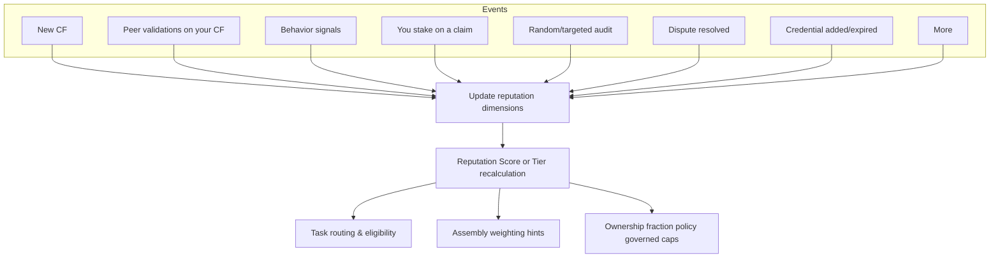

## 평판이란
평판은 아이덴티티(사람/에이전트)를 위한 **다차원 신뢰 시스템**입니다. 당신의 작업이 **얼마나 정확한지**, **타인이 어떻게 검증했는지**, **어떤 속성을 보유하는지**(예: 자격), 그리고 **얼마나 성실히 커밋하는지**(응답성, 처리량, 경제적 스테이크)를 포착합니다. 프로토콜은 **차원별 세밀 신호**를 보존하면서, 라우팅과 가시성을 위해 단순한 **점수**와 **티어**를 제공합니다.

## 차원 & 신호
평판은 **정량적·다차원적**입니다. 각 차원은 기록/버전 관리되며, 거버넌스가 종합 점수를 만드는 가중치를 정합니다.

- **정확도 & 합의** — 본인 CF에 대한 검증 결과; 통과율, 분쟁율, 번복 이력  
- **행동 신뢰성** — **응답성**(정시 납품, 리뷰 회전), 지속 처리량, 태스크 완료 품질  
- **보증 속성** — 사람 참여자/신뢰 레지스트리의 **제3자 증명**(라이선스/소속/인증)과 **프로토콜 검증**(튜토리얼/퀴즈/테스트 통과)  
- **시신성** — 최근 활동 가중; 장기 비활성은 완만히 감소  
- **신뢰로서의 스테이킹** — 주장을 스테이크로 뒷받침; 감사는 평판을 상승/삭감 가능  

<Tip>
프로토콜은 **차원별 원시 신호를 모두 보존**해 시간이 지남에 따라 모델을 개선하게 하고, UI는 명확한 티어와 점수 구간을 보여줍니다. 모델 버전은 투명/감사 가능하게 유지됩니다.
</Tip>

### 평판에 영향을 줄 수 있는 예시 이벤트

| Event | Reputation impact |
|---|---|
| Your CF validated with high agreement | Increase (accuracy + agreement) |
| Your CF challenged and overturned | Decrease (dispute loss) |
| Consistently on‑time, responsive participation | Increase (behavioral reliability) |
| You stake and pass random audit | Increase (confidence rewarded) |
| You stake and fail audit (slashed) | Decrease (confidence penalized) |
| New credential/skill verified | Increase (attribute boost; capped) |
| Long inactivity | Gentle decay (recency) |

## 평판의 기능

- **더 나은 작업 & 보상 해금.** 높은 평판은 **더 높은 보수의 태스크**와 품질/커밋을 기대하는 역할을 엽니다. 일부 태스크는 **추가 자격**(면허, 학력, 도메인 전문성 등)을 요구하기도 하며, 평판은 이를 **보완**합니다(대체 아님).  
- **조립 시 기여 가중.** 높은 평판의 아이덴티티는 **데이터 조립**에서 **더 큰 가중치**를 받을 수 있어(예: 낮은 리뷰 정족수, 높은 포함 우선순위) 품질 향상과 중복 리뷰 감소에 기여합니다.  
- **소유권 분수에 영향(거버넌스).** 거버넌스 한도 내에서, 높은 평판 기여자는 동등 기여 유형에 대해 **더 큰 소유권 지분**을 받을 수 있습니다(신뢰/예상 품질 반영). 정확한 정책은 **토큰화 소유권 증명**에 있고, **로열티 엔진**이 분배 시 설명합니다.  
- **경제적 커밋으로 부스트.** **스테이킹**을 통해 평판을 **부스트**할 수 있습니다. 감사 통과는 신뢰 상승; 실패는 하락. skin‑in‑the‑game으로 신호를 실제 결과에 연결합니다.

## 평판 업데이트(수명주기)

- 신규 CF는 **중립**에서 시작; 검증이 점수를 상/하향시킵니다.  
- 행동 신호는 지속적으로 누적됩니다.  
- 스테이킹은 감사 이후 **승수**(양/음)처럼 작동합니다.  
- 플래핑/게이밍 방지를 위해 일정/쿨다운에 따라 티어를 갱신합니다.

## 안전성·공정성·회복

- **시빌/담합 저항:** 시간 축으로 집계; 검증자 다양성 요구; 위험 패턴에 레이트리밋  
- **쿨다운 & 감쇠:** 일정 기반으로 변화 적용; 비활성 기간에 완만 감쇠로 신호 신선도 유지  
- **이의 제기 & 분쟁:** 이의 결과 기록; 공정한 정정은 회복에 도움  
- **블랙박스 없음:** 모든 변화는 기록된 이벤트에 매핑; 모델/가중치는 버전 관리

## 프라이버시 & 공개

- **공개:** **티어**, 대략적 점수 구간, 상위 사유(예: “고합의”, “검증된 라이선스”)  
- **비공개/권한부여:** 원시 아티팩트/**PII**; 평문 대신 **검증 가능한 자격/암호화 증거** 선호  
- **선택적 공개:** 익명 자격/영지식 선택 공개는 **실험적**이며 변경될 수 있음

## 불변 조건

- **이벤트 구동 & 추가 전용:** 평판 변화는 기록 이벤트에서 유래; 히스토리는 재작성되지 않음  
- **입력 결정성:** 동일 이벤트 + 동일 모델 버전 ⇒ 동일 평판 결과  
- **최소 공개:** 결정에 필요한 것만 공개  
- **감사 가능성:** 각 변화는 관련 CF/검증/보증에 연결

## 인터페이스

- **아이덴티티:** 점수 소유자; 연결 지갑/DID; 검증된 속성  
- **기여 지문:** 본인 CF에 대한 검증/감사가 업데이트를 유도  
- **데이터 조립:** 평판은 **가중 힌트**를 제공해 리뷰 필요를 줄일 수 있음  
- **토큰화 소유권 & 로열티 엔진:** 거버넌스 정책은 평판→**소유권 지분** 매핑과 분배 설명을 담당  
- **액세스 & 계량:** 티어/속성이 정책으로 매핑(무엇을 할 수 있고, 얼마나 리뷰가 필요한가)

<Warning>
**상태 노트**:  
가중치, 티어 임계, 스테이킹 파라미터, 평판→소유권 매핑은 **거버넌스** 대상이며 진화할 수 있습니다. 익명 자격과 ZK 선택 공개는 **실험적**이며 변경될 수 있습니다.
</Warning>

