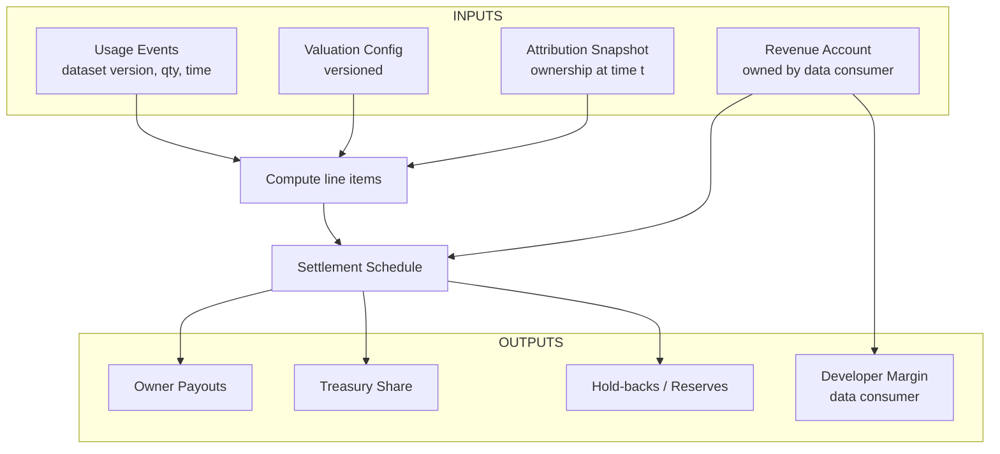

**로열티 엔진**은 데이터셋 **사용**과 **매출**을 소유자에게 가는 **분배**로 바꿉니다—깨끗하고 예측 가능하며, 완전한 감사 추적을 동반합니다. 이를 위해 네 가지 버전 고정 입력을 결합합니다:

1) **사용 이벤트(계량):** 누가 **어떤 데이터셋 버전**을 **얼마나**, **언제** 사용했는지  
2) **평가 구성:** 접근이 **어떻게 가격/가중**되는지(품질, 정보 이득, 수요/희소성, 거버넌스 가중, 시신성)  
3) **귀속 스냅샷:** **이벤트 유효 시점의 소유권 분수**  
4) **수익 계정:** 해당 데이터셋/제품의 **데이터 소비자(AI 빌더)** 가 통제하는 총매출

<Tip>
**한 문장 목표:** **동일 이벤트** + **동일 소유권** + **동일 평가 구성** ⇒ **재생 시 동일 분배 결과**
</Tip>

## 분배 흐름

**무슨 일이 일어나는가:** 사용 이벤트와 평가가 **분배 명세(line item)**를 만들고; 엔진은 해당 **시점의 소유권**을 조회해 **금고 몫**과 **준비금**을 적용한 뒤, **일정**에 따라 분배합니다. **수익 계정**은 이를 자금 조달하고 개발자 마진도 포착합니다.

- **사용 이벤트(Access & Metering):** **데이터셋 버전**, **수량**(rows/GB/requests), **타임스탬프**, **유효 가격/가중 버전**을 고정한 서명 레코드  
- **평가 구성(거버넌스):** 버전 관리되는 요인 집합으로 데이터셋/버전의 **유효 가격/가중**을 산출(품질/정보성/수요·희소/시장 레퍼런스/거버넌스 가중/신규성/시신성 등)  
- **귀속 스냅샷(토큰화 소유권):** **이벤트 시점**의 단위/데이터셋 소유권 분수(버전 고정)  
- **수익 계정(데이터 소비자):** AI 제품 매출 유입 계정; 분배/금고 몫/소비자 마진의 출처

<Tip>
**모든 것의 버전 관리.** 이벤트는 평가 구성 버전·데이터셋 버전을 참조하고, 소유권은 이벤트 타임스탬프에서 읽습니다. 따라서 분배는 **재생 가능**하고 **설명 가능**합니다.
</Tip>

## 라인 아이템 계산 방식
각 사용 이벤트에 대해 엔진은 **무엇이 사용되었고**, **얼마나 사용되었으며**, **비용은 얼마인지**(평가에서), **그때 누가 소유했는지**(귀속)를 결정해 **총액**과 **소유자별 분해**를 생성합니다(금고/준비금 적용 전).

**예시(개념):**  
> 프로토콜, 시스템 개발자, 지식 기여자 포함
- **총 사용:** 1,000 요청 × **$0.002**/요청 = **$2.00**  
- **준비금(분쟁 보류):** **5%** × 총액 = **$0.10** → **순분배 = $1.90**  
- **거버넌스 분할(예시; 정책 밴드 내):**  
  - **codatta(프로토콜): 15%** × 순 = **$0.285**  
  - **스키마/택사노미/워크플로 개발자: 10%** × 순 = **$0.190**  
  - **지식 기여자 풀: 60%** × 순 = **$1.140**  
  - **소비자 마진(AI 빌더): 나머지 15%** × 순 = **$0.285**

- **지식 풀 내부(시점 *t* 소유권 예):**  
  - **샘플 제공자(환자): 30%** of pool = **$0.342**  
  - **레이블러(Lin 박사): 50%** of pool = **$0.570**  
  - **검증자/후원자: 20%** of pool = **$0.228**

- **합계 검증:** **$0.10(준비금)** + **$0.285** + **$0.190** + **$1.140** + **$0.285** = **$2.00**

<Warning>
참고: 퍼센트는 **거버넌스·버전 관리** 대상입니다. 태스크 매니페스트는 허용 밴드 내에서 몫을 설정할 수 있습니다. **지식 풀 분배**는 이벤트 시점의 **실제 소유권 분수**를 따릅니다(태스크/데이터셋별 상이).
</Warning>

## 정산, 일정 & 통화

- **지급 시점:** 달력 **일정**(예: 주간) 또는 임계 충족 시  
- **지급 통화:** **멀티 자산 분배** 지원(스테이블코인/메이저/프로토콜 토큰 등)  
- **크로스체인:** 소유자가 서로 다른 체인에 있을 때 **브릿지/스왑** 단계를 큐잉; 경로/레이트를 영수증에 기록  
- **영수증 & 스테이트먼트:** 각 분배는 이벤트 ID, 평가 버전, 귀속 스냅샷 해시, 최종 금액 포함(Products → Royalty Statements)

## 분쟁, 준비금 & 리플레이

- **준비금:** **준비금율**(거버넌스)이 **분쟁 창구** 동안 해당 라인 아이템의 일부를 격리  
- **해결:** CF 수정/폐기 또는 분쟁 해결 시, 엔진은 영향받은 라인 아이템을 **재계산**해 자금을 해제/재배치  
- **리플레이:** 이벤트/평가/소유권이 버전 고정이므로, 입력이 같으면 결과도 **동일**. 분쟁으로 입력이 바뀌면 변경이 기록/설명됨

## TNPL(Train‑Now‑Pay‑Later)
**TNPL** 합의를 지원합니다: 빌더는 데이터를 **지금 접근**하고 **미래 매출에서 지불**합니다. 실무적으로는 이벤트가 **이연 의무**를 누적하고, 매출 유입 시 엔진이 정산하며, 양측에 명확한 스테이트먼트를 제공합니다.

## 인터페이스

- **입력:** **[/core-concepts/access-control-metering](/core-concepts/access-control-metering)**(이벤트), **[/core-concepts/tokenized-ownership-proofs](/core-concepts/tokenized-ownership-proofs)**(귀속 스냅샷), **[/core-concepts/data-assembly](/core-concepts/data-assembly)**(데이터셋/버전 ID)  
- **출력:** **소유자/금고/준비금/소비자 마진** 분배; **영수증**/**스테이트먼트**(감사용)

## 불변 조건(필수)

- **결정성:** 동일 이벤트 + 동일 소유권 + 동일 평가 구성 ⇒ 동일 분배 결과  
- **추적 가능:** 모든 금액은 데이터셋 버전 → 자산 → CF → 기여자로 역추적  
- **최소 공개:** 금액은 공개하되 민감 아티팩트는 암호화 유지  
- **소급 편집 금지:** 과거 스테이트먼트는 유효; 정정은 **재계산**과 사유 기록으로 처리

<Warning>
**상태 노트(거버넌스·진화):**  
- **평가 구성**, **금고/준비금 정책**은 거버넌스가 설정하며 진화할 수 있고, 변경은 버전 고정됩니다.  
- **소유권 유동성**(2차 거래)은 **선택적**이며 분배 수학을 바꾸지 않고 **수령자만** 바꿉니다.  
- **통화 & 브릿지**는 생태계에 따라 확장/변경될 수 있습니다.
</Warning>

