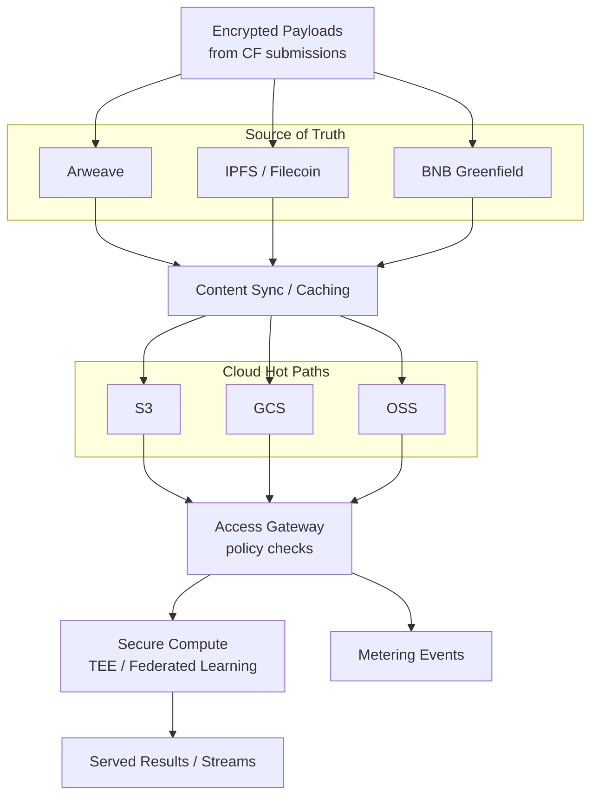

**이 레이어가 하는 일**  
기여된 콘텐츠를 **내구성 있게, 비공개로, 빠르게 접근 가능**하게 유지합니다. 탈중앙 **진실 소스**와 클라우드 **핫 경로**를 결합해 저지연을 달성하고, 민감 처리는 **보안 컴퓨트** 환경에서 실행합니다. 제공되는 모든 바이트는 **기여 지문(CF)** 과 **데이터셋 버전**에 결속되어 출처와 청구가 설명 가능하게 유지됩니다.

## 아키텍처 한눈에 보기

- **진실 소스:** 콘텐츠 주소 스토리지(**Arweave**, **IPFS/Filecoin**, **BNB Greenfield**)가 데이터를 CF 해시에 불변으로 고정합니다.  
- **핫 경로:** 클라우드 오브젝트 스토어(**S3/GCS/OSS**)는 허용된 슬라이스를 캐시해 **저지연 읽기**와 **배치 처리량**을 제공합니다. 모든 것은 진실 소스를 가리킵니다.  
- **액세스 게이트웨이:** 정책 집행(역할/속성/토큰 게이트), **계량 이벤트** 방출, 필요 시 보안 컴퓨트로 위임.  
- **보안 컴퓨트:** 프라이버시 민감 작업을 **TEE/연합**으로 실행; 인가된 당사자만 복호화 데이터를 볼 수 있습니다.

## 암호화 & 키(쉬운 설명)

- **전송/보관 암호화:** 저장 전 페이로드를 암호화; 링크는 TLS 사용  
- **엔벌로프 키:** 정책 통제 마스터 키(KMS)가 감싼 단수명 콘텐츠 키 사용  
- **선택적 복호화:** 게이트웨이는 **정책이 허용하는 바이트만**, 필요한 시간에만 복호화  
- **BYO‑KMS(선택):** 엔터프라이즈 소비자는 자체 키 매니저를 연동 가능

> **출처는 그대로:** CF의 콘텐츠 참조(해시/CID)는 바뀌지 않으며, 캐시 계층은 허용 바이트만 미러링합니다.

## 보안 컴퓨트 패턴

- **TEE 엔클레이브** — 원시 데이터 노출 없이 요청별 변환(마스킹, 피처 추출 등)  
- **연합 실행** — 사일로 간 훈련/평가; 데이터는 로컬 유지, 업데이트만 이동  
- **결정적 영수증:** 출력은 데이터셋/버전 ID를 포함해 하류 청구/감사가 제공 결과와 일치

## 관측성 & 비용/지연 노브

- **관측성:** 요청 로그, 정책 결정, 계량 ID를 감사용으로 보관  
- **노브:** 캐시 TTL, 공통 질의에 대한 사전 물질화 뷰, 지역별 복제 범위 제어  
- **백프레셔:** 부하 시 비용/성능 보호를 위해 레이트리밋/샘플링

## 인터페이스

- **입력:** CF 콘텐츠 참조(해시/CID/URI), **[/core-concepts/data-assembly](/core-concepts/data-assembly)** 에서 오는 **데이터셋/버전 ID**, **[/core-concepts/access-control-metering](/core-concepts/access-control-metering)** 의 접근 정책  
- **출력:** 정책 게이트 바이트 스트림/오브젝트, **계량 이벤트**, 동일 버전 ID에 결속된 선택적 TEE 출력  
- **크로스 링크:** 출처는 CF로, 청구는 **[/core-concepts/royalty-engine](/core-concepts/royalty-engine)** 로

## 불변 조건(필수)

- **진실 소스 우선:** 클라우드 캐시는 탈중앙 기록을 대체하지 않음  
- **추적 가능:** 제공된 각 바이트는 (데이터셋 버전 → 자산 → CF)로 매핑  
- **최소 공개:** 필요한 만큼만 복호화/처리; 엔클레이브/연합 패턴 선호  
- **재생 가능:** 동일 버전에 대한 동일 요청은 동일 계량 트레일을 생성

## 상태 노트

- 지원 스택은 확장되더라도 하이브리드 설계는 안정적으로 유지됩니다.  
- TEE 제공자와 연합 프레임워크는 시간이 지나며 바뀔 수 있으나 **인터페이스는 동일**하게 유지됩니다.

