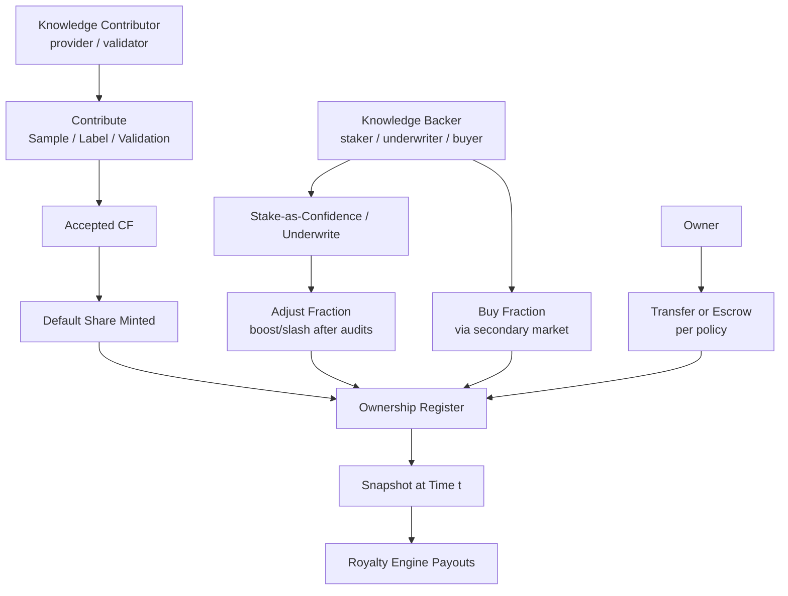
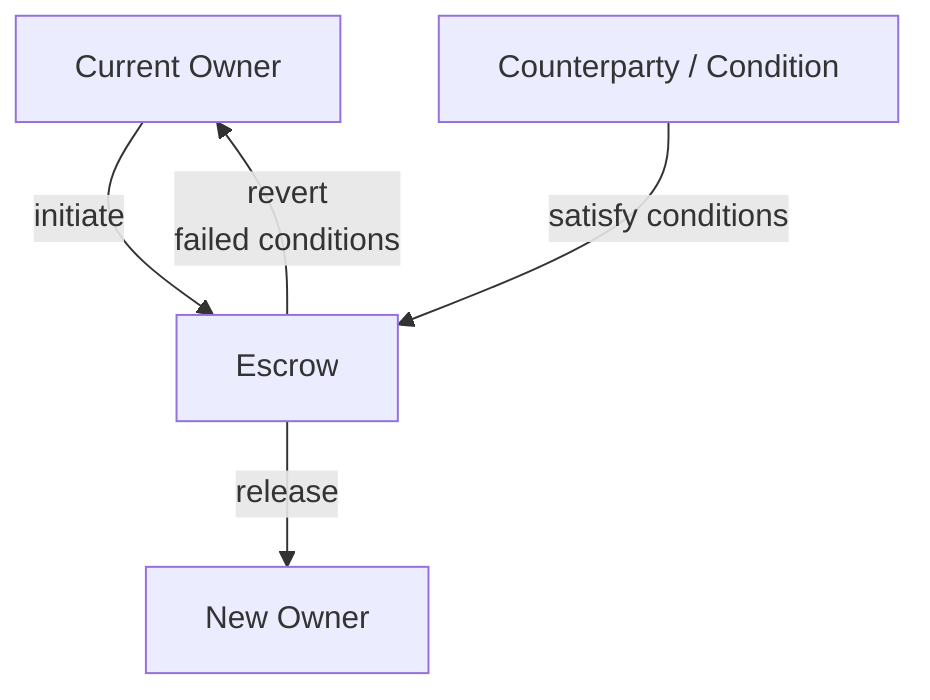

**이 페이지가 다루는 것**  
**누가 무엇을 소유하는지**, 그리고 그것을 어떻게 증명하는지에 대한 계약입니다. 소유권은 **단위**(단일 CF)나 **데이터셋 버전**에 부여될 수 있습니다. 권리는 **양도 가능**하며, **영수증/증명**으로 입증 가능하고, **시간 고정 스냅샷**과 **챌린지 윈도우** 덕분에 분배에 안전하게 사용할 수 있습니다.

## 무엇을 소유할 수 있나

- **단위 수준 소유권:** 단일 **CF**에 대한 분수 지분(샘플/레이블/검증에 흔함)  
- **데이터셋 수준 소유권:** **특정 데이터셋 버전**(큐레이션된 CF 번들)에 대한 분수 지분  
- **거버넌스 기반선:** 정책에 따라 프로토콜(금고)·스키마/워크플로 개발자 몫 등 작은 기반선을 유보할 수 있으며, 모든 것은 투명하고 버전 관리됩니다.

<Tip>
소유권은 **분수적**입니다. 해당 단위 또는 데이터셋 버전에서 지분 합계는 항상 1.0입니다.
</Tip>

## 지분을 얻는 방법

- **지식 기여자(제공자/검증자)**:  
  **샘플/레이블/검증**을 기여합니다. *원자 기여*를 제출하고, 기여가 **CF로 수락·게시**되면(태스크 정책에 따름) 프로토콜이 **기본 지분**을 민팅합니다.

- **지식 후원자(스테이커/언더라이터/구매자)**:  
  **신뢰로서의 스테이킹/언더라이팅.** 데이터 품질을 지원하거나 코호트/데이터셋을 보증하기 위해 스테이크를 잠급니다. 정기 감사로 거버넌스 한도 내 **지분을 상향/삭감**할 수 있습니다.  
  **지분 구매(2차 시장).** **소유권 유동성**이 활성화된 경우 오더북/AMM/OTC로 기존 지분을 구매합니다. 이는 **분배 수학**을 바꾸지 않고, **수령자만** 바꿉니다.

- **이전/에스크로(정책 통제):**  
  기존 지분을 아이덴티티(지갑/DID) 간 이동하거나, **조건 충족 전**까지 **에스크로**에 보관합니다(지급 정산, KYC 통과, 마일스톤, 분쟁 해결, 지정일 도달 등). 원장은 모든 변화를 기록하고, 스냅샷은 시점 *t*의 **기록상 소유자**(에스크로 포함)를 반영합니다.

## 내보낼 수 있는 증명

- **소유권 영수증:** 특정 시점의 단위/데이터셋에 대한 본인 지분의 서명 진술  
- **포함 증명:** 배치 앵커 사용 시, 영수증이 앵커 집합에 포함되었음을 보이는 **Merkle/누산기 증명**  
- **이전 영수증/에스크로 노트:** 누가 무엇을 누구에게, 어떤 조건으로 이전했는지  
- **스냅샷 해시:** **로열티 엔진**이 특정 기간 분배 계산에 사용하는 다이제스트

<Tip>
**모든 증명**은 **타임스탬프**를 가지며 데이터셋/버전 ID를 참조해 감사 시 결과를 정확히 재생할 수 있습니다.
</Tip>

## 분쟁 & 챌린지 윈도우

- **챌린지 윈도우:** 민팅/조정/이전 후 일정 기간 동안 분쟁 제기가 가능하며, 해당 분배는 해결까지 **준비금**을 사용합니다.  
- **해결:** **[/core-concepts/data-assembly](/core-concepts/data-assembly)** 의 수정/폐기가 소유권을 재형성할 수 있으며, 재계산은 변화 값을 설명하고 영수증은 전/후 상태를 기록합니다.

---

## 이전 vs 에스크로 — 정의와 공존 이유

**이전(직접):** **소유권 레지스터**에서 기록상 소유자를 즉시 바꿉니다. 지갑 통합, 팀/그랜트 배분, OTC 정산, 분쟁 재배분, 조직 간 이관에 사용하세요. 시장 **매수**와 달리 이전은 무가/유가 모두 가능하며 가격발견이 필요 없습니다. **민팅**과 달리 이전은 **기존 지분을 이동**하므로 총공급은 변하지 않습니다.

**에스크로(조건부):** **임시 보관자**(컨트랙트/커스터디언)가 조건이 충족될 때까지 지분을 보유합니다(지급 클리어, KYC 통과, 마일스톤 달성, 분쟁 해결, 날짜 도달). 에스크로 중에는 **분배가 준비금으로 보류**되거나 **에스크로에 누적**되고, 해결 시 **해제/재배분**됩니다. 스냅샷은 시점 *t*의 **에스크로 상 기록 소유자**를 가리켜 리플레이의 결정성을 보장합니다.

## 유동성(검토 중)

가격 발견과 자본 효율을 개선하기 위한 소유권 2차 시장이 **존재할 수** 있습니다. 로열티에는 **필수 아님**; 자산이 **얼마를** 지불하는지는 바뀌지 않고 **누가** 받는지만 바뀝니다.

<Info>
**실험적:**  
유동성 venue와 상장 기준은 탐색 중이며 인터페이스는 변경될 수 있습니다.
</Info>

## 인터페이스

- **입력:** **[/core-concepts/contribution-fingerprint](/core-concepts/contribution-fingerprint)** 에서 수락된 CF, 스테이킹 결과, 협상된 후원자 지분  
- **출력:** 소유권 **영수증**, **[/core-concepts/royalty-engine](/core-concepts/royalty-engine)** 용 **스냅샷**, 이전/에스크로 기록  
- **크로스 링크:** 데이터셋 버전은 **[/core-concepts/data-assembly](/core-concepts/data-assembly)** 에서 오고, 정책 게이트는 **[/core-concepts/access-control-metering](/core-concepts/access-control-metering)** 에 있으며, 권한 부여를 위한 아이덴티티는 **[/core-concepts/identity](/core-concepts/identity)** 에 존재합니다.

## 불변 조건

- **스냅샷 진실성:** 분배는 **시점 *t*의 소유권 스냅샷**을 사용; 이후 변경이 과거를 덮지 않음  
- **영수증 우선:** 영수증/증명이 검증되면, 거버넌스 분쟁이 뒤집기 전까지 소유권 주장이 우선  
- **합계=1:** 단위/데이터셋 수준 분수 지분 합은 항상 1.0  
- **추가 전용:** 민팅/조정/이전은 새 항목으로 기록; 원장 상태는 과거를 편집하지 않음

<Warning>
**상태 노트:**  
- 기반선 지분(프로토콜/워크플로 개발자 등)은 거버넌스 대상이며 버전 관리됩니다.  
- 평판→지분 상한 매핑은 거버넌스 대상이며 진화할 수 있습니다(**[/core-concepts/reputation](/core-concepts/reputation)** 참고).  
- 필요 시 체인 간 영수증과 브릿지가 지원되며 포맷은 확장될 수 있습니다.
</Warning>

