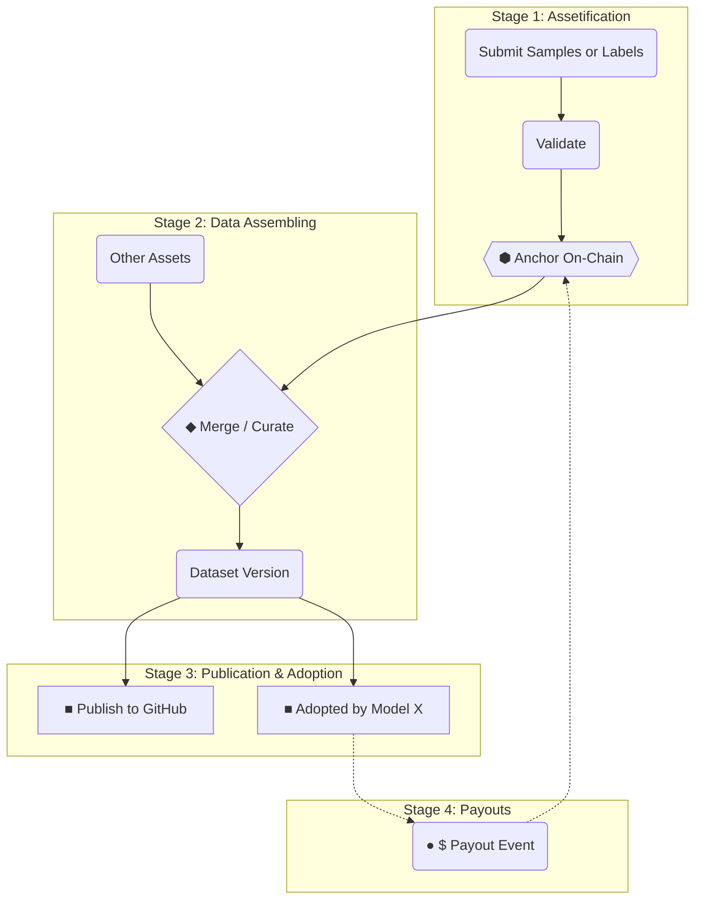

Codatta는 원시 기여가 **신뢰할 수 있는 온체인 자산**이 되고, 다시 **데이터셋으로 조립**되어 **수익과 로열티**로 이어지는 전 과정을 투명하게 보여줍니다.

**데이터 계보 (Data Lineage)** 페이지는 이 흐름을 네 단계로 나누어 기여자, 검증자, 데이터 구매자, 백커가 모두 같은 지도를 공유할 수 있게 합니다.

## 계보 다이어그램

아래 다이어그램(영문 노드 사용)은 Codatta 프로토콜에서 데이터가 거치는 네 가지 단계를 시각화합니다.

## 라이프사이클 단계

### 1. 자산화 (Assetification)

원시 기여가 신뢰할 수 있는 온체인 자산으로 변환되는 단계입니다:

- **제출 (Submission):** 기여자가 샘플·레이블 등 원자 기여를 제출하고, 각 기여에 대해 기여 지문(CF)이 생성됩니다.  
- **스크리닝 및 검증 (Screening & Validation):** Codatta는 휴리스틱 기반 형식/정책 준수/중복 제거 검사와 AI 에이전트의 의미론적 검사를 포함한 자동 사전 스캔을 실행합니다. 필요시 휴먼 리뷰가 트리거됩니다. 이 단계에서 실패한 제출은 거부되며 **CF를 생성하지 않습니다**。  
- **CF 생성 및 앵커링 (CF Creation & Anchoring):** 승인된 각 원자 기여에 대해 시스템은 **CF 커밋**을 구축하고(콘텐츠 해시 정규화, 증거 및 신호 첨부, 기여자 신원 바인딩), 선택된 네트워크에서 **CF의 지문을 온체인에 앵커**합니다(CF당 또는 배치 Merkle 루트).  

관련 문서:

- **[기여 지문 (CF)](/ko/core-systems/contribution-fingerprint)**

### 2. 데이터 조립 (Data Assembling)

자산화가 끝난 후, 앵커된 자산이 모여 실제로 사용 가능한 데이터셋으로 조립됩니다:

- **구성 (Composition):** 여러 원자 자산과 자산 번들이 하나의 조립 파이프라인으로 합쳐집니다.  
- **버전 관리 (Versioning):** 입력이나 규칙이 바뀔 때마다 새로운 데이터셋 버전이 생성되어, 과거 상태를 보존하고 diff를 쉽게 비교할 수 있습니다.  

자세한 조립 규칙과 매니페스트, 버전 정책은 **[데이터 조립 (Data Assembly)](/ko/core-systems/data-assembly)** 문서를 참고하세요.

### 3. 게시 및 채택 (Publication & Adoption)

조립과 앵커링이 끝난 데이터셋은 실제 사용을 위해 게시됩니다:

- **게시 (Publication):** 내부 카탈로그, HuggingFace, GitHub, 기타 플랫폼에 게시됩니다.  
- **채택 (Adoption):** 특정 AI 모델이나 애플리케이션이 해당 데이터셋 버전을 학습·평가·추론에 사용하며, 이는 “유틸리티 증거”로 기록됩니다.  

접근 제어와 사용 계량에 대한 자세한 내용은 다음을 참고하세요:

- **[액세스 제어 & 계량](/ko/core-systems/access-control-metering)**  
- **[스토리지·컴퓨트·서빙](/ko/core-systems/storage-compute-serving)**

### 4. 분배 (Payouts)

채택 이벤트가 매출(라이선스·API 요금 등)을 발생시키면, 수익은 소유권 그래프를 따라 권리자에게 돌아갑니다:

- **가치 흐름 (Value Flow):** 각 유료 이벤트는 특정 데이터셋 버전과 사용 컨텍스트에 고정됩니다.  
- **분배 (Distribution):** 이벤트 시점의 소유권 스냅샷을 기준으로, 기여자·검증자·백커·프로토콜 금고 등에 순수익이 분배됩니다.  
- **백커 (Backers):** 소유권 지분이 2차 거래된 경우에도, 시스템은 항상 그 시점의 **현재 소유자**에게 분배하도록 보장합니다.  

분배 수학, 준비금, 재생 가능성에 대해서는 **[로열티 엔진 (Royalty Engine)](/ko/core-systems/royalty-engine)** 문서를 참고하세요.

