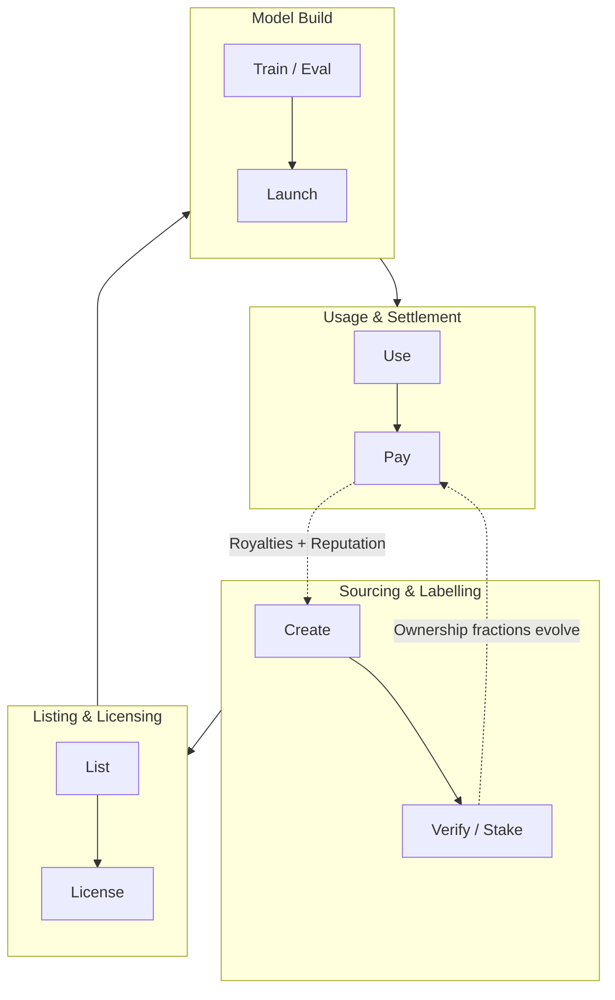

<Tip>
### 한눈에 보기
이 문서는 codatta가 데이터를 **수익 창출 자산(로열티 경제)** 으로 전환하는 방식, 그 위에 **TNPL(Train‑Now, Pay‑Later)** 비즈니스 모델이 어떻게 작동하는지, 그리고 대규모로 실용적으로 운영하려면 왜 블록체인 기반이 적합한지 간단히 설명합니다. 전체 맥락은 비전 문서를 참고하세요: [https://codatta.io/vision](https://codatta.io/vision)

**핵심 개념:**
* **로열티 경제**: 사용량 기반의 지속적 수익 분배(데이터 소유자/검증자).
* **TNPL**: 개발자는 먼저 훈련하고, 가치가 창출되면 로열티로 나중에 지불.
* **블록체인(간단한 근거)**: 프로그래머블 소유권, 증명 가능한 출처, 자동 분배.
</Tip>

## 로열티 경제

### 개념

프로토콜 수준에서 **데이터 사용**—훈련/파인튜닝/평가 소비 + **라이선스된 데이터에서 파생된 하류 AI 모델의 계량된 추론**—과 데이터 소유자(기여자, 검증자, 후원자) 및 프로토콜 금고를 향한 **지속적 로열티 흐름**을 연결합니다.

### 왜 중요한가

* AI 데이터의 수익 모델을 일회성 판매에서 **스트리밍형·사용량 기반 수익**으로 전환.
* 인센티브 정렬: **더 좋은 데이터 → 더 좋은 모델 → 더 많은 사용 → 더 많은 로열티**.
* 고숙련 기여(전문가 레이블, 증거 기반 신호 등)를 **경제적으로 타당**하게 만듭니다.

### 동작 방식(개념)

1. **기여 & 지문화**: 데이터가 기여되고 **기여 지문** 및 **계보‑자산 기록**에 결속됩니다.
2. **소유권 분수**: **기여·검증·신뢰로서의 스테이킹**을 통해 소유권이 확립됩니다(분수/시간 범위).
3. **사용 계량 & 귀속**:
   * **훈련/파인튜닝**: 소비 이벤트를 기록해 계보와 귀속(누가, 무엇을, 언제 사용했는지) 확립.
   * **추론(서빙)**: **라이선스된 데이터에서 파생된 모델**의 사용을 **계량**(요청/토큰/API 콜 등)하여 로열티 계산.
4. **로열티 라우팅**: 스마트컨트랙트가 현재 소유권 분수에 따라 소유자와 금고로 수익을 분배합니다.

### 분배 조정 노브

* **훈련 중 지불**: **훈련/파인튜닝 소비** 중 마이크로 로열티(또는 거래별 귀속 전용); **파생 모델의 추론은 계량**되어 정산.
* **성과 연동형**: 합의된 품질 임계 충족 시 승수 적용.
* **프로토콜 몫**: 인프라/감사/연구 유지를 위한 공익 몫.

> **비유**: 지식에 대한 **음원 스트리밍 로열티**—당신의 데이터가 의미 있게 사용될 때마다 수익이 돌아옵니다.

---

## 새로운 비즈니스 모델: TNPL

**정의**: 개발자가 **선결제 없이** 데이터에 접근하도록 하고, 훈련된 모델이 가치를 창출하면 **로열티**가 데이터 소유자에게 돌아가도록 합니다.

### 개발자 워크플로우
1. **접근 요청** → TNPL 조건 합의(로열티율, KPI 조항, 만기 조건)
2. **훈련/평가** → 에스크로 유사 합의 하에 프로토콜이 계보·사용을 추적
3. **출시 & 수익화** → 모델/API가 수익을 창출; 스마트컨트랙트가 TNPL 조건에 따라 분배

### 왜 개발자가 선호하는가
* 초기 비용/리스크 감소; **실험이 원활**해집니다.
* 현금을 데이터 구매보다 **PMF**에 집중.

### 왜 기여자가 선호하는가
* 실제 채택에 비례해 확장되는 **롱테일 수익**.
* 공정성: **측정된 영향**과 **검증 가능한 사용**에 연동된 분배.

### 왜 프로토콜이 선호하는가
* 데이터 활용 극대화; 인디/엔터프라이즈 빌더 모두 유치.
* **토큰·금고 수요**를 강화하는 반복 흐름 창출.

---

## 왜 블록체인인가(간단 버전)

* **프로그래머블 소유권**: 스테이킹/검증에 따라 갱신되는 분할·시간 제한 소유권.
* **증명 가능한 출처**: 온체인 지문과 계보로 **누가 무엇을 기여했는지** 감사 가능.
* **자동 분배**: 스마트컨트랙트가 전 세계로 즉시 로열티 라우팅.
* **개방형 시장 접근**: 누구나 발견·라이선스·빌드 가능—폐쇄 정원 없음.
* **조합성**: 소유권 분수를 **포트폴리오**로 재구성(위험/수익 조정).
* **프라이버시 설계(하이브리드)**: 민감 데이터는 오프체인; 증명/해시/정책은 온체인.

<Note>
**종합**: 위 원시 요소들이 **작동하는 로열티 경제**의 최소 기판을 이룹니다. **프로그래머블 소유권**은 지급 권리를 표현/갱신하고, **출처**는 각 사용을 올바른 기여자에 결부합니다. **자동 분배**와 **개방형 접근**은 이벤트 단위 마이크로 로열티를 경제적·글로벌하게 만들고, **조합성**은 비유동 데이터 조각을 금융/발견 가능한 자산으로 바꾸며, **하이브리드 프라이버시**는 엔터프라이즈 거버넌스/규제를 만족시킵니다. 이 전체 세트가 함께 작동하지 않으면 귀속은 집행 불가능, 정산은 비확장, 시장은 폐쇄적이 되어 **TNPL**과 사용량 기반 **로열티**는 성장할 수 없습니다.
</Note>

## 로열티 경제의 모드

| 모드                   | 언제 지급           | 트리거               | 전형적 사용               | 비고                    |
| ---------------------- | ------------------- | -------------------- | ------------------------- | ----------------------- |
| **훈련 중 지불**       | 훈련/서빙 중        | 계량된 사용          | 파인튜닝, 평가, API       | 부드러운 마이크로 흐름  |
| **성과 연동형**        | KPI 충족 후         | 정확도/지연/SLA      | 안전성 평가, 리스크 신호  | 공정성·엄정성 강화      |
| **TNPL**               | 성공 후             | 수익화 이벤트        | 스타트업, 파일럿          | 선불 없음; 업사이드 공유 |

세 모드는 하나의 계약에서 조합 가능합니다.

---

## 데이터(지식) 생애주기와 로열티 흐름

이 흐름은 codatta의 **로열티 경제**에서 데이터와 로열티의 생애주기를 보여줍니다.
데이터는 **소싱 & 라벨링** → **리스팅 & 라이선싱** → **모델 빌드** → **사용 & 정산**의 네 단계를 통과하며, 점선 피드백 루프는 **소유권 분수**가 어떻게 진화하고 **로열티/평판 갱신**이 생태계를 지속적으로 순환시키는지 나타냅니다.

<Tip>
**예시 — 컴플라이언스용 시그널(간단화)**

암호화 생태계에는 **매우 많은 계정**이 **빠르고 정확하게** 라벨링되어야 합니다. 각 주석은 **증거**, **신뢰할 수 있는 추론**, 그리고 **최신 상태**(주가 아닌 분 단위)를 반영해야 합니다. **Codatta**는 전 세계 **인텔리전스 네트워크**—기여자, 검증자, AI—를 운영해 이러한 주석을 대규모로 생성/업데이트합니다. 아래 단계는 **생성에서 로열티까지의 핵심 흐름**을 보여줍니다.

<Expandable title="details">
<Steps>
   <Step title="Sourcing & Labelling">
   기여자가 **증거 기반 리스크 시그널**을 스테이킹(신뢰)과 함께 제출합니다.
   </Step>
   <Step title="Listing & Licensing">
   다수의 검증자가 **교차 검증**하고; 소유권 분수가 업데이트됩니다.
   </Step>
   <Step title="Model Build">
   KYT 제공자가 **TNPL**로 구독하고; 모델과 시스템이 개선됩니다.
   </Step>
   <Step title="Usage & Settlement">
   클라이언트가 KYT API를 사용함에 따라 **로열티**가 기여자 집합과 금고로 스트리밍됩니다.
   </Step>
</Steps>
</Expandable>
</Tip>

---

## 역할과 인센티브(누가 무엇을 버는가)

| 역할            | 기여                         | 수익                                      |
| --------------- | ---------------------------- | ----------------------------------------- |
| **기여자**      | 원본 데이터, 레이블, 증거    | 지속 로열티(분수 지분)                    |
| **검증자**      | QA, 반증, 감사               | 로열티 지분 + 검증 보상                   |
| **후원자**      | 신뢰로서의 스테이킹, 발굴    | 스테이크 영향에 비례한 로열티 지분        |
| **프로토콜**    | 인프라, 거버넌스, 보안       | 지속 가능성을 위한 금고 몫                |

---

## 계약 & 조건(쉬운 표현)

* **로열티율**: 사용 이벤트에 연동된 매출 비율.
* **귀속 범위**: 로열티가 적용되는 자산/버전 범위.
* **KPI 조항**(선택): 성능 임계에 따른 요율 변경.
* **만기/갱신**: 기간 제한, 재협상 트리거.
* **감사 가능성**: 어떤 데이터가 기록·검증되는지, 그리고 분쟁 창구.

---

## 모두의 리스크가 줄어드는 이유

* **빌더**: CAPEX → OPEX로 전환; **모델이 작동할 때만** 지불.
* **기여자**: 일회성 용역 리스크에서 보호; 업사이드 보존.
* **구매자**: 출처에서 모델 영향까지의 **투명한 시야** 확보.

---

## 자주 묻는 질문(요약)

**Q: TNPL은 단순 분할납부인가요?**  
*A:* 아니요. **검증 가능한 데이터 사용/성능**에 의해 앵커된 **계약상 수익 공유**입니다.

**Q: 선불 + 로열티 혼합이 가능한가요?**  
*A:* 예. (최소 보장 + 로열티 테일) 형태의 하이브리드 거래를 지원합니다.

**Q: 데이터 통제권을 잃지는 않나요?**  
*A:* 아닙니다. 접근은 정책으로 게이트되고; 온체인 정책이 범위와 조건을 집행합니다.

**Q: 프라이버시/규제 측면은 어떤가요?**  
*A:* 민감 콘텐츠는 오프체인; **지문/정책/흐름**만 온체인. 데이터룸과 접근 로그는 감사 가능합니다.

---

## 더보기
* 비전: [https://codatta.io/vision](https://codatta.io/vision)
* 개념 용어집: Royalty Economy, Royalty Loop, TNPL(예정)
* 심층: 데이터 로열티에 블록체인이 필요한 이유(예정)

